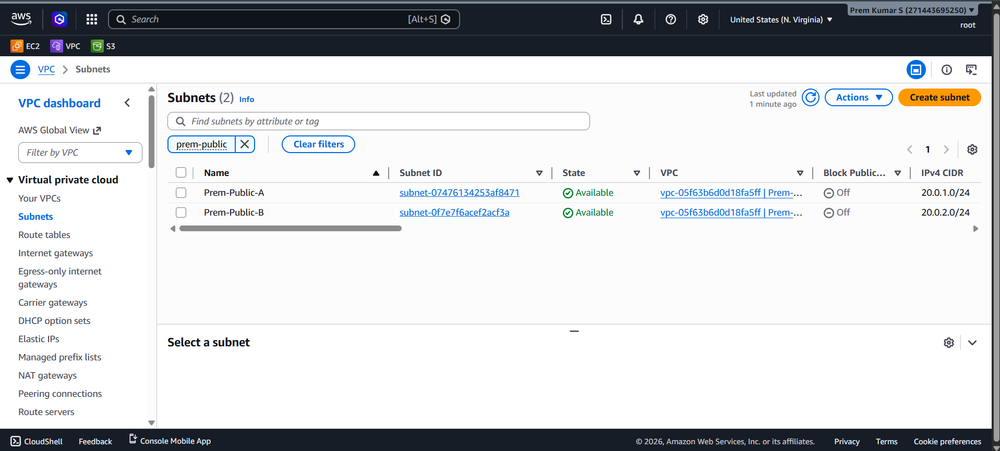
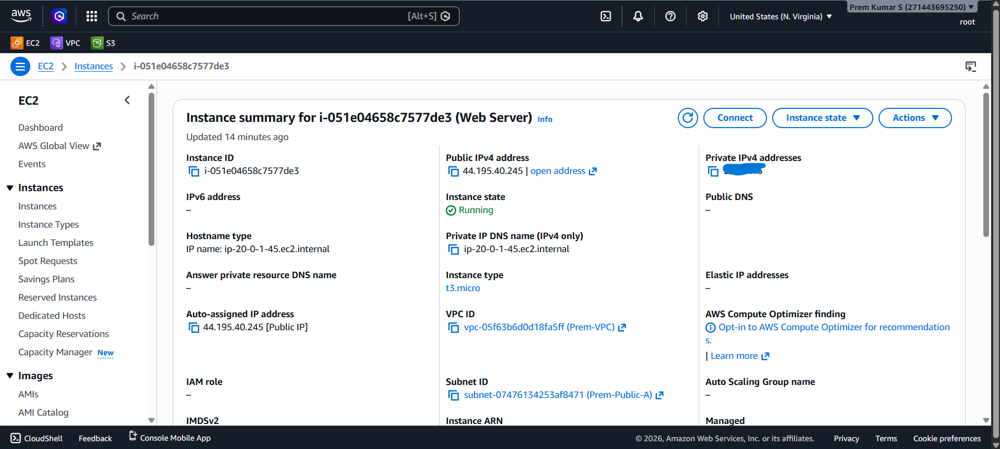
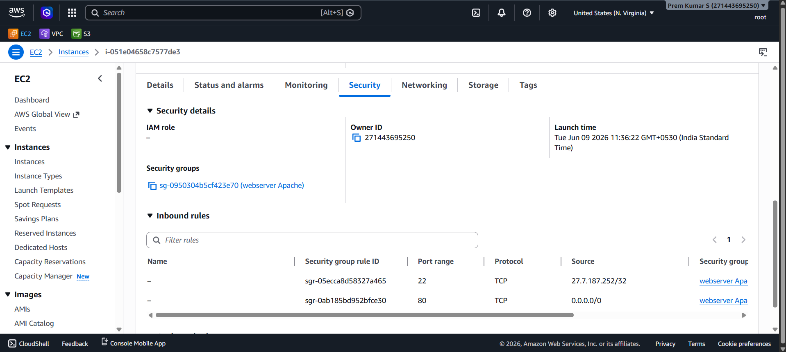
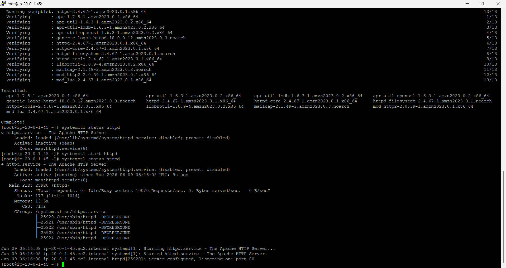
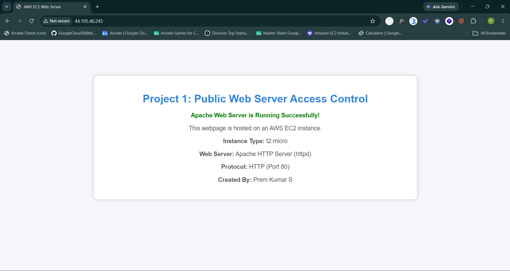

<!-- Badges -->


---

# 🌐 Project 1: Public Web Server Access Control

> Deploy a publicly accessible Apache HTTP web server on an AWS EC2 instance inside a custom VPC — with controlled security group rules, restricted SSH access, and validated end-to-end browser connectivity.

---

## 📑 Table of Contents

- [Overview](#-overview)
- [Architecture Diagram](#-architecture-diagram)
- [AWS Services Used](#-aws-services-used)
- [Prerequisites](#-prerequisites)
- [Project Structure](#-project-structure)
- [Setup & Deployment](#-setup--deployment)
- [How It Works](#-how-it-works)
- [Screenshots](#-screenshots)
- [Clean Up](#-clean-up)
- [Contributing](#-contributing)
- [License](#-license)
- [Author](#-author)

---

## 📌 Overview

### Problem Statement

A common requirement in cloud infrastructure is making a web application publicly reachable over the internet while keeping the management plane (SSH) restricted to authorized personnel only. Doing this correctly requires a well-configured VPC, public subnets with proper routing, and tight security group rules.

### What This Project Solves

This project provisions a production-grade baseline for a public web server on AWS:

- Creates a **custom VPC** with two public subnets across availability zones for resilience
- Deploys an **EC2 instance** running Apache HTTP Server, reachable from any browser worldwide
- Implements **least-privilege security** — HTTP open to public, SSH locked to a single trusted IP
- Validates the full traffic path from internet → IGW → public subnet → EC2 → Apache → browser

### Skills Demonstrated

`AWS VPC` · `EC2` · `Security Groups` · `Internet Gateway` · `Route Tables` · `Apache httpd` · `Linux (Amazon Linux 2023)` · `Network Architecture` · `Cloud Security`

---

## 🏗️ Architecture Diagram

```
┌─────────────────────────────────────────────────────────────────┐
│                        PUBLIC INTERNET                          │
└──────────────────────────────┬──────────────────────────────────┘
                               │
                               ▼
┌─────────────────────────────────────────────────────────────────┐
│                    INTERNET GATEWAY (IGW)                       │
│                   attached to Prem-VPC                          │
└──────────────────────────────┬──────────────────────────────────┘
                               │
                               ▼
┌─────────────────────────────────────────────────────────────────┐
│                   Prem-VPC (us-east-1)                          │
│                                                                 │
│  ┌────────────────────────┐  ┌────────────────────────┐        │
│  │   Prem-Public-A        │  │   Prem-Public-B        │        │
│  │   20.0.1.0/24 (AZ-1a) │  │   20.0.2.0/24 (AZ-1b) │        │
│  │                        │  │                        │        │
│  │  ┌──────────────────┐  │  │   (spare / HA ready)  │        │
│  │  │  EC2: Web Server │  │  │                        │        │
│  │  │  t3.micro        │  │  │                        │        │
│  │  │  Apache httpd    │  │  │                        │        │
│  │  │  44.195.40.245   │  │  │                        │        │
│  │  └────────┬─────────┘  │  │                        │        │
│  │           │             │  │                        │        │
│  │  ┌────────▼─────────┐  │  │                        │        │
│  │  │  Security Group  │  │  │                        │        │
│  │  │  webserver Apache│  │  │                        │        │
│  │  │  :22 → one IP    │  │  │                        │        │
│  │  │  :80 → 0.0.0.0/0 │  │  │                        │        │
│  │  └──────────────────┘  │  │                        │        │
│  └────────────────────────┘  └────────────────────────┘        │
│                                                                 │
│           Route Table: 0.0.0.0/0 → IGW                         │
└─────────────────────────────────────────────────────────────────┘
```

**Traffic Flow:**
```
Browser → Internet → IGW → Route Table → Public Subnet → Security Group (:80 allowed) → EC2 → Apache → HTML Response
```

---

## ☁️ AWS Services Used

| Service | Purpose |
|---|---|
| **Amazon VPC** | Custom isolated network environment with full control over IP ranges |
| **Public Subnets** | Two subnets (`Prem-Public-A`, `Prem-Public-B`) enabling internet-routable instances |
| **Internet Gateway** | Bridges the VPC to the public internet for inbound/outbound traffic |
| **Route Tables** | Routes `0.0.0.0/0` traffic from subnets to the Internet Gateway |
| **Amazon EC2** | Virtual machine (`t3.micro`) hosting the Apache web server |
| **Security Groups** | Stateful firewall — port 22 restricted by IP, port 80 open to all |
| **Apache HTTP Server** | Open-source web server (`httpd`) installed on Amazon Linux 2023 |

---

## ✅ Prerequisites

### Tools & Accounts

| Requirement | Version / Notes |
|---|---|
| AWS Account | Free Tier eligible — [Sign up here](https://aws.amazon.com/free/) |
| AWS Console Access | IAM user or root with EC2 + VPC permissions |
| SSH Key Pair | `.pem` file downloaded during EC2 launch |
| Terminal / SSH Client | Any terminal (Windows: Git Bash / PuTTY / WSL) |
| Browser | Any modern browser for final verification |

### AWS Permissions Required

Your IAM user/role must have permissions for:
- `ec2:*` — launch, configure, and manage EC2 instances
- `vpc:*` — create and manage VPCs, subnets, route tables, and gateways

### Region

All resources are deployed in **`us-east-1` (N. Virginia)**.

---

## 📁 Project Structure

```
Project 1 - Public Web Server Access/
│
├── README.md                          # This file — full project documentation
│
└── output/                            # Evidence screenshots
    ├── 01_Public_Subnet.png           # VPC subnets created and available
    ├── 02_EC2_Running.png             # EC2 instance in running state with public IP
    ├── 03_Security_Group_Rules.png    # Inbound rules: SSH (port 22), HTTP (port 80)
    ├── 04_Apache_Service_Running.png  # Apache httpd installed and active via systemctl
    └── 05_Website_Accessed_From_Browser.png  # Browser confirms public web access
```

---

## 🚀 Setup & Deployment

### Step 1 — Create VPC & Subnets

1. Open **AWS Console** → **VPC** → **Your VPCs** → **Create VPC**
2. Configure the VPC:
   - **Name:** `Prem-VPC`
   - **IPv4 CIDR:** `20.0.0.0/16`
3. Create two subnets under `Prem-VPC`:

   | Subnet Name | CIDR Block | Availability Zone |
   |---|---|---|
   | `Prem-Public-A` | `20.0.1.0/24` | `us-east-1a` |
   | `Prem-Public-B` | `20.0.2.0/24` | `us-east-1b` |

4. Attach an **Internet Gateway** to `Prem-VPC`
5. Update the **Route Table** — add route: `0.0.0.0/0` → Internet Gateway

---

### Step 2 — Create Security Group

Navigate to **EC2 → Security Groups → Create Security Group**

- **Name:** `webserver Apache`
- **VPC:** `Prem-VPC`

**Inbound Rules:**

| Type | Protocol | Port | Source | Reason |
|---|---|---|---|---|
| SSH | TCP | 22 | `<your-ip>/32` | Admin access only |
| HTTP | TCP | 80 | `0.0.0.0/0` | Public web access |

> ⚠️ **Security Note:** Replace `<your-ip>` with your actual public IP. Never set SSH source to `0.0.0.0/0` in production.

---

### Step 3 — Launch EC2 Instance

Navigate to **EC2 → Instances → Launch Instances**

| Setting | Value |
|---|---|
| Name | `Web Server` |
| AMI | Amazon Linux 2023 |
| Instance Type | `t3.micro` |
| Key Pair | Select or create a `.pem` key pair |
| VPC | `Prem-VPC` |
| Subnet | `Prem-Public-A` |
| Auto-assign Public IP | **Enable** |
| Security Group | `webserver Apache` |

---

### Step 4 — Install & Configure Apache

Connect to the instance via SSH:

```bash
ssh -i "your-key.pem" ec2-user@<EC2-PUBLIC-IP>
```

Once connected, run the following commands:

```bash
# Elevate to root
sudo su

# Update all system packages
yum update -y

# Install Apache HTTP Server
yum install httpd -y

# Start the Apache service
systemctl start httpd

# Enable Apache to auto-start on reboot
systemctl enable httpd

# Verify the service is active and running
systemctl status httpd
```

Expected output (truncated):
```
● httpd.service - The Apache HTTP Server
   Active: active (running) since Tue 2026-06-09 06:16:08 UTC
   Main PID: 25920 (httpd)
   ...
   Server configured, listening on: port 80
```

---

### Step 5 — Deploy a Custom Web Page

```bash
# Navigate to Apache's web root directory
cd /var/www/html

# Create the index.html page
cat > index.html << 'EOF'
<!DOCTYPE html>
<html lang="en">
<head>
  <meta charset="UTF-8" />
  <title>AWS EC2 Web Server</title>
  <style>
    body { font-family: Arial, sans-serif; display: flex; justify-content: center;
           align-items: center; height: 100vh; margin: 0; background: #f0f2f5; }
    .card { background: white; padding: 40px 60px; border-radius: 12px;
            box-shadow: 0 4px 20px rgba(0,0,0,0.1); text-align: center; }
    h1 { color: #1a6bbf; }
    .ok { color: green; font-weight: bold; }
  </style>
</head>
<body>
  <div class="card">
    <h1>Project 1: Public Web Server Access Control</h1>
    <p class="ok">✅ Apache Web Server is Running Successfully!</p>
    <p>This webpage is hosted on an AWS EC2 instance.</p>
    <p><strong>Instance Type:</strong> t3.micro</p>
    <p><strong>Web Server:</strong> Apache HTTP Server (httpd)</p>
    <p><strong>Protocol:</strong> HTTP (Port 80)</p>
    <p><strong>Created By:</strong> Prem Kumar S</p>
  </div>
</body>
</html>
EOF
```

---

### Step 6 — Verify Public Access

Open any browser and navigate to:

```
http://<EC2-PUBLIC-IP>
```

> Example used in this project: `http://44.195.40.245`

✅ If you see the Apache page — the deployment is successful!

---

## 🔍 How It Works

### 1. VPC & Subnets
The custom VPC (`Prem-VPC`) provides an isolated network environment. Two public subnets (`Prem-Public-A`, `Prem-Public-B`) are created in separate Availability Zones for resilience. Each subnet has a CIDR block carved from the VPC range.

### 2. Internet Gateway & Route Table
An Internet Gateway (IGW) is attached to the VPC, and a route (`0.0.0.0/0 → IGW`) is added to the public route table. This is what makes subnets "public" — instances inside them can communicate with the internet.

### 3. Security Group
Acts as a virtual firewall at the instance level. Two inbound rules are defined:
- **Port 22 (SSH):** Restricted to a single trusted IP (`/32` CIDR) — ensures only the admin can manage the server.
- **Port 80 (HTTP):** Open to `0.0.0.0/0` — allows any browser worldwide to reach the web server.

### 4. EC2 Instance
A `t3.micro` instance (Free Tier eligible) is launched with Amazon Linux 2023. It gets a public IP automatically assigned and is placed in the `Prem-Public-A` subnet.

### 5. Apache HTTP Server
Apache (`httpd`) is installed via `yum`, started with `systemctl`, and configured to serve static HTML from `/var/www/html/`. Port 80 serves the custom `index.html` page to any incoming HTTP request.

---

## 📸 Screenshots

### 1 — Public Subnets Created

> `Prem-Public-A` and `Prem-Public-B` visible in the VPC Subnets dashboard with state **Available**.



---

### 2 — EC2 Instance Running

> EC2 instance `i-051e04658c7577de3` in **Running** state with public IP `44.195.40.245` assigned.



---

### 3 — Security Group Rules

> Inbound rules showing SSH (port 22) restricted to a single IP and HTTP (port 80) open to the world.



---

### 4 — Apache Service Running

> Terminal output confirming `httpd` is **active (running)** via `systemctl status httpd`.



---

### 5 — Website Accessed from Browser

> Custom HTML page loaded successfully in a browser at `http://44.195.40.245` — end-to-end verification complete.



---

## 🧹 Clean Up

To avoid ongoing AWS charges, terminate all resources after the project:

### Via AWS Console

1. **EC2:** Instances → Select `Web Server` → Instance State → **Terminate**
2. **Security Group:** EC2 → Security Groups → Delete `webserver Apache`
3. **Subnets:** VPC → Subnets → Delete `Prem-Public-A` and `Prem-Public-B`
4. **Internet Gateway:** VPC → Internet Gateways → Detach from VPC → Delete
5. **VPC:** VPC → Your VPCs → Delete `Prem-VPC`

### Via AWS CLI

```bash
# Terminate EC2 instance
aws ec2 terminate-instances --instance-ids i-051e04658c7577de3

# Delete security group (after instance termination)
aws ec2 delete-security-group --group-id <sg-id>

# Detach and delete internet gateway
aws ec2 detach-internet-gateway --internet-gateway-id <igw-id> --vpc-id <vpc-id>
aws ec2 delete-internet-gateway --internet-gateway-id <igw-id>

# Delete subnets
aws ec2 delete-subnet --subnet-id subnet-07476134253af8471
aws ec2 delete-subnet --subnet-id subnet-0f7e7f6acef2acf3a

# Delete VPC
aws ec2 delete-vpc --vpc-id vpc-05f63b6d0d18fa5ff
```

> ⚠️ **Always verify** in the AWS Console that all resources are deleted to prevent unexpected billing.

---

## 🤝 Contributing

Contributions, suggestions, and improvements are welcome!

```bash
# 1. Fork the repository
# Click the "Fork" button on GitHub

# 2. Clone your fork
git clone https://github.com/ThePremkumar/<repo-name>.git

# 3. Create a feature branch
git checkout -b feature/your-feature-name

# 4. Make your changes and commit
git add .
git commit -m "feat: describe your change clearly"

# 5. Push to your fork
git push origin feature/your-feature-name

# 6. Open a Pull Request on GitHub
# Compare & pull request → Add description → Submit
```

### Contribution Guidelines

- Follow existing naming conventions for AWS resources
- Document all new steps with screenshots where possible
- Keep security best practices — never commit credentials or `.pem` files
- Update this README if your change affects setup or architecture

---

## 📄 License

```
MIT License

Copyright (c) 2026 Prem Kumar S

Permission is hereby granted, free of charge, to any person obtaining a copy
of this software and associated documentation files (the "Software"), to deal
in the Software without restriction, including without limitation the rights
to use, copy, modify, merge, publish, distribute, sublicense, and/or sell
copies of the Software, and to permit persons to whom the Software is
furnished to do so, subject to the following conditions:

The above copyright notice and this permission notice shall be included in all
copies or substantial portions of the Software.

THE SOFTWARE IS PROVIDED "AS IS", WITHOUT WARRANTY OF ANY KIND, EXPRESS OR
IMPLIED, INCLUDING BUT NOT LIMITED TO THE WARRANTIES OF MERCHANTABILITY,
FITNESS FOR A PARTICULAR PURPOSE AND NONINFRINGEMENT. IN NO EVENT SHALL THE
AUTHORS OR COPYRIGHT HOLDERS BE LIABLE FOR ANY CLAIM, DAMAGES OR OTHER
LIABILITY, WHETHER IN AN ACTION OF CONTRACT, TORT OR OTHERWISE, ARISING FROM,
OUT OF OR IN CONNECTION WITH THE SOFTWARE OR THE USE OR OTHER DEALINGS IN THE
SOFTWARE.
```

---

## 👤 Author

<table>
  <tr>
    <td align="center">
      <strong>Prem Kumar S</strong><br/>
      <a href="https://github.com/ThePremkumar">🐙 GitHub: @ThePremkumar</a><br/>
      <a href="https://thepremkumar.netlify.app">🌐 Portfolio: thepremkumar.netlify.app</a><br/>
      <br/>
      <em>Cloud Computing Enthusiast · AWS Practitioner · DevOps Learner</em>
    </td>
  </tr>
</table>

---

<div align="center">

⭐ **If you found this project helpful, please give it a star!** ⭐

*Built with ☁️ on AWS · Region: us-east-1 (N. Virginia)*

</div>
