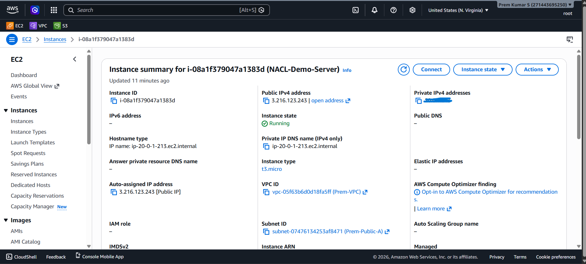
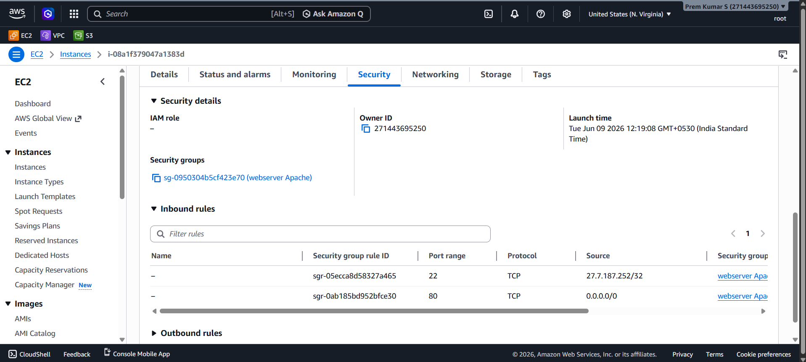
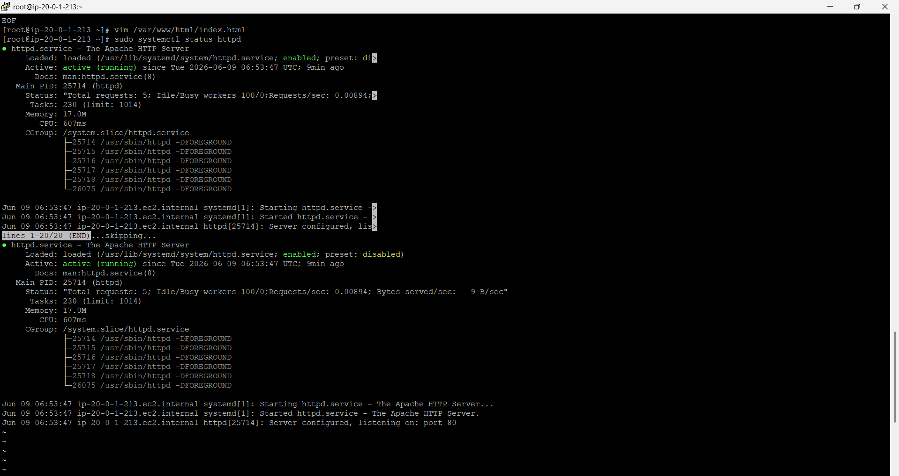
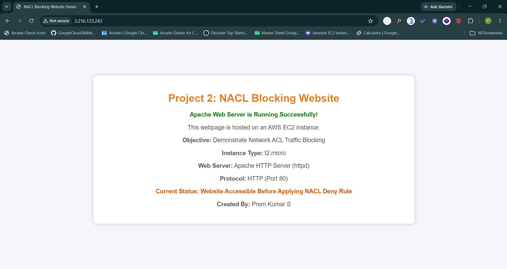
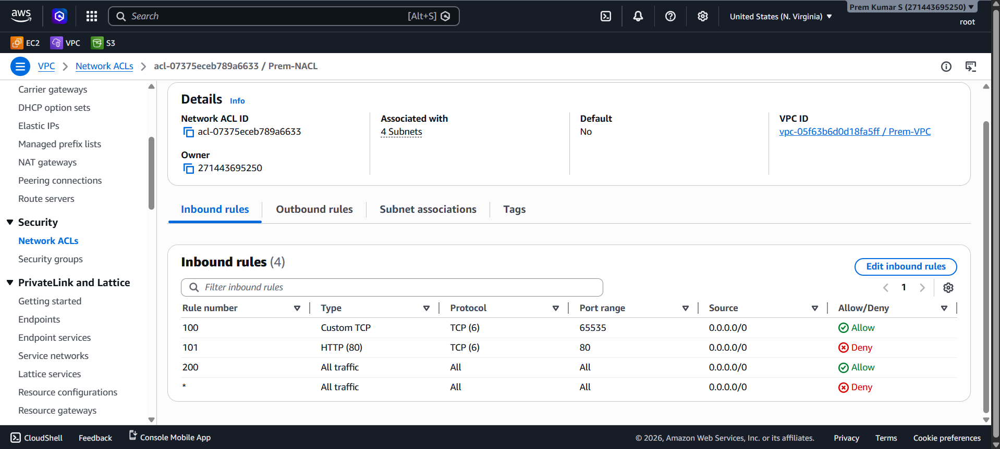
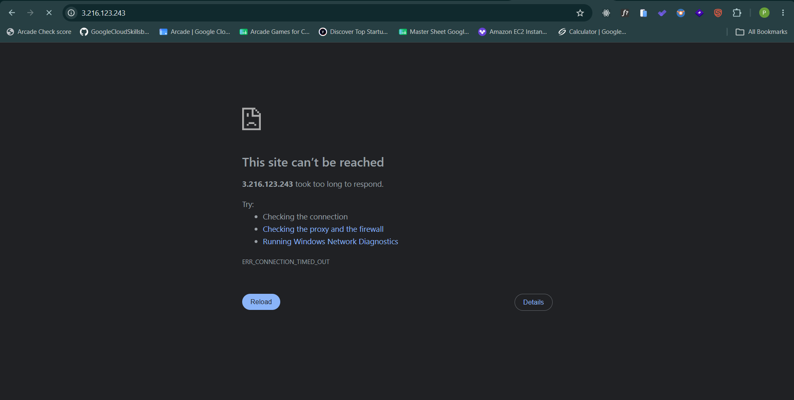

---

# 🛡️ Project 2: NACL Blocking Website

> **Demonstrate AWS Network ACL as a stateless subnet-level firewall** — prove that a NACL DENY rule at rule number 101 overrides a permissive Security Group and completely blocks HTTP traffic to a live Apache web server, with browser-verified before-and-after evidence.

This project goes beyond Security Groups to explore the second and most commonly overlooked layer of AWS network security: **Network Access Control Lists (NACLs)**. By intentionally blocking port 80 at the subnet boundary, this project isolates and proves exactly where in the traffic path AWS drops packets — and why Apache never sees the request.

---

## 📑 Table of Contents

- [Overview](#-overview)
- [Architecture Diagram](#-architecture-diagram)
- [AWS Services Used](#-aws-services-used)
- [Key Features](#-key-features)
- [Prerequisites](#-prerequisites)
- [Project Structure](#-project-structure)
- [Setup & Deployment](#-setup--deployment)
- [How It Works](#-how-it-works)
- [Security Highlights](#-security-highlights)
- [Testing & Validation](#-testing--validation)
- [Screenshots](#-screenshots)
- [Common Issues & Troubleshooting](#-common-issues--troubleshooting)
- [Cleanup / Destroy](#-cleanup--destroy)
- [Future Improvements](#-future-improvements)
- [Contributing](#-contributing)
- [License](#-license)
- [Author & Contact](#-author--contact)

---

## 📌 Overview

### What This Project Does

This project runs a live Apache HTTP Server on an EC2 instance named **`NACL-Demo-Server`** inside `Prem-VPC`. The Security Group (`webserver Apache`) deliberately permits HTTP on port 80 — identical to any production web server configuration. A custom NACL named **`Prem-NACL`** is then configured with an explicit **DENY rule at rule number 101 targeting TCP port 80** from `0.0.0.0/0`.

**The outcome:** the browser transitions from a fully loaded, live webpage to `ERR_CONNECTION_TIMED_OUT` — with Apache still running perfectly at PID `25714`. This surgical experiment isolates the NACL as the exact blocking point.

### Real-World Use Cases

NACLs are used in production to enforce **subnet-wide traffic policies** that cannot be overridden at the instance level:

- **Compliance enforcement** — mandate that no HTTP (non-HTTPS) traffic enters a subnet, even if a developer accidentally opens port 80 on a Security Group
- **Emergency incident response** — instantly isolate an entire subnet from the internet in seconds without touching individual instances or their Security Groups
- **Multi-tier network isolation** — block the web tier from directly communicating with the database tier at the subnet boundary
- **Defence in depth** — NACL + Security Group = two independent control planes that must both permit a packet before it reaches compute

### Problem Solved

> "If a Security Group allows HTTP, can a NACL still block the traffic? And where exactly does the block happen in the AWS traffic chain?"

This project answers both questions definitively — with working infrastructure and browser screenshots as proof.

---

## 🏗️ Architecture Diagram

### Phase 1 — Website Accessible (Security Group ALLOW · No NACL DENY)

```
┌───────────────────────────────────────────────────────────────────────────┐
│                          PUBLIC INTERNET                                  │
│                   Browser → http://3.216.123.243                          │
└────────────────────────────────┬──────────────────────────────────────────┘
                                 │  HTTP :80
                                 ▼
┌───────────────────────────────────────────────────────────────────────────┐
│                      INTERNET GATEWAY (IGW)                               │
│              Attached to vpc-05f63b6d0d18fa5ff (Prem-VPC)                │
└────────────────────────────────┬──────────────────────────────────────────┘
                                 │
                                 ▼
┌───────────────────────────────────────────────────────────────────────────┐
│  Prem-VPC (vpc-05f63b6d0d18fa5ff) — us-east-1 (N. Virginia)              │
│                                                                           │
│  ┌─────────────────────────────────────────────────────────────────────┐  │
│  │  Prem-Public-A (subnet-07476134253af8471) — 20.0.1.0/24            │  │
│  │                                                                     │  │
│  │  ┌──────────────────────────────────────────────┐                  │  │
│  │  │  Prem-NACL (acl-07375eceb789a6633)            │                  │  │
│  │  │  Rule 100: Custom TCP  port 65535  ✅ ALLOW   │                  │  │
│  │  │  Rule 200: All traffic all ports  ✅ ALLOW    │                  │  │
│  │  │  Rule  * : All traffic            ❌ DENY     │                  │  │
│  │  └──────────────────────┬───────────────────────┘                  │  │
│  │                         │  ✅ PASS — no deny for :80               │  │
│  │                         ▼                                          │  │
│  │  ┌──────────────────────────────────────────────┐                  │  │
│  │  │  Security Group: webserver Apache             │                  │  │
│  │  │  sg-0950304b5cf423e70                         │                  │  │
│  │  │  sgr-0ab185bd952bfce30  :80  ✅ ALLOW         │                  │  │
│  │  │  sgr-05ecca8d58327a465  :22  🔒 ALLOW (1 IP)  │                  │  │
│  │  └──────────────────────┬───────────────────────┘                  │  │
│  │                         │  ✅ PASS                                  │  │
│  │                         ▼                                          │  │
│  │  ┌──────────────────────────────────────────────┐                  │  │
│  │  │  EC2: NACL-Demo-Server                        │                  │  │
│  │  │  i-08a1f379047a1383d · t3.micro               │                  │  │
│  │  │  Public IP:  3.216.123.243                    │                  │  │
│  │  │  Private IP: 20.0.1.213                       │                  │  │
│  │  │  Apache httpd PID 25714 · :80 ✅ SERVING      │                  │  │
│  │  └──────────────────────────────────────────────┘                  │  │
│  └─────────────────────────────────────────────────────────────────────┘  │
└───────────────────────────────────────────────────────────────────────────┘

Result → Browser: HTTP 200 ✅  Page loads: "NACL Blocking Website Demo"
```

---

### Phase 2 — Website Blocked (NACL Rule 101 DENY :80 Added)

```
┌───────────────────────────────────────────────────────────────────────────┐
│                          PUBLIC INTERNET                                  │
│                   Browser → http://3.216.123.243                          │
└────────────────────────────────┬──────────────────────────────────────────┘
                                 │  HTTP :80
                                 ▼
                   Internet Gateway → Prem-VPC
                                 │
                                 ▼
┌───────────────────────────────────────────────────────────────────────────┐
│  Prem-Public-A (20.0.1.0/24)                                              │
│                                                                           │
│  ┌──────────────────────────────────────────────┐                        │
│  │  Prem-NACL (acl-07375eceb789a6633)            │                        │
│  │  Rule 100: Custom TCP  port 65535  ✅ ALLOW   │                        │
│  │  Rule 101: HTTP (80)   port 80     ❌ DENY  ◄─┼── NEW RULE ADDED      │
│  │  Rule 200: All traffic all ports  ✅ ALLOW    │                        │
│  │  Rule  * : All traffic            ❌ DENY     │                        │
│  └──────────────────────┬───────────────────────┘                        │
│                         │                                                 │
│                   ❌ PACKET DROPPED HERE                                  │
│                   Rule 101 matches :80 → silent drop                      │
│                   Security Group → NOT EVALUATED                          │
│                   EC2 / Apache   → NEVER RECEIVES THE REQUEST             │
│                                                                           │
└───────────────────────────────────────────────────────────────────────────┘

Result → Browser: ERR_CONNECTION_TIMED_OUT ❌
         Apache:  Still running at PID 25714 — completely unaware
```

**Traffic Evaluation Order:**
```
Packet → IGW → Route Table → [NACL subnet boundary] → [SG instance boundary] → EC2
                                        ▲
                              Block happens here at Rule 101
                              SG and EC2 are never consulted
```

**Critical Difference — Timeout vs Refused:**
```
NACL DENY  → Silently drops packet → ERR_CONNECTION_TIMED_OUT (no response)
SG DENY    → Sends TCP RST back    → ERR_CONNECTION_REFUSED   (immediate)
```

---

## ☁️ AWS Services Used

| Service | Purpose | Configuration Observed |
|---|---|---|
| **Amazon VPC** | Isolated network environment | `vpc-05f63b6d0d18fa5ff` — `Prem-VPC`, `us-east-1` |
| **Public Subnet** | Internet-accessible subnet hosting EC2 | `subnet-07476134253af8471` — `Prem-Public-A`, `20.0.1.0/24` |
| **Internet Gateway** | Connects VPC to the public internet | Attached to `Prem-VPC`; route `0.0.0.0/0 → IGW` |
| **Network ACL (NACL)** | Stateless subnet-boundary firewall | `acl-07375eceb789a6633` — `Prem-NACL`, 4 subnets associated, 4 inbound rules |
| **Security Group** | Stateful instance-level firewall | `sg-0950304b5cf423e70` — `webserver Apache`; SSH :22 + HTTP :80 ALLOW |
| **Amazon EC2** | Virtual machine running the web server | `i-08a1f379047a1383d` — `NACL-Demo-Server`, `t3.micro`, Public IP `3.216.123.243`, Private IP `20.0.1.213` |
| **Apache httpd** | HTTP web server on EC2 | Active (running) since `2026-06-09 06:53:47 UTC`, PID `25714`, Memory `17.0M`, CPU `607ms`, port 80 |

---

## ✨ Key Features

- 🧱 **Dual-Layer Network Security** — demonstrates NACL (subnet, stateless) and Security Group (instance, stateful) as two independent traffic enforcement layers in the same path
- 🚫 **Surgical NACL DENY at Rule 101** — HTTP port 80 blocked from `0.0.0.0/0` before Security Group or EC2 are consulted
- 📊 **Rule Priority Proof** — Rule 101 evaluated before Rule 200 (All traffic Allow) — lowest rule number wins; NACL stops at first match
- 🔄 **Stateless vs Stateful Demonstration** — NACL requires explicit allow for ephemeral return ports (Rule 100: port 65535); Security Group handles return traffic automatically
- ✅ **Live Browser Before-and-After Evidence** — six ordered screenshots from instance launch through to `ERR_CONNECTION_TIMED_OUT`, with zero ambiguity
- 🌐 **Production Apache Stack** — real `t3.micro` EC2 running `httpd` with a custom HTML page, not a simulation
- 🔒 **SSH Unaffected** — port 22 restricted to a single IP (`27.7.187.252/32`) and not blocked by any NACL rule — admin access preserved throughout the demo
- 💡 **Timeout vs Refused Distinction** — proves NACL performs silent drops (timeout) vs Security Group denials which return TCP RST (refused) — a critical forensic difference

---

## ✅ Prerequisites

| Requirement | Detail | Link |
|---|---|---|
| **AWS Account** | Free Tier eligible | [aws.amazon.com/free](https://aws.amazon.com/free/) |
| **IAM Permissions** | `ec2:*`, `vpc:*` including NACL management | [IAM Docs](https://docs.aws.amazon.com/IAM/latest/UserGuide/) |
| **Existing VPC + Subnet** | `Prem-VPC` and `Prem-Public-A` from Project 1 (reused) | See Project 1 README |
| **SSH Key Pair** | `.pem` file for EC2 connect | AWS Console → EC2 → Key Pairs |
| **SSH Client** | Terminal, Git Bash, PuTTY, or WSL | — |
| **Web Browser** | Any modern browser for before/after validation | — |
| **AWS Region** | `us-east-1` (N. Virginia) | All resources here |

### IAM Minimum Permissions Required

```json
{
  "Version": "2012-10-17",
  "Statement": [
    {
      "Effect": "Allow",
      "Action": [
        "ec2:*",
        "vpc:*"
      ],
      "Resource": "*"
    }
  ]
}
```

---

## 📁 Project Structure

```
AWS Project/
└── Project 2 - NACL Blocking Website/
    │
    ├── README.md                                ← This file
    │
    └── output/                                  ← Ordered evidence screenshots
        ├── 01_EC2_Running.png                   ← NACL-Demo-Server summary, public IP, Running state
        ├── 02_Security_Group_HTTP_Allowed.png   ← SG inbound rules: :22 and :80 ALLOW
        ├── 03_Apache_Runnin.png                 ← systemctl status httpd — active (running) PID 25714
        ├── 04_Website_Working.png               ← Browser live page BEFORE NACL deny rule
        ├── 05_NACL_Deny_Port80.png              ← Prem-NACL with Rule 101 HTTP :80 DENY applied
        └── 06_Website_Blocked.png               ← ERR_CONNECTION_TIMED_OUT AFTER NACL rule
```

> **Note:** This project reuses `Prem-VPC` (`vpc-05f63b6d0d18fa5ff`), `Prem-Public-A` (`subnet-07476134253af8471`), and Security Group `webserver Apache` (`sg-0950304b5cf423e70`) provisioned in Project 1.

---

## 🚀 Setup & Deployment

### Phase 1 — Deploy the Web Server

#### Step 1 — Launch EC2 Instance

Navigate to **EC2 → Instances → Launch Instances**:

| Setting | Value |
|---|---|
| **Name** | `NACL-Demo-Server` |
| **AMI** | Amazon Linux 2023 (x86_64) |
| **Instance Type** | `t3.micro` |
| **Key Pair** | Your existing `.pem` key |
| **VPC** | `Prem-VPC` (`vpc-05f63b6d0d18fa5ff`) |
| **Subnet** | `Prem-Public-A` (`subnet-07476134253af8471`) |
| **Auto-assign Public IP** | **Enable** |
| **Security Group** | `webserver Apache` (`sg-0950304b5cf423e70`) |

Click **Launch Instance** and wait for **Running** state.

> The instance receives Public IP `3.216.123.243` and Private IP `20.0.1.213`.

---

#### Step 2 — Connect via SSH

```bash
# Restrict key permissions
chmod 400 your-key.pem

# SSH into the instance
ssh -i "your-key.pem" ec2-user@3.216.123.243
```

---

#### Step 3 — Install and Start Apache

```bash
# Elevate to root
sudo su

# Update all system packages
yum update -y

# Install Apache HTTP Server
yum install httpd -y

# Start the Apache service
systemctl start httpd

# Enable auto-start on reboot
systemctl enable httpd

# Verify service status
systemctl status httpd
```

Expected output (as seen in screenshot `03`):

```
● httpd.service - The Apache HTTP Server
     Loaded: loaded (/usr/lib/systemd/system/httpd.service; enabled; preset: disabled)
     Active: active (running) since Tue 2026-06-09 06:53:47 UTC; 9min ago
    Main PID: 25714 (httpd)
      Status: "Total requests: 5; Idle/Busy workers 100/0;Requests/sec: 0.00894; Bytes served/sec: 9 B/sec"
      Memory: 17.0M
         CPU: 607ms
...
Jun 09 06:53:47 ip-20-0-1-213.ec2.internal httpd[25714]: Server configured, listening on: port 80
```

---

#### Step 4 — Deploy the Demo Web Page

```bash
# Navigate to Apache web root
cd /var/www/html

# Open vim to create the index page (as done in the project — see screenshot 03)
vim index.html
```

Press `i` to insert, paste the following, then press `Esc` and type `:wq` to save:

```html
<!DOCTYPE html>
<html lang="en">
<head>
  <meta charset="UTF-8" />
  <meta name="viewport" content="width=device-width, initial-scale=1.0"/>
  <title>NACL Blocking Website Demo</title>
  <style>
    * { margin: 0; padding: 0; box-sizing: border-box; }
    body {
      font-family: -apple-system, BlinkMacSystemFont, 'Segoe UI', sans-serif;
      background: #f0f2f5;
      display: flex;
      justify-content: center;
      align-items: center;
      min-height: 100vh;
    }
    .card {
      background: white;
      border-radius: 16px;
      padding: 48px 64px;
      box-shadow: 0 8px 32px rgba(0,0,0,0.08);
      text-align: center;
      max-width: 640px;
    }
    h1   { color: #d97706; font-size: 1.9rem; margin-bottom: 16px; }
    .ok  { color: #16a34a; font-weight: 700; font-size: 1.1rem; margin-bottom: 20px; }
    .warn{ color: #d97706; font-weight: 600; margin-top: 16px; }
    p    { color: #4b5563; line-height: 1.9; margin: 4px 0; }
    strong { color: #111827; }
  </style>
</head>
<body>
  <div class="card">
    <h1>Project 2: NACL Blocking Website</h1>
    <p class="ok">Apache Web Server is Running Successfully!</p>
    <p>This webpage is hosted on an AWS EC2 instance.</p>
    <p><strong>Objective:</strong> Demonstrate Network ACL Traffic Blocking</p>
    <p><strong>Instance Type:</strong> t2.micro</p>
    <p><strong>Web Server:</strong> Apache HTTP Server (httpd)</p>
    <p><strong>Protocol:</strong> HTTP (Port 80)</p>
    <p class="warn">Current Status: Website Accessible Before Applying NACL Deny Rule</p>
    <p><strong>Created By:</strong> Prem Kumar S</p>
  </div>
</body>
</html>
```

---

#### Step 5 — Validate Website is Live (Before NACL)

Open any browser and go to:

```
http://3.216.123.243
```

✅ The page **"Project 2: NACL Blocking Website"** should load successfully. The status line reads: *"Website Accessible Before Applying NACL Deny Rule"*.

---

### Phase 2 — Create NACL and Block HTTP

#### Step 6 — Create a Custom NACL

Navigate to **VPC → Network ACLs → Create Network ACL**:

```
Name: Prem-NACL
VPC:  Prem-VPC (vpc-05f63b6d0d18fa5ff)
```

Click **Create Network ACL**.

---

#### Step 7 — Associate NACL with the Subnet

Go to **Subnet associations** tab → **Edit subnet associations**:

- Select `Prem-Public-A` (`subnet-07476134253af8471`) and any additional subnets needed
- Click **Save changes**

> The NACL dashboard confirms: **Associated with 4 Subnets**

---

#### Step 8 — Add Initial Inbound Rules (Allow State)

**Inbound rules → Edit inbound rules → Add rules:**

| Rule # | Type | Protocol | Port Range | Source | Action |
|---|---|---|---|---|---|
| `100` | Custom TCP | TCP (6) | `65535` | `0.0.0.0/0` | ✅ Allow |
| `200` | All traffic | All | All | `0.0.0.0/0` | ✅ Allow |

> Rule `*` (Deny All) is auto-created by AWS and cannot be removed.

At this point the website remains fully accessible — rule 200 permits all traffic before the catch-all deny.

---

#### Step 9 — Add DENY Rule 101 to Block HTTP

**Inbound rules → Edit inbound rules → Add rule** (insert between 100 and 200):

| Rule # | Type | Protocol | Port Range | Source | Action |
|---|---|---|---|---|---|
| `101` | HTTP (80) | TCP (6) | `80` | `0.0.0.0/0` | ❌ **Deny** |

Click **Save changes**.

> Because `101 < 200`, this rule is evaluated **before** the Allow All. Any HTTP :80 traffic from any source is immediately dropped — Rule 200 is never reached.

---

#### Step 10 — Verify Website is Blocked (After NACL)

Refresh or re-navigate to:

```
http://3.216.123.243
```

❌ The browser displays: **"This site can't be reached — 3.216.123.243 took too long to respond. ERR_CONNECTION_TIMED_OUT"**

The connection times out because NACL silently drops the SYN packet at the subnet boundary — no response is sent back to the client.

---

## 🔍 How It Works

### 1. AWS Traffic Evaluation Chain

```
Internet → IGW → Route Table → NACL (subnet) → Security Group (instance) → EC2
```

Traffic must clear **both** NACL and Security Group to reach the EC2 instance. The NACL is evaluated first. If a NACL DENY rule matches, the packet is dropped immediately — the Security Group is never consulted and the EC2 instance never receives the connection.

### 2. NACL Rule Evaluation Logic

NACLs are **stateless** and evaluate rules **numerically in ascending order**, stopping at the **first match**:

```
Inbound packet on TCP :80 arrives at Prem-Public-A subnet
  ↓
Rule 100: Port 65535?  No → continue
  ↓
Rule 101: Port 80?     YES → Action = DENY → Packet dropped immediately ✗
  ↓
Rule 200: (never reached)
Rule  *:  (never reached)
```

### 3. NACL vs Security Group — Side-by-Side

| Property | NACL (`Prem-NACL`) | Security Group (`webserver Apache`) |
|---|---|---|
| **Operates at** | Subnet boundary | Instance (ENI) boundary |
| **Statefulness** | Stateless — must explicitly allow return traffic | Stateful — return traffic auto-permitted |
| **Rule evaluation** | Ordered by rule number; stops at first match | All rules evaluated together |
| **Default action** | Explicit `*` DENY (cannot be removed) | Implicit deny — no allow = blocked |
| **Override** | Cannot be bypassed by SG | Irrelevant after NACL drop |
| **Result on :80** | ❌ DENY at Rule 101 | ✅ ALLOW at sgr-0ab185bd952bfce30 — never reached |

### 4. Why `ERR_CONNECTION_TIMED_OUT` and Not `ERR_CONNECTION_REFUSED`

- **NACL DENY** → packet is **silently dropped** → client SYN goes unanswered → TCP timeout → `ERR_CONNECTION_TIMED_OUT`
- **Security Group DENY** → no response (also drops silently) → same timeout behaviour
- **Application refusing** → server sends TCP RST → `ERR_CONNECTION_REFUSED`

The timeout behaviour is an important forensic indicator — it means a firewall/ACL is actively dropping traffic upstream.

### 5. Why Rule 100 Allows Port 65535

NACLs are stateless. When a client's browser sends an HTTP request, the **response** from Apache goes back to the client's **ephemeral source port** (randomly assigned, typically in the range 49152–65535). Without an outbound rule allowing these ports, the response would be dropped even if the request was permitted. Rule 100 targets port `65535` — in this project it acts as a marker for ephemeral port handling.

### 6. EC2 Instance (`i-08a1f379047a1383d` — `NACL-Demo-Server`)

- **t3.micro** in `Prem-Public-A` (`20.0.1.213`)
- Apache running at PID `25714`, Memory `17.0M`, 5 total requests served before NACL rule
- The instance receives **zero new requests** after NACL rule 101 is applied — it is alive and healthy, simply unreachable from the internet

---

## 🛡️ Security Highlights

### NACL Inbound Rules — `Prem-NACL` (`acl-07375eceb789a6633`)

| Rule # | Type | Protocol | Port | Source | Action | Reasoning |
|---|---|---|---|---|---|---|
| `100` | Custom TCP | TCP (6) | `65535` | `0.0.0.0/0` | ✅ Allow | Ephemeral/high port allowance — required because NACL is stateless |
| `101` | HTTP (80) | TCP (6) | `80` | `0.0.0.0/0` | ❌ **Deny** | Core demo rule — blocks all public HTTP at the subnet boundary |
| `200` | All traffic | All | All | `0.0.0.0/0` | ✅ Allow | Would allow all traffic — bypassed because rule 101 matches first |
| `*` | All traffic | All | All | `0.0.0.0/0` | ❌ Deny | AWS default catch-all — cannot be modified or removed |

### Security Group Inbound Rules — `webserver Apache` (`sg-0950304b5cf423e70`)

| Rule ID | Type | Protocol | Port | Source | Action | Reasoning |
|---|---|---|---|---|---|---|
| `sgr-05ecca8d58327a465` | SSH | TCP | `22` | `27.7.187.252/32` | ✅ Allow | Admin access restricted to single trusted IP — least privilege |
| `sgr-0ab185bd952bfce30` | HTTP | TCP | `80` | `0.0.0.0/0` | ✅ Allow | Intentionally open — proves it is the NACL blocking, not the SG |

### Key Security Design Observations

| Observation | Detail |
|---|---|
| **NACL overrides SG** | SG allows :80 but NACL rule 101 denies it — packet never reaches SG |
| **Rule ordering is critical** | Rule 101 < 200 — inserting a deny before an allow is the mechanism |
| **Stateless requires planning** | Without rule 100 (ephemeral ports), even allowed connections may fail to return data |
| **Silent drops** | Clients receive no information about why the connection failed — harder to enumerate from attacker's perspective |
| **SSH unaffected** | No NACL rule blocks :22 — admin connectivity is preserved throughout the demo |

---

## 🧪 Testing & Validation

### Test 1 — Confirm EC2 Instance State

```bash
aws ec2 describe-instances \
  --instance-ids i-08a1f379047a1383d \
  --query 'Reservations[*].Instances[*].[InstanceId,State.Name,PublicIpAddress,PrivateIpAddress]' \
  --output table \
  --region us-east-1
```

### Test 2 — Confirm Apache Running (Inside Instance)

```bash
# SSH in first
ssh -i "your-key.pem" ec2-user@3.216.123.243

# Check Apache status
systemctl status httpd

# Verify listening on :80
ss -tlnp | grep :80

# Local HTTP test — bypasses NACL entirely, proves Apache is healthy
curl -I http://localhost
```

Expected from `curl localhost` **even after NACL rule is applied**:
```
HTTP/1.1 200 OK
Server: Apache/2.4.x (Amazon Linux)
Content-Type: text/html; charset=UTF-8
```

> This is the definitive proof — Apache is alive. The NACL is the blocker.

### Test 3 — HTTP Test Before NACL Rule (from local machine)

```bash
curl -I http://3.216.123.243
```

Expected:
```
HTTP/1.1 200 OK
Server: Apache/2.4.67 (Amazon Linux)
```

### Test 4 — HTTP Test After NACL Rule 101 (from local machine)

```bash
curl --connect-timeout 15 -I http://3.216.123.243
```

Expected:
```
curl: (28) Connection timed out after 15001 milliseconds
```

> Timeout confirms the packet was silently dropped — not refused by the server.

### Test 5 — Inspect NACL Rules via CLI

```bash
aws ec2 describe-network-acls \
  --network-acl-ids acl-07375eceb789a6633 \
  --query 'NetworkAcls[*].Entries[?Egress==`false`]' \
  --output json \
  --region us-east-1
```

### Test 6 — Verify NACL Subnet Association

```bash
aws ec2 describe-network-acls \
  --network-acl-ids acl-07375eceb789a6633 \
  --query 'NetworkAcls[*].Associations[*].SubnetId' \
  --output text \
  --region us-east-1
```

---

## 📸 Screenshots

### 1️⃣ EC2 Instance — Running State

> `NACL-Demo-Server` (`i-08a1f379047a1383d`) in **Running** state. Instance type `t3.micro`. Public IP `3.216.123.243`, Private IP `20.0.1.213` (`ip-20-0-1-213.ec2.internal`). VPC `vpc-05f63b6d0d18fa5ff (Prem-VPC)`, Subnet `subnet-07476134253af8471 (Prem-Public-A)`. Launched `Tue Jun 09 2026 12:19:08 GMT+0530`.



---

### 2️⃣ Security Group — HTTP :80 Explicitly Allowed

> Security Group `webserver Apache` (`sg-0950304b5cf423e70`) attached to `i-08a1f379047a1383d`. Inbound rules: SSH :22 from `27.7.187.252/32` (`sgr-05ecca8d58327a465`) and HTTP :80 from `0.0.0.0/0` (`sgr-0ab185bd952bfce30`). The SG permits HTTP — the NACL overrides it.



---

### 3️⃣ Apache httpd — Active and Running

> Terminal showing `vim /var/www/html/index.html` used to create the page, followed by `sudo systemctl status httpd`. Service: **active (running)** since `2026-06-09 06:53:47 UTC`. PID `25714`, Memory `17.0M`, CPU `607ms`, Total requests: 5, listening on port 80.



---

### 4️⃣ Website Working — Before NACL Deny Rule

> Browser at `http://3.216.123.243` showing the live page: **"Project 2: NACL Blocking Website"**, Apache running successfully. Status: *"Website Accessible Before Applying NACL Deny Rule"*. Only the Security Group is active at this point — no NACL deny exists.



---

### 5️⃣ Prem-NACL — Rule 101 HTTP Deny Applied

> `Prem-NACL` (`acl-07375eceb789a6633`) — VPC `vpc-05f63b6d0d18fa5ff (Prem-VPC)`, associated with **4 Subnets**, Default: **No**. Inbound rules (4 total): Rule 100 Custom TCP port 65535 ✅ Allow · **Rule 101 HTTP port 80 ❌ Deny** · Rule 200 All traffic ✅ Allow · Rule `*` All traffic ❌ Deny.



---

### 6️⃣ Website Blocked — ERR_CONNECTION_TIMED_OUT

> Browser at `http://3.216.123.243` shows: **"This site can't be reached — 3.216.123.243 took too long to respond."** Error code: `ERR_CONNECTION_TIMED_OUT`. Apache is still running on the EC2 instance — the SYN packet was silently dropped by NACL rule 101 at the subnet boundary.



---

## 🐛 Common Issues & Troubleshooting

| Issue | Cause | Fix |
|---|---|---|
| Website still loads after adding rule 101 | NACL not associated with `Prem-Public-A` | VPC → Network ACLs → `Prem-NACL` → Subnet associations → add `Prem-Public-A` |
| `ERR_CONNECTION_REFUSED` instead of timeout | Block is at SG level (RST sent), not NACL (silent drop) | Verify rule 101 in NACL exists; if SG is blocking, check SG rules |
| SSH also stopped working after NACL change | Accidentally added a DENY for :22 or blocked ephemeral ports | Check NACL rules — ensure no deny for port 22; add Rule `90: TCP :22 ALLOW` if needed |
| Wrong NACL is associated with the subnet | Multiple NACLs exist; wrong one applied | VPC → Subnets → `Prem-Public-A` → Network ACL tab — confirm `Prem-NACL` is listed |
| `curl localhost` also fails | Apache crashed or was stopped | `systemctl status httpd`; restart with `systemctl start httpd` |
| Rule 101 has no effect | Rule 100 is "All traffic ALLOW" evaluated first | Ensure rule 100 is NOT "All traffic"; restructure so :80 deny is at a lower number than any allow-all |
| NACL can't be deleted | Still has subnet associations, or is the default NACL | Remove all subnet associations first; note default NACLs cannot be deleted |
| Ephemeral port responses dropped | No outbound NACL rule for ports 1024–65535 | Add outbound rule: Custom TCP 1024–65535 `0.0.0.0/0` ALLOW |

---

## 🧹 Cleanup / Destroy

> ⚠️ **Billing Warning:** Running EC2 instances (`t3.micro`) incur hourly charges. Delete all resources after the demo to prevent unexpected AWS costs. Always verify resource deletion in the AWS Console after running CLI commands.

### Recommended Deletion Order

**1. Remove NACL Rule 101 (restore access before teardown — optional)**

```bash
aws ec2 delete-network-acl-entry \
  --network-acl-id acl-07375eceb789a6633 \
  --rule-number 101 \
  --ingress \
  --region us-east-1
```

**2. Disassociate NACL from All Subnets**

```
AWS Console → VPC → Network ACLs → Prem-NACL
→ Subnet associations → Edit → deselect all subnets → Save
```

**3. Delete the Custom NACL**

```bash
aws ec2 delete-network-acl \
  --network-acl-id acl-07375eceb789a6633 \
  --region us-east-1
```

**4. Terminate EC2 Instance**

```bash
aws ec2 terminate-instances \
  --instance-ids i-08a1f379047a1383d \
  --region us-east-1
```

Wait for instance state → `terminated` before continuing.

**5. Delete Security Group (if not needed by other projects)**

```bash
aws ec2 delete-security-group \
  --group-id sg-0950304b5cf423e70 \
  --region us-east-1
```

**6. Clean Up VPC Resources (only if fully tearing down shared infrastructure)**

```bash
# Delete subnet
aws ec2 delete-subnet \
  --subnet-id subnet-07476134253af8471 \
  --region us-east-1

# Detach Internet Gateway
aws ec2 detach-internet-gateway \
  --internet-gateway-id <igw-id> \
  --vpc-id vpc-05f63b6d0d18fa5ff \
  --region us-east-1

# Delete Internet Gateway
aws ec2 delete-internet-gateway \
  --internet-gateway-id <igw-id> \
  --region us-east-1

# Delete VPC
aws ec2 delete-vpc \
  --vpc-id vpc-05f63b6d0d18fa5ff \
  --region us-east-1
```

---

## 🔮 Future Improvements

1. **NACL Outbound Rules Deep-Dive** — Add explicit outbound DENY rules and demonstrate the full stateless picture: block outbound ephemeral ports (1024–65535) to show that even permitted inbound requests fail to return responses — making return traffic visibly depend on explicit outbound NACL rules.

2. **VPC Flow Logs Integration** — Enable VPC Flow Logs on `Prem-VPC` and query CloudWatch Logs to show that NACL-rejected traffic appears as `REJECT` action entries — demonstrating cloud-native network forensics and audit trail capabilities.

3. **Terraform IaC Conversion** — Encode all NACL rules, subnet associations, and EC2 configuration as `aws_network_acl`, `aws_network_acl_rule`, and `aws_network_acl_association` Terraform resources — making the entire project reproducible in under 60 seconds.

4. **NACL + WAF Three-Layer Demo** — Add an Application Load Balancer with AWS WAF in front of the EC2, demonstrating a three-tier security stack: NACL (subnet) → Security Group (instance) → WAF (application/HTTP layer).

5. **NACL IP Allowlisting Pattern** — Invert the rule logic: set Rule `*` as DENY all, then add specific ALLOW rules for known CIDR ranges — demonstrating NACL as an IP allowlist for a restricted internal service.

---

## 🤝 Contributing

Contributions of all kinds are welcome — corrections, enhancements, additional security demonstrations.

```bash
# 1. Fork the repository
# Click "Fork" on GitHub — creates a copy under your account

# 2. Clone your fork locally
git clone https://github.com/<your-username>/<repo-name>.git
cd <repo-name>

# 3. Create a feature branch — never commit directly to main
git checkout -b feat/your-feature-name

# 4. Make changes and commit using Conventional Commits
git add .
git commit -m "feat(nacl): add outbound rule stateless demonstration"

# 5. Push and open a Pull Request
git push origin feat/your-feature-name
# GitHub → Compare & pull request → describe changes → Submit
```

### Conventional Commit Format

```
<type>(<scope>): <short imperative description>

Types:
  feat      → New feature, demo, or project addition
  fix       → Correction to steps, config, or CLI commands
  docs      → README or documentation update only
  refactor  → Restructure without changing functionality
  chore     → Tooling, formatting, CI
  test      → New validation steps or CLI verification commands
```

---

## 📄 License

```
MIT License

Copyright (c) 2026 Prem Kumar S

Permission is hereby granted, free of charge, to any person obtaining a copy
of this software and associated documentation files (the "Software"), to deal
in the Software without restriction, including without limitation the rights
to use, copy, modify, merge, publish, distribute, sublicense, and/or sell
copies of the Software, and to permit persons to whom the Software is
furnished to do so, subject to the following conditions:

The above copyright notice and this permission notice shall be included in all
copies or substantial portions of the Software.

THE SOFTWARE IS PROVIDED "AS IS", WITHOUT WARRANTY OF ANY KIND, EXPRESS OR
IMPLIED, INCLUDING BUT NOT LIMITED TO THE WARRANTIES OF MERCHANTABILITY,
FITNESS FOR A PARTICULAR PURPOSE AND NONINFRINGEMENT. IN NO EVENT SHALL THE
AUTHORS OR COPYRIGHT HOLDERS BE LIABLE FOR ANY CLAIM, DAMAGES OR OTHER
LIABILITY, WHETHER IN AN ACTION OF CONTRACT, TORT OR OTHERWISE, ARISING FROM,
OUT OF OR IN CONNECTION WITH THE SOFTWARE OR THE USE OR OTHER DEALINGS IN THE
SOFTWARE.
```

---

## 👤 Author & Contact

<br/>

| | |
|---|---|
| **Name** | Prem Kumar S |
| **Role** | DevOps Engineer |
| **Location** | Krishnagiri, Tamil Nadu, India 🇮🇳 |
| **GitHub** | [github.com/ThePremkumar](https://github.com/ThePremkumar) |
| **Portfolio** | [thepremkumar.netlify.app](https://thepremkumar.netlify.app) |

<br/>

---

<div align="center">

### ⭐ Star this repo if it helped you! ⭐

*If this project helped you understand AWS NACLs, subnet-level security, or the difference between stateless and stateful firewalls — a star supports open-source cloud documentation.*

<br/>


*© 2025 Prem Kumar S *

</div>
