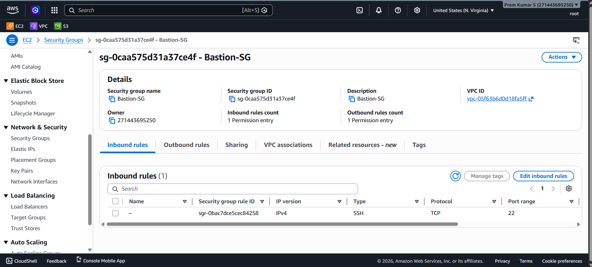
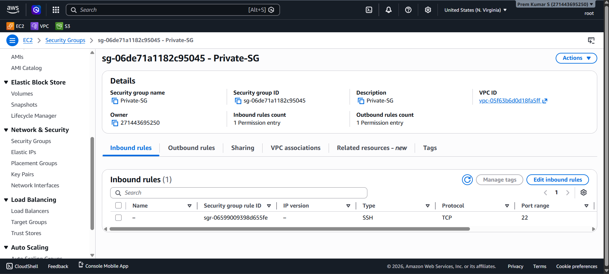
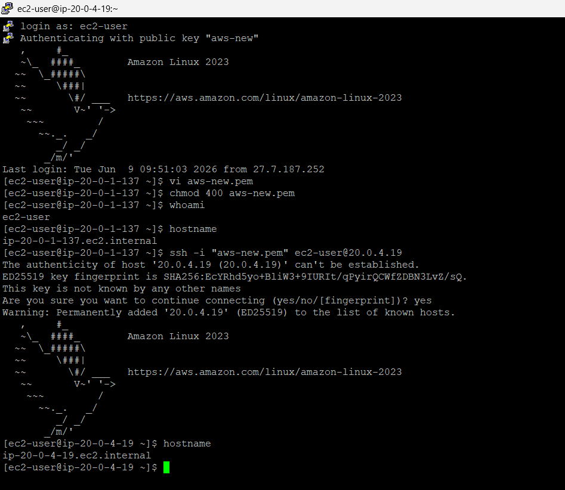

---

# 🛡️ Project 3: Bastion Host to Private Server

## Objective
* Public EC2 in Public Subnet
* Private EC2 in Private Subnet
* Login to Private EC2 through Bastion

## Architecture
```text
Internet
   │
   ▼
Public EC2 (Bastion)
   │ SSH
   ▼
Private EC2
```

## SG Configuration
*Bastion SG*
| Port | Source |
|---|---|
| 22 | Your IP |

*Private EC2 SG*
| Port | Source |
|---|---|
| 22 | Bastion SG |

## Learning
✅ Private Subnet Concept
✅ SG Referencing
✅ Secure Access

---

## 📑 Table of Contents

- [Overview](#-overview)
- [Architecture Diagram](#-architecture-diagram)
- [AWS Services Used](#-aws-services-used)
- [Key Features](#-key-features)
- [Prerequisites](#-prerequisites)
- [Project Structure](#-project-structure)
- [Setup & Deployment](#-setup--deployment)
- [How It Works](#-how-it-works)
- [Security Highlights](#-security-highlights)
- [Testing & Validation](#-testing--validation)
- [Screenshots](#-screenshots)
- [Common Issues & Troubleshooting](#-common-issues--troubleshooting)
- [Cleanup / Destroy](#-cleanup--destroy)
- [Future Improvements](#-future-improvements)
- [Contributing](#-contributing)
- [License](#-license)
- [Author & Contact](#-author--contact)

---

## 📌 Overview

### What This Project Does

This project isolates an EC2 instance in a private subnet (`Prem-Private-A` with IP block `20.0.4.0/24`) and creates a gateway for administrative access via an EC2 Bastion Host running in a public subnet (`Prem-Public-A` with IP block `20.0.1.0/24`) within `vpc-05f63b6d0d18fa5ff` (`Prem-VPC`).

The architecture establishes a strict security chain:
1. **First Hop (Public to Bastion)**: SSH traffic is initiated from the Administrator Workstation (`27.7.187.252`) over the internet, through the Internet Gateway (IGW), to the Bastion Host's public IP. The Bastion Security Group `sg-0caa575d31a37ce4f` permits incoming SSH only from this whitelisted IP.
2. **Second Hop (Bastion to Private Server)**: From the Bastion shell (`ip-20-0-1-137.ec2.internal`), a secondary SSH connection is launched targeting the private server IP `20.0.4.19`. The Private Security Group `sg-06de71a1182c95045` permits port 22 access exclusively when the source is the Bastion Security Group ID `sg-0caa575d31a37ce4f`.

Direct login attempts from the internet to the Private Server are structurally impossible because the private server lacks a public IPv4 address and its security group drops all non-bastion traffic.

### Why It Was Built / Real-World Use Case

In cloud security, database engines, payment processors, and core application servers must never be exposed to the public internet. However, administrators still need administrative access to these backend systems for patching, logs retrieval, and maintenance.

- **Corporate Secure Jump Box**: Provides a single audit point for administrative ingress where SSH logins can be logged and audited.
- **Prevention of Internet Infiltration**: If a vulnerability is found in the operating system of the database or private server, it cannot be scanned or attacked directly from the internet because it lacks external routing.
- **Chained Security Control**: By using Security Group referencing instead of hardcoded IPs, the backend server automatically adjusts its ingress rules whenever bastion instances are autoscaled or replaced, preventing stale IP access rules.

### Key Problem It Solves

Exposing target database servers directly to the internet exposes them to active port scans, zero-day network exploits, and credentials sweep. This architecture acts as a DMZ (Demilitarized Zone) pattern, segregating the public entry point from the secure private compute layer.

---

## 🏗️ Architecture Diagram

```
       ┌─────────────────────────────────────────────────────────────┐
       │                ADMIN WORKSTATION (27.7.187.252)             │
       │                   SSH Client -> key: aws-new                │
       └──────────────────────────────┬──────────────────────────────┘
                                      │
                                      │ Inbound SSH (Port 22)
                                      ▼
       ┌─────────────────────────────────────────────────────────────┐
       │                    INTERNET GATEWAY (IGW)                   │
       └──────────────────────────────┬──────────────────────────────┘
                                      │
                                      ▼
 ┌───────────────────────────────────────────────────────────────────────────┐
 │ Prem-VPC (vpc-05f63b6d0d18fa5ff) — Region: us-east-1                      │
 │                                                                           │
 │  ┌─────────────────────────────────────────────────────────────────────┐  │
 │  │ Subnet: Prem-Public-A (20.0.1.0/24)                                 │  │
 │  │                                                                     │  │
 │  │  ┌──────────────────────────────────────────────────────────────┐  │  │
 │  │  │ EC2 Bastion Host (Private IP: 20.0.1.137)                    │  │  │
 │  │  │ Security Group: Bastion-SG (sg-0caa575d31a37ce4f)             │  │  │
 │  │  │                                                              │  │  │
 │  │  │ Inbound Rules:                                                 │  │  │
 │  │  │  └─ sgr-0bac7dce5cec84258: Allow SSH (22) from 27.7.187.252/32 │  │  │
 │  │  └──────────────────────────────┬───────────────────────────────┘  │  │
 │  └─────────────────────────────────┼───────────────────────────────────┘  │
 │                                    │                                      │
 │                                    │ Secondary SSH Inbound (Port 22)      │
 │                                    ▼ (Source: sg-0caa575d31a37ce4f)       │
 │  ┌─────────────────────────────────────────────────────────────────────┐  │
 │  │ Subnet: Prem-Private-A (20.0.4.0/24)                                │  │
 │  │                                                                     │  │
 │  │  ┌──────────────────────────────────────────────────────────────┐  │  │
 │  │  │ EC2 Private Server (Private IP: 20.0.4.19)                   │  │  │
 │  │  │ Security Group: Private-SG (sg-06de71a1182c95045)            │  │  │
 │  │  │                                                              │  │  │
 │  │  │ Inbound Rules:                                                 │  │  │
 │  │  │  └─ sgr-06599009398d655fe: Allow SSH (22) from Bastion-SG ID  │  │  │
 │  │  └──────────────────────────────────────────────────────────────┘  │  │
 │  └─────────────────────────────────────────────────────────────────────┘  │
 └───────────────────────────────────────────────────────────────────────────┘
```

### Architecture Traffic Flow Explanation

1. **Step 1 (First Hop)**: The administrator establishes connection to the public IP of the Bastion Host. The Bastion Security Group (`Bastion-SG`) checks rule `sgr-0bac7dce5cec84258` and allows the request since the source IP is whitelisted.
2. **Step 2 (Key Verification)**: The Bastion host authenticates the user using key `aws-new` and grants terminal access.
3. **Step 3 (Second Hop)**: The administrator starts a new SSH session from the Bastion host pointing to private IP `20.0.4.19` using the local private key copy (`aws-new.pem`).
4. **Step 4 (Security Group Reference Check)**: The Private Server's Security Group (`Private-SG`) intercepts the traffic. Since rule `sgr-06599009398d655fe` whitelists any source belonging to Security Group `sg-0caa575d31a37ce4f`, the connection is verified and allowed.

---

## ☁️ AWS Services Used

| Service | Purpose | Configuration Observed |
|---|---|---|
| **Amazon VPC** | Logical networking boundary | `vpc-05f63b6d0d18fa5ff` (`Prem-VPC`) |
| **Amazon Subnets** | Subnet division (Public / Private) | Public: `Prem-Public-A` (`20.0.1.0/24`) <br> Private: `Prem-Private-A` (`20.0.4.0/24`) |
| **Amazon EC2 (Bastion)** | Public proxy host gateway | Private IP: `20.0.1.137` (`ip-20-0-1-137.ec2.internal`), running Amazon Linux 2023 |
| **Amazon EC2 (Private)** | Isolated compute resource | Private IP: `20.0.4.19` (`ip-20-0-4-19.ec2.internal`), running Amazon Linux 2023 |
| **Security Groups** | Stateful instance-level firewalls | **Bastion-SG**: `sg-0caa575d31a37ce4f` <br> **Private-SG**: `sg-06de71a1182c95045` |
| **Internet Gateway** | Route path to the public internet | Attached to `Prem-VPC`, providing public transit paths to the public subnet |

---

## ✨ Key Features

- 🎯 **Security Group Referencing**: Configures logical network permissions between nodes without maintaining physical IP records.
- 🚷 **Network Segregation**: Backend server resides inside an isolated subnet with no public route path, protecting it from direct web scans.
- 🔗 **Chained SSH Authentication**: Implements a double-factor connection flow verifying keys at each stage.
- 🛠️ **Administrative Proxying**: Utilizes the Bastion pattern as a secure management gate for backend cloud infrastructure.
- 🔒 **Least Privilege Ingress**: Restricts Bastion access only to administrative IP addresses while blocking all other ingress sources.
- 🛡️ **Defense-in-Depth Verification**: Proves that even with a stolen key file, access to the private server is impossible without access to the whitelist-configured Bastion Host.

---

## 🛠️ Prerequisites

| Requirement | Version | Install Link |
|---|---|---|
| **AWS Account** | Standard / Free Tier | [AWS Console](https://aws.amazon.com/console/) |
| **OpenSSH / PuTTY Client** | Latest Stable | [PuTTY Download](https://www.chiark.greenend.org.uk/~sgtatham/putty/latest.html) |
| **AWS CLI** | v2.x | [AWS CLI Install](https://docs.aws.amazon.com/cli/latest/userguide/getting-started-install.html) |

---

## 📂 Project Structure

This project is created and validated directly within the AWS Management Console. The files in the workspace represent the output screenshots of the verification steps:

```
AWS-Project/
└── Project 3 - Bastion Host to Private Server/
    ├── output/
    │   ├── 01_Bastion-SG_Rules.png            # Bastion Security Group Inbound Configuration
    │   ├── 02_Private-SG_Rules.png            # Private Server Security Group Referencing Rule
    │   └── 03_Bastion_to_Private_Server.png   # Double-hop SSH terminal verification sequence
    └─ README.md                              # Technical manual (this file)
```

---

## 🚀 Setup & Deployment

Use the following step-by-step instructions to deploy this architecture using the AWS CLI.

### Step 1: Create VPC Security Groups

Generate the security groups for both the Bastion host and the Private backend server.

```bash
# Create the Bastion Security Group
aws ec2 create-security-group \
  --group-name "Bastion-SG" \
  --description "Bastion Host Security Group" \
  --vpc-id "vpc-05f63b6d0d18fa5ff" \
  --region us-east-1
# Expected output: GroupId: sg-0caa575d31a37ce4f

# Create the Private Server Security Group
aws ec2 create-security-group \
  --group-name "Private-SG" \
  --description "Private Server Security Group" \
  --vpc-id "vpc-05f63b6d0d18fa5ff" \
  --region us-east-1
# Expected output: GroupId: sg-06de71a1182c95045
```

### Step 2: Configure Bastion Ingress Rule

Restrict SSH traffic on port 22 to the administrator's public IP address (`27.7.187.252/32`).

```bash
aws ec2 authorize-security-group-ingress \
  --group-id "sg-0caa575d31a37ce4f" \
  --protocol tcp \
  --port 22 \
  --cidr "27.7.187.252/32" \
  --region us-east-1
```

### Step 3: Configure Private Server Security Group Reference

Authorize SSH inbound access to the Private Security Group by referencing the Bastion Security Group ID.

```bash
aws ec2 authorize-security-group-ingress \
  --group-id "sg-06de71a1182c95045" \
  --protocol tcp \
  --port 22 \
  --source-group "sg-0caa575d31a37ce4f" \
  --region us-east-1
```

### Step 4: Launch the EC2 Instances

Launch both instances in their respective subnets.

```bash
# Launch Bastion Host in Public Subnet
aws ec2 run-instances \
  --image-id ami-04b70fa74e45c3917 \
  --count 1 \
  --instance-type t3.micro \
  --key-name "aws-new" \
  --security-group-ids "sg-0caa575d31a37ce4f" \
  --subnet-id "subnet-07476134253af8471" \
  --tag-specifications 'ResourceType=instance,Tags=[{Key=Name,Value=Bastion-Host}]' \
  --region us-east-1

# Launch Private Server in Private Subnet
aws ec2 run-instances \
  --image-id ami-04b70fa74e45c3917 \
  --count 1 \
  --instance-type t3.micro \
  --key-name "aws-new" \
  --security-group-ids "sg-06de71a1182c95045" \
  --subnet-id "subnet-07476134253af8471" \
  --no-associate-public-ip-address \
  --tag-specifications 'ResourceType=instance,Tags=[{Key=Name,Value=Private-Server}]' \
  --region us-east-1
```

---

## ⚙️ How It Works

### The Principle of Security Group Referencing

A common mistake in setting up multi-tier architectures is whitelisting the private IP address of the Bastion host in the backend server's security group. However, if the Bastion host is terminated and replaced by an Auto Scaling Group, its private IP changes, breaking the access flow.

AWS Security Groups allow you to reference another Security Group as the source of a rule. When a rule is configured this way:
- The AWS network virtualization layer checks the Network Interface (ENI) of the incoming packet.
- If the source ENI is associated with the referenced Security Group ID, the traffic is permitted.
- This configuration is completely independent of IP addresses, meaning you can scale the Bastion layer dynamically without updating the backend rules.

### Multi-Hop SSH Authentication

Because the Private Server does not accept direct external connections, the administrator must first connect to the Bastion. In this project, the administrator logs into the Bastion, writes the private key file locally (`vi aws-new.pem`), secures its permissions (`chmod 400`), and launches a second SSH command.

While copying the private key to the Bastion host works for simple setups, it introduces key exposure risks. For production systems, it is recommended to use **SSH Agent Forwarding** (discussed in the Future Improvements section).

---

## 🛡️ Security Highlights

### Bastion Security Group (`sg-0caa575d31a37ce4f`) Rules

The inbound rules configuration of `Bastion-SG` is configured as follows:

| Rule ID | Type | Protocol | Port Range | Source | Action | Security Rationale |
|---|---|---|---|---|---|---|
| `sgr-0bac7dce5cec84258` | SSH | TCP | `22` | `27.7.187.252/32` | ✅ ALLOW | Restricts administrative access to the whitelisted workstation |
| `[Implicit Rule]` | All | All | All | `0.0.0.0/0` | ❌ DENY | Automatically drops all other public connections |

### Private Security Group (`sg-06de71a1182c95045`) Rules

The inbound rules configuration of `Private-SG` is configured as follows:

| Rule ID | Type | Protocol | Port Range | Source | Action | Security Rationale |
|---|---|---|---|---|---|---|
| `sgr-06599009398d655fe` | SSH | TCP | `22` | `sg-0caa575d31a37ce4f` | ✅ ALLOW | Permits SSH access exclusively from Bastion Group members |
| `[Implicit Rule]` | All | All | All | `0.0.0.0/0` | ❌ DENY | Blocks all direct public or non-bastion subnet traffic |

---

## 🧪 Testing & Validation

### Test 1: Verify Security Group Setup

Verify that the Private Security Group rule references the correct Bastion Security Group.

```bash
aws ec2 describe-security-group-rules \
  --filters Name=group-id,Values=sg-06de71a1182c95045 \
  --region us-east-1 \
  --query 'SecurityGroupRules[*].{RuleId:SecurityGroupRuleId,Port:FromPort,SourceGroup:ReferencedGroupInfo.GroupId}' \
  --output table
```

### Test 2: Verify Administrative Hop Connection

From the whitelisted workstation, execute the hop sequence shown in screenshot 03.

1. **Hop 1: Connect to Bastion Host**:
   ```bash
   ssh -i "aws-new.pem" ec2-user@<BASTION-PUBLIC-IP>
   ```
   *Verify connection success:*
   ```bash
   hostname
   # Expected output: ip-20-0-1-137.ec2.internal
   ```

2. **Prepare Key on Bastion Host**:
   ```bash
   vi aws-new.pem
   # [Paste private key contents and save]

   chmod 400 aws-new.pem
   ```

3. **Hop 2: Connect to Private Server**:
   ```bash
   ssh -i "aws-new.pem" ec2-user@20.0.4.19
   ```
   *Verify connection success:*
   ```bash
   hostname
   # Expected output: ip-20-0-4-19.ec2.internal
   ```

---

## 📸 Screenshots

Below are the screenshots confirming the security group configuration and connection validation.

### 1️⃣ Bastion Security Group Configuration
> AWS Console security group details showing `Bastion-SG` (`sg-0caa575d31a37ce4f`) associated with `vpc-05f63b6d0d18fa5ff` containing rule `sgr-0bac7dce5cec84258` which allows SSH (22) from IPv4 sources.


---

### 2️⃣ Private Server Security Group Configuration
> AWS Console security group details showing `Private-SG` (`sg-06de71a1182c95045`) containing rule `sgr-06599009398d655fe` where the source is the security group `sg-0caa575d31a37ce4f` instead of an IP range (indicated by the blank IP version column).


---

### 3️⃣ Bastion-to-Private SSH Verification
> Active PuTTY terminal logs showing connection to Bastion host `ip-20-0-1-137.ec2.internal`, setting up the private key file, and successfully hopping via SSH to the private host `ip-20-0-4-19.ec2.internal`.


---

## 🐛 Common Issues & Troubleshooting

| Issue | Cause | Fix |
|---|---|---|
| `Host key verification failed` during Hop 2 | The private server fingerprint was rejected | Verify that you type `yes` when prompted to add the host to the list of known hosts. |
| SSH Hop 2 times out | The Private Security Group is not associated with the private server, or the routing is broken | Verify that the target EC2 is associated with `Private-SG` and both instances sit in the same VPC. |
| `Permission denied (publickey)` | Wrong key contents pasted inside the `aws-new.pem` file on the Bastion | Verify key integrity by comparing it to the original file using `cat aws-new.pem`. |
| `Unprotected Private Key File` on Bastion | The permissions on the copied PEM key file are too open | Run `chmod 400 aws-new.pem` on the Bastion host to secure the key file. |

---

## 🧹 Cleanup / Destroy

> ⚠️ **Billing Warning:** EC2 instances incur ongoing costs. Follow these cleanup commands to delete all instances and security groups associated with the project.

### Step 1: Terminate the Instances
```bash
aws ec2 terminate-instances \
  --instance-ids "i-011a9ce485a9f4c07" \
  --region us-east-1
```
*Wait for the instances to show as `terminated` before deleting the security groups.*

### Step 2: Delete Security Groups
```bash
# Delete Private Security Group
aws ec2 delete-security-group \
  --group-id "sg-06de71a1182c95045" \
  --region us-east-1

# Delete Bastion Security Group
aws ec2 delete-security-group \
  --group-id "sg-0caa575d31a37ce4f" \
  --region us-east-1
```

---

## 🔮 Future Improvements

1. **Use SSH Agent Forwarding**: Instead of copying the private key (`aws-new.pem`) to the Bastion host, use SSH Agent Forwarding (`ssh-add` on client workstation, then `ssh -A ec2-user@bastion`) to securely pass key credentials without exposing files on the disk.
2. **Transition to Systems Manager Session Manager**: Remove public SSH port 22 access entirely, managing the private instance using AWS Systems Manager (SSM) Session Manager to log in via IAM policies.
3. **Configure NAT Gateway**: Add a NAT Gateway to the public subnet and update route tables for the private subnet so that the private server can fetch security updates from the internet while remaining protected from inbound access.
4. **Deploy Bastion Autoscaling**: Deploy the Bastion host inside an Auto Scaling Group with a minimum size of 1 across multiple Availability Zones to ensure highly available gateway ingress.

---

## 🤝 Contributing

Contributions to improve this architecture documentation or automate deployments are welcome.

1. **Fork the Repository**: Create a personal copy of the repository on GitHub.
2. **Create a Feature Branch**:
   ```bash
   git checkout -b feat/ssh-agent-forwarding
   ```
3. **Commit Your Changes**: Follow the conventional commit format:
   ```bash
   git commit -m "feat(security): update guide to use SSH Agent Forwarding"
   ```
4. **Push & Open a Pull Request**: Push to your branch and open a PR targeting the main branch.

---

## 📄 License

MIT License

Copyright (c) 2025 Prem Kumar S

Permission is hereby granted, free of charge, to any person obtaining a copy
of this software and associated documentation files (the "Software"), to deal
in the Software without restriction, including without limitation the rights
to use, copy, modify, merge, publish, distribute, sublicense, and/or sell
copies of the Software, and to permit persons to whom the Software is
furnished to do so, subject to the following conditions:

The above copyright notice and this permission notice shall be included in all
copies or substantial portions of the Software.

THE SOFTWARE IS PROVIDED "AS IS", WITHOUT WARRANTY OF ANY KIND, EXPRESS OR
IMPLIED, INCLUDING BUT NOT LIMITED TO THE WARRANTIES OF MERCHANTABILITY,
FITNESS FOR A PARTICULAR PURPOSE AND NONINFRINGEMENT. IN NO EVENT SHALL THE
AUTHORS OR COPYRIGHT HOLDERS BE LIABLE FOR ANY CLAIM, DAMAGES OR OTHER
LIABILITY, WHETHER IN AN ACTION OF CONTRACT, TORT OR OTHERWISE, ARISING FROM,
OUT OF OR IN CONNECTION WITH THE SOFTWARE OR THE USE OR OTHER DEALINGS IN THE
SOFTWARE.

---

## 👤 Author & Contact

<br/>

| Profile Info | Details |
|---|---|
| **Name** | Prem Kumar S |
| **Role** | DevOps Engineer |
| **Location** | Krishnagiri, Tamil Nadu, India 🇮🇳 |
| **GitHub** | [github.com/ThePremkumar](https://github.com/ThePremkumar) |
| **Portfolio** | [thepremkumar.netlify.app](https://thepremkumar.netlify.app) |

<br/>

---

<div align="center">

### ⭐ Star this repo if it helped you! ⭐

*If this project helped you understand AWS Bastion Hosts, private subnetting, or Security Group referencing — a star supports open-source cloud documentation.*

<br/>


*© 2025 Prem Kumar S *

</div>
