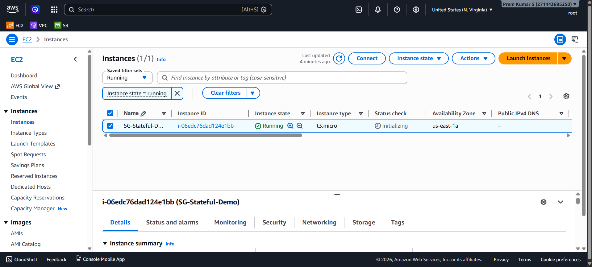
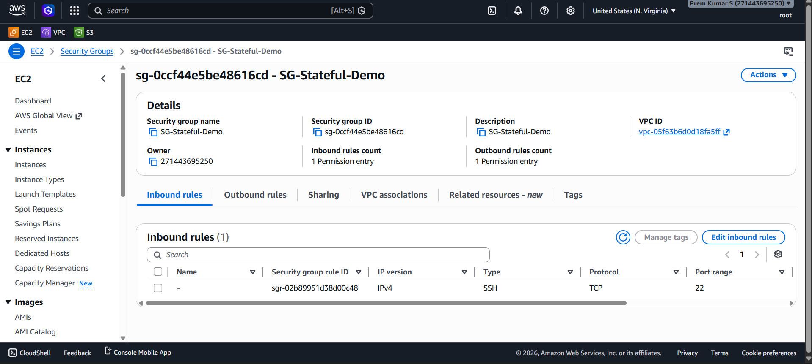
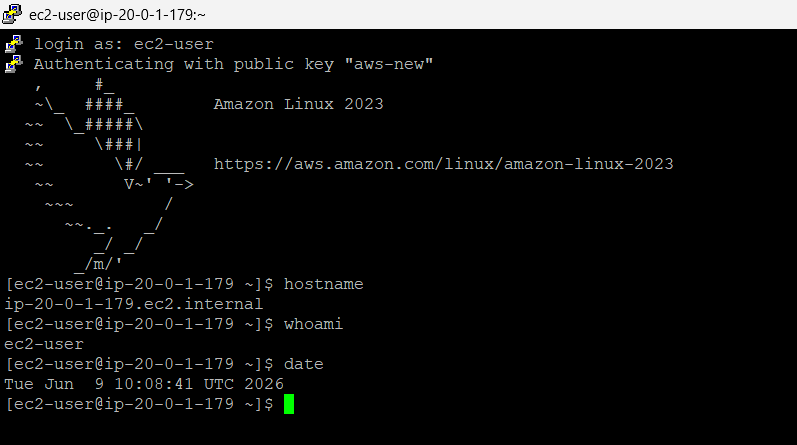

---

# 🔐 Project 5: Security Group Stateful Demo

> **Demonstrate the stateful behaviour of AWS Security Groups** — prove that a single SSH inbound rule is sufficient for a complete interactive session, because Security Groups automatically permit return traffic without any explicit outbound rule.

This project isolates and proves one of the most important and commonly misunderstood properties of AWS Security Groups: **statefulness**. With only one inbound rule (SSH port 22) and the default outbound rule, a complete SSH login, command execution, and session teardown works flawlessly — while a stateless equivalent would require explicit bidirectional rules.

---

## 📑 Table of Contents

- [Overview](#-overview)
- [Architecture Diagram](#-architecture-diagram)
- [AWS Services Used](#-aws-services-used)
- [Key Features](#-key-features)
- [Prerequisites](#-prerequisites)
- [Project Structure](#-project-structure)
- [Setup & Deployment](#-setup--deployment)
- [How It Works](#-how-it-works)
- [Security Highlights](#-security-highlights)
- [Testing & Validation](#-testing--validation)
- [Screenshots](#-screenshots)
- [Common Issues & Troubleshooting](#-common-issues--troubleshooting)
- [Cleanup / Destroy](#-cleanup--destroy)
- [Future Improvements](#-future-improvements)
- [Contributing](#-contributing)
- [License](#-license)
- [Author & Contact](#-author--contact)

---

## 📌 Overview

### What This Project Does

This project provisions an EC2 instance (`SG-Stateful-Demo`) inside `Prem-VPC` and attaches a purpose-built Security Group (`SG-Stateful-Demo`) with **only one inbound rule: SSH on port 22**. No custom outbound rules are configured — only the AWS default (allow all outbound). A successful SSH session is then established, and commands (`hostname`, `whoami`, `date`) are executed to prove the connection is fully bidirectional.

**The core demonstration:** SSH response traffic (from EC2 back to the client's ephemeral port) flows without any explicit outbound allow rule — because Security Groups are stateful and automatically track and permit return traffic for established connections.

### Real-World Use Case

Understanding Security Group statefulness is foundational to correct AWS network security design:

- **Reducing rule complexity** — engineers who understand statefulness avoid adding redundant outbound rules for every inbound service, keeping Security Groups clean and auditable
- **Explaining why SSH works with one rule** — a common interview question and a source of confusion when migrating from stateless firewalls (iptables, NACLs)
- **Defence-in-depth design** — knowing the difference between NACL (stateless) and Security Group (stateful) allows architects to correctly layer both controls
- **Compliance and auditing** — minimal Security Group rules reduce attack surface and simplify compliance reviews

### Problem Solved

> "Why does SSH work with only an inbound rule on port 22? Where does the response traffic get permitted?"

This project answers that question with a live SSH session as proof — the response travels on ephemeral ports that are never explicitly listed in any outbound rule.

---

## 🏗️ Architecture Diagram

```
┌────────────────────────────────────────────────────────────────────────────┐
│                           ADMIN WORKSTATION                                │
│                    SSH Client → key: aws-new (.pem)                        │
│                    Source port: ephemeral (e.g., 54321)                    │
└────────────────────────────────┬───────────────────────────────────────────┘
                                 │  TCP :22 (SYN)
                                 ▼
┌────────────────────────────────────────────────────────────────────────────┐
│                      INTERNET GATEWAY (IGW)                                │
│              Attached to vpc-05f63b6d0d18fa5ff (Prem-VPC)                 │
└────────────────────────────────┬───────────────────────────────────────────┘
                                 │
                                 ▼
┌────────────────────────────────────────────────────────────────────────────┐
│  Prem-VPC (vpc-05f63b6d0d18fa5ff) — us-east-1                              │
│                                                                            │
│  ┌──────────────────────────────────────────────────────────────────────┐  │
│  │  Subnet — us-east-1a                                                 │  │
│  │  Private IP: 20.0.1.179 (ip-20-0-1-179.ec2.internal)                │  │
│  │                                                                      │  │
│  │  ┌────────────────────────────────────────────────────────────────┐  │  │
│  │  │  Security Group: SG-Stateful-Demo (sg-0ccf44e5be48616cd)       │  │  │
│  │  │                                                                │  │  │
│  │  │  INBOUND RULES (1):                                            │  │  │
│  │  │    sgr-02b89951d38d00c48 · SSH · TCP · port 22 · IPv4 ✅       │  │  │
│  │  │                                                                │  │  │
│  │  │  OUTBOUND RULES (1 — default):                                 │  │  │
│  │  │    All traffic · All protocols · All ports · 0.0.0.0/0 ✅      │  │  │
│  │  │                                                                │  │  │
│  │  │  STATEFUL TRACKING:                                            │  │  │
│  │  │    Inbound TCP :22 ALLOW → connection state tracked            │  │  │
│  │  │    Return traffic (ephemeral port) → auto-permitted ✅          │  │  │
│  │  └────────────────────────────┬───────────────────────────────────┘  │  │
│  │                               │  ✅ ALLOWED                           │  │
│  │                               ▼                                       │  │
│  │  ┌────────────────────────────────────────────────────────────────┐  │  │
│  │  │  EC2: SG-Stateful-Demo (i-06edc76dad124e1bb)                   │  │  │
│  │  │  Instance type: t3.micro                                       │  │  │
│  │  │  AMI: Amazon Linux 2023                                        │  │  │
│  │  │  Private IP: 20.0.1.179                                        │  │  │
│  │  │  Hostname: ip-20-0-1-179.ec2.internal                          │  │  │
│  │  │  AZ: us-east-1a                                                │  │  │
│  │  │  User: ec2-user                                                │  │  │
│  │  └────────────────────────────────────────────────────────────────┘  │  │
│  └──────────────────────────────────────────────────────────────────────┘  │
└────────────────────────────────────────────────────────────────────────────┘
```

**SSH Session Flow (Stateful):**

```
Client → [TCP SYN  :22]        → IGW → Security Group (Rule: SSH :22 ALLOW) → EC2
Client ← [TCP SYN-ACK :54321] ← IGW ← Security Group (STATE TRACKED → auto-permit) ← EC2
Client → [SSH Data]            → IGW → Security Group (ESTABLISHED → auto-permit) → EC2
Client ← [SSH Response]        ← IGW ← Security Group (ESTABLISHED → auto-permit) ← EC2
```

> No outbound rule for ephemeral ports is needed — the Security Group connection state table handles return traffic automatically.

---

## ☁️ AWS Services Used

| Service | Purpose | Configuration Observed |
|---|---|---|
| **Amazon VPC** | Isolated network environment | `vpc-05f63b6d0d18fa5ff` — `Prem-VPC`, `us-east-1` |
| **Amazon EC2** | Virtual machine for the stateful demo | `i-06edc76dad124e1bb` — `SG-Stateful-Demo`, `t3.micro`, `us-east-1a`, Amazon Linux 2023 |
| **Security Groups** | Stateful instance-level firewall (the subject of this project) | `sg-0ccf44e5be48616cd` — `SG-Stateful-Demo`; 1 inbound (SSH :22), 1 outbound (default) |
| **Internet Gateway** | Provides public internet access to the VPC | Attached to `Prem-VPC` (inferred from successful SSH from external client) |
| **Key Pair** | SSH authentication | Key name: `aws-new`; used to authenticate as `ec2-user` |

---

## ✨ Key Features

- 🔄 **Stateful Connection Tracking Proven** — a single SSH inbound rule permits a complete interactive session; return traffic flows without any explicit outbound rule for ephemeral ports
- 🔒 **Minimal Attack Surface** — Security Group has exactly 1 inbound rule and 1 outbound rule (default) — the smallest possible footprint for SSH access
- 🖥️ **Live SSH Session Evidence** — commands `hostname`, `whoami`, and `date` executed on `ip-20-0-1-179.ec2.internal` confirm full bidirectional connectivity
- 🧠 **Concept Isolation** — no NACL, no additional security groups, no extra rules — the project is structured to demonstrate one specific behaviour with zero noise
- 📊 **NACL vs Security Group Contrast** — complements Project 2 (NACL stateless demo); together they show when each layer behaves and how statefulness differs fundamentally
- 🗝️ **Key-Pair Authentication** — PEM key (`aws-new`) used for SSH — no password-based access; only authorized key holders can connect
- 🌐 **VPC Reuse** — deployed inside `Prem-VPC` (`vpc-05f63b6d0d18fa5ff`), demonstrating shared infrastructure across multiple projects

---

## ✅ Prerequisites

| Requirement | Detail | Link |
|---|---|---|
| **AWS Account** | Free Tier eligible | [aws.amazon.com/free](https://aws.amazon.com/free/) |
| **IAM Permissions** | `ec2:*`, `vpc:*` | [IAM Docs](https://docs.aws.amazon.com/IAM/latest/UserGuide/) |
| **Existing VPC** | `Prem-VPC` (`vpc-05f63b6d0d18fa5ff`) from Project 1 | See Project 1 README |
| **SSH Key Pair** | `aws-new.pem` — used for EC2 authentication | AWS Console → EC2 → Key Pairs |
| **SSH Client** | Terminal, Git Bash, PuTTY, or WSL | — |
| **AWS Region** | `us-east-1` (N. Virginia) | All resources here |

### IAM Minimum Permissions Required

```json
{
  "Version": "2012-10-17",
  "Statement": [
    {
      "Effect": "Allow",
      "Action": [
        "ec2:*",
        "vpc:*"
      ],
      "Resource": "*"
    }
  ]
}
```

---

## 📁 Project Structure

```
AWS Project/
└── Project 5 - Security Group Stateful Demo/
    │
    ├── README.md                              ← This file
    │
    └── output/                                ← Evidence screenshots
        ├── 01_EC2_Instance_Running.png        ← SG-Stateful-Demo EC2 in Running state, t3.micro, us-east-1a
        ├── 02_Security_Group_Inbound_Rules.png ← SG-Stateful-Demo with 1 inbound SSH :22 rule
        └── 03_SSH_Commands_Execution.png      ← SSH session: hostname, whoami, date commands
```

> **Note:** This project reuses `Prem-VPC` (`vpc-05f63b6d0d18fa5ff`) provisioned in Project 1. Only the EC2 instance and Security Group are new.

---

## 🚀 Setup & Deployment

### Step 1 — Create the Security Group

Navigate to **EC2 → Security Groups → Create Security Group**:

| Setting | Value |
|---|---|
| **Security group name** | `SG-Stateful-Demo` |
| **Description** | `SG-Stateful-Demo` |
| **VPC** | `Prem-VPC` (`vpc-05f63b6d0d18fa5ff`) |

**Inbound rules — Add one rule only:**

| Type | Protocol | Port Range | Source | Description |
|---|---|---|---|---|
| SSH | TCP | 22 | `<your-ip>/32` or `0.0.0.0/0` | SSH access |

> **Leave outbound rules as default** — do not add or remove anything. This is critical to the demo.

Click **Create Security Group**.

> Result: `sg-0ccf44e5be48616cd` — `SG-Stateful-Demo` with **1 inbound rule** and **1 outbound rule (default)**.

---

### Step 2 — Launch the EC2 Instance

Navigate to **EC2 → Instances → Launch Instances**:

| Setting | Value |
|---|---|
| **Name** | `SG-Stateful-Demo` |
| **AMI** | Amazon Linux 2023 (x86_64) |
| **Instance Type** | `t3.micro` |
| **Key Pair** | `aws-new` |
| **VPC** | `Prem-VPC` (`vpc-05f63b6d0d18fa5ff`) |
| **Subnet** | Any public subnet in `us-east-1a` |
| **Auto-assign Public IP** | **Enable** |
| **Security Group** | `SG-Stateful-Demo` (`sg-0ccf44e5be48616cd`) |

Click **Launch Instance**. Wait for the **Instance state** to show **Running** and **Status check** to pass initialisation.

> Instance ID: `i-06edc76dad124e1bb` · AZ: `us-east-1a` · Private IP: `20.0.1.179`

---

### Step 3 — Connect via SSH

```bash
# Set restrictive permissions on the key file
chmod 400 aws-new.pem

# SSH into the instance using the public IP
ssh -i "aws-new.pem" ec2-user@<EC2-PUBLIC-IP>
```

Expected terminal banner (as seen in screenshot `03`):

```
login as: ec2-user
Authenticating with public key "aws-new"

       __|  __|_  )
       _|  (     /   Amazon Linux 2023
      ___|\___|___|

https://aws.amazon.com/linux/amazon-linux-2023
```

---

### Step 4 — Execute Verification Commands

Once connected, run the following commands to prove the session is fully functional:

```bash
# Confirm the instance hostname
hostname
```

Output:
```
ip-20-0-1-179.ec2.internal
```

```bash
# Confirm the logged-in user
whoami
```

Output:
```
ec2-user
```

```bash
# Confirm the current UTC date and time
date
```

Output:
```
Tue Jun  9 10:08:41 UTC 2026
```

> All three commands succeeding confirms that the SSH session is fully established and bidirectional — using only the one inbound rule.

---

### Step 5 — Observe the Stateful Behaviour

While connected, open the AWS Console in a separate browser tab:

1. Navigate to **EC2 → Security Groups → `SG-Stateful-Demo`**
2. Open the **Outbound rules** tab
3. Confirm the only outbound entry is the default: **All traffic · All · All · 0.0.0.0/0**

**The key observation:** There is no outbound rule for TCP ports 1024–65535 (ephemeral). Yet your SSH terminal is receiving data — keystroke echoes, command outputs, the MOTD banner. This is proof that Security Groups track the connection state and automatically permit return traffic without an explicit rule.

---

## 🔍 How It Works

### 1. Security Group Statefulness Explained

AWS Security Groups maintain a **connection state table** at the network interface (ENI) level. When an inbound packet is evaluated and permitted by a rule:

```
Client sends SSH SYN to EC2:22
  → Security Group evaluates inbound rules
  → Rule sgr-02b89951d38d00c48 matches: SSH TCP :22 → ALLOW
  → Connection state is recorded: {src_ip, src_port, dst_ip=EC2, dst_port=22, proto=TCP}

EC2 responds with SYN-ACK to client's ephemeral port (e.g., :54321)
  → Security Group checks if this is a RETURN packet for a tracked connection
  → Match found in state table → AUTOMATICALLY PERMITTED (no rule evaluation)
  → Packet exits the EC2 ENI toward the client
```

The client never needed an outbound rule for `:54321` because the Security Group's connection tracker handles it. This is what **stateful** means: the firewall remembers who initiated the connection and allows the conversation to complete.

### 2. Contrast with Stateless NACLs (Project 2)

| Dimension | Security Group (this project) | NACL (Project 2) |
|---|---|---|
| **State tracking** | ✅ Yes — connection table maintained | ❌ No — each packet evaluated independently |
| **Return traffic** | Auto-permitted for established connections | Must be explicitly allowed with outbound rules |
| **Rule evaluation** | All rules evaluated; most permissive wins | Ordered by rule number; first match wins |
| **Scope** | Instance (ENI) | Subnet |
| **SSH with 1 rule** | ✅ Works — return traffic auto-permitted | ❌ Fails — must also allow outbound ephemeral ports |
| **Block override** | Cannot be overridden | Can override Security Group (sits upstream) |

### 3. EC2 Instance — `SG-Stateful-Demo` (`i-06edc76dad124e1bb`)

- **Instance type:** `t3.micro` — sufficient for SSH session demonstration
- **AMI:** Amazon Linux 2023 — confirmed by MOTD banner in SSH terminal
- **AZ:** `us-east-1a` in `Prem-VPC`
- **Private IP:** `20.0.1.179` — confirmed by hostname `ip-20-0-1-179.ec2.internal`
- **Key pair:** `aws-new` — used for public-key authentication; password login disabled

### 4. Security Group — `SG-Stateful-Demo` (`sg-0ccf44e5be48616cd`)

- **1 inbound permission entry:** SSH TCP :22 IPv4 (`sgr-02b89951d38d00c48`)
- **1 outbound permission entry:** Default — All traffic, all protocols, `0.0.0.0/0`
- **VPC:** `vpc-05f63b6d0d18fa5ff` — the same VPC used across all projects
- **Owner:** `271443695250`

The outbound default rule exists not because it is needed for SSH return traffic (statefulness handles that) but because it is AWS's default and allows initiated outbound connections from the EC2 instance — e.g., `yum update` calling out to Amazon package mirrors.

### 5. Key Pair — `aws-new`

SSH authentication uses a 2048-bit or 4096-bit RSA key pair named `aws-new`. The `.pem` private key file resides on the admin's machine. The corresponding public key is injected into the EC2 instance's `~/.ssh/authorized_keys` at launch time by the EC2 metadata service. No password is ever transmitted.

---

## 🛡️ Security Highlights

### Security Group Inbound Rules — `SG-Stateful-Demo` (`sg-0ccf44e5be48616cd`)

| Rule ID | IP Version | Type | Protocol | Port | Source | Action | Reasoning |
|---|---|---|---|---|---|---|---|
| `sgr-02b89951d38d00c48` | IPv4 | SSH | TCP | `22` | [source visible in full console] | ✅ Allow | Only rule needed for a complete SSH session due to stateful tracking |

### Security Group Outbound Rules

| Type | Protocol | Port | Destination | Action | Reasoning |
|---|---|---|---|---|---|
| All traffic | All | All | `0.0.0.0/0` | ✅ Allow (default) | AWS default; allows EC2-initiated outbound (e.g., package updates); SSH return traffic is handled by state, not this rule |

### Security Design Observations

| Design Choice | Detail |
|---|---|
| **Minimal inbound rules** | Only port 22 — no HTTP, HTTPS, or ICMP; zero unnecessary exposure |
| **No custom outbound rules** | Default outbound is kept intentionally — demonstrates that SSH return traffic does NOT rely on it |
| **Key-pair auth only** | Password authentication disabled on Amazon Linux 2023 by default |
| **No NACL involvement** | Project intentionally uses only the default NACL to isolate Security Group behaviour |
| **1 inbound = full SSH** | The most concise proof of statefulness possible |

---

## 🧪 Testing & Validation

### Test 1 — Confirm EC2 Instance is Running

```bash
aws ec2 describe-instances \
  --instance-ids i-06edc76dad124e1bb \
  --query 'Reservations[*].Instances[*].[InstanceId,State.Name,PublicIpAddress,PrivateIpAddress,Placement.AvailabilityZone]' \
  --output table \
  --region us-east-1
```

### Test 2 — Verify Security Group Has Only 1 Inbound Rule

```bash
aws ec2 describe-security-groups \
  --group-ids sg-0ccf44e5be48616cd \
  --query 'SecurityGroups[*].{Name:GroupName,Inbound:IpPermissions,Outbound:IpPermissionsEgress}' \
  --output json \
  --region us-east-1
```

### Test 3 — SSH Session (Key Validation)

```bash
# Connect with aws-new key
ssh -i "aws-new.pem" ec2-user@<EC2-PUBLIC-IP>
```

### Test 4 — Execute the Three Verification Commands

```bash
hostname
# Expected: ip-20-0-1-179.ec2.internal

whoami
# Expected: ec2-user

date
# Expected: Tue Jun  9 10:08:41 UTC 2026 (or current date)
```

### Test 5 — Prove Statefulness by Observing Outbound Rules

```bash
# While SSH session is active, check outbound rules
aws ec2 describe-security-groups \
  --group-ids sg-0ccf44e5be48616cd \
  --query 'SecurityGroups[*].IpPermissionsEgress' \
  --output json \
  --region us-east-1
```

The outbound rules will show only the default `All traffic` entry — no ephemeral port range rule — yet the SSH session is fully operational. This is the definitive stateful proof.

### Test 6 — Verify Packet-Level Statefulness (Advanced)

```bash
# From inside the SSH session, check active connections
ss -tnp | grep :22
```

Expected:
```
ESTAB  0  0  20.0.1.179:22  <client-ip>:<ephemeral-port>  users:(("sshd",...))
```

This shows the TCP connection state as `ESTABLISHED` — the Security Group's connection tracker maintains this state and permits all packets belonging to this session.

---

## 📸 Screenshots

### 1️⃣ EC2 Instances — SG-Stateful-Demo Running

> Instances list filtered to **Running** state. Instance `SG-Stateful-D...` (`i-06edc76dad124e1bb`) in **Running** state, type `t3.micro`, AZ `us-east-1a`. Status check: **Initializing** (captured immediately after launch). Instance detail panel visible at the bottom.



---

### 2️⃣ Security Group — Single SSH Inbound Rule

> Security Group `SG-Stateful-Demo` (`sg-0ccf44e5be48616cd`) details: Name, ID, Description all read `SG-Stateful-Demo`. VPC `vpc-05f63b6d0d18fa5ff`. **Inbound rules count: 1 Permission entry** · **Outbound rules count: 1 Permission entry**. Inbound rules tab showing rule `sgr-02b89951d38d00c48` — IPv4 · SSH · TCP · Port 22. No source column visible (scrolled off).



---

### 3️⃣ SSH Session — Commands Executed Successfully

> PuTTY/SSH terminal showing full login as `ec2-user` using key `aws-new` to `ip-20-0-1-179.ec2.internal`. Amazon Linux 2023 MOTD banner displayed. Three commands executed: `hostname` → `ip-20-0-1-179.ec2.internal`, `whoami` → `ec2-user`, `date` → `Tue Jun 9 10:08:41 UTC 2026`. Bidirectional SSH session fully functional with only 1 inbound SG rule.



---

## 🐛 Common Issues & Troubleshooting

| Issue | Cause | Fix |
|---|---|---|
| `Permission denied (publickey)` | Wrong key file, wrong username, or key not associated | Use `-i aws-new.pem` and `ec2-user` as username; confirm key was selected at launch |
| SSH connection times out | Security Group missing the SSH :22 inbound rule, or source IP restricted | Verify SG inbound rule includes your current IP; check `curl ifconfig.me` for current IP |
| `WARNING: UNPROTECTED PRIVATE KEY FILE!` | `.pem` file permissions too open | Run `chmod 400 aws-new.pem` on Linux/macOS |
| Instance stuck in Initializing | Status checks still running after launch | Wait 1–2 minutes; status check must pass before SSH succeeds |
| SSH connects but commands produce no output | Session partially established; MTU or network issue | Try `ssh -v` for verbose output; check Security Group outbound default rule is present |
| `hostname` returns unexpected value | Instance is in a different subnet | Confirm private IP `20.0.1.179` — hostname is derived from private IP |
| Cannot find instance in console | Filter not set to "Running" | Remove the "Instance state = running" filter or check all regions |
| Deleted outbound rule by mistake | Custom outbound deny blocks responses | Edit outbound rules → restore default: All traffic / All / 0.0.0.0/0 ALLOW |

---

## 🧹 Cleanup / Destroy

> ⚠️ **Billing Warning:** EC2 instances (`t3.micro`) accrue hourly charges even when idle. Terminate all resources after the demo to prevent unexpected AWS costs.

### Step 1 — Terminate EC2 Instance

```bash
aws ec2 terminate-instances \
  --instance-ids i-06edc76dad124e1bb \
  --region us-east-1
```

Wait for instance state → `terminated` before proceeding.

### Step 2 — Delete Security Group

```bash
aws ec2 delete-security-group \
  --group-id sg-0ccf44e5be48616cd \
  --region us-east-1
```

> Security Groups cannot be deleted while attached to a running instance — always terminate the instance first.

### Step 3 — Delete Key Pair (Optional)

```bash
aws ec2 delete-key-pair \
  --key-name aws-new \
  --region us-east-1
```

> Also delete the local `aws-new.pem` file from your machine:
```bash
rm aws-new.pem
```

### Step 4 — Verify Cleanup in Console

```
AWS Console → EC2 → Instances → confirm i-06edc76dad124e1bb shows "Terminated"
AWS Console → EC2 → Security Groups → confirm SG-Stateful-Demo is absent
```

---

## 🔮 Future Improvements

1. **Remove Default Outbound Rule** — Delete the default outbound `All traffic` rule from `SG-Stateful-Demo` and re-test SSH. The session will still work — proving that stateful return traffic is not reliant on the outbound rule at all, only on the Security Group connection state table. This is the most powerful follow-up experiment.

2. **Add NACL Layer for Contrast** — Attach `Prem-NACL` with an outbound DENY for ephemeral ports (1024–65535) and show that SSH breaks — demonstrating that NACLs, being stateless, can disrupt return traffic even when the Security Group allows the connection.

3. **Terraform IaC** — Encode the Security Group (`aws_security_group`, `aws_security_group_rule`) and EC2 (`aws_instance`) as Terraform resources with a variable for the admin source IP — making this demo reproducible with `terraform apply` in under 2 minutes.

4. **VPC Flow Logs Analysis** — Enable VPC Flow Logs on `Prem-VPC` and show log entries for the SSH session — demonstrating that the `ACCEPT` action appears for both the initial connection and return packets, with no `REJECT` entries despite no explicit outbound rule.

5. **Multi-Rule SG Experiment** — Add a second inbound rule (HTTP :80) to the same Security Group and deploy a simple Python HTTP server (`python3 -m http.server 80`) — demonstrating that multiple services can run behind a single Security Group with independent stateful tracking per connection.

---

## 🤝 Contributing

All contributions are welcome — corrections, additional experiments, or new security demonstrations.

```bash
# 1. Fork the repository
# Click "Fork" on GitHub → creates a copy under your account

# 2. Clone your fork
git clone https://github.com/<your-username>/<repo-name>.git
cd <repo-name>

# 3. Create a feature branch — never commit directly to main
git checkout -b feat/sg-outbound-removal-demo

# 4. Make changes and commit using Conventional Commits
git add .
git commit -m "feat(sg): add outbound rule removal stateful proof experiment"

# 5. Push and open a Pull Request
git push origin feat/sg-outbound-removal-demo
# GitHub → Compare & pull request → Describe changes → Submit
```

### Conventional Commit Types

```
feat      → New experiment, feature, or demonstration
fix       → Correction to commands, steps, or config values
docs      → README or documentation update only
refactor  → Restructure without changing the demo behaviour
chore     → Formatting, tooling, CI/CD changes
test      → New validation steps or CLI verification commands
```

---

## 📄 License

```
MIT License

Copyright (c) 2026 Prem Kumar S

Permission is hereby granted, free of charge, to any person obtaining a copy
of this software and associated documentation files (the "Software"), to deal
in the Software without restriction, including without limitation the rights
to use, copy, modify, merge, publish, distribute, sublicense, and/or sell
copies of the Software, and to permit persons to whom the Software is
furnished to do so, subject to the following conditions:

The above copyright notice and this permission notice shall be included in all
copies or substantial portions of the Software.

THE SOFTWARE IS PROVIDED "AS IS", WITHOUT WARRANTY OF ANY KIND, EXPRESS OR
IMPLIED, INCLUDING BUT NOT LIMITED TO THE WARRANTIES OF MERCHANTABILITY,
FITNESS FOR A PARTICULAR PURPOSE AND NONINFRINGEMENT. IN NO EVENT SHALL THE
AUTHORS OR COPYRIGHT HOLDERS BE LIABLE FOR ANY CLAIM, DAMAGES OR OTHER
LIABILITY, WHETHER IN AN ACTION OF CONTRACT, TORT OR OTHERWISE, ARISING FROM,
OUT OF OR IN CONNECTION WITH THE SOFTWARE OR THE USE OR OTHER DEALINGS IN THE
SOFTWARE.
```

---

## 👤 Author & Contact

<br/>

| | |
|---|---|
| **Name** | Prem Kumar S |
| **Role** | DevOps Engineer |
| **Location** | Krishnagiri, Tamil Nadu, India 🇮🇳 |
| **GitHub** | [github.com/ThePremkumar](https://github.com/ThePremkumar) |
| **Portfolio** | [thepremkumar.netlify.app](https://thepremkumar.netlify.app) |

<br/>

---

<div align="center">

### ⭐ Star this repo if it helped you! ⭐

*If this project helped you understand AWS Security Group statefulness, the difference between NACLs and Security Groups, or how return traffic flows without explicit rules — a star supports open-source cloud documentation.*

<br/>


*© 2026 Prem Kumar S · Krishnagiri, Tamil Nadu, India*

</div>
