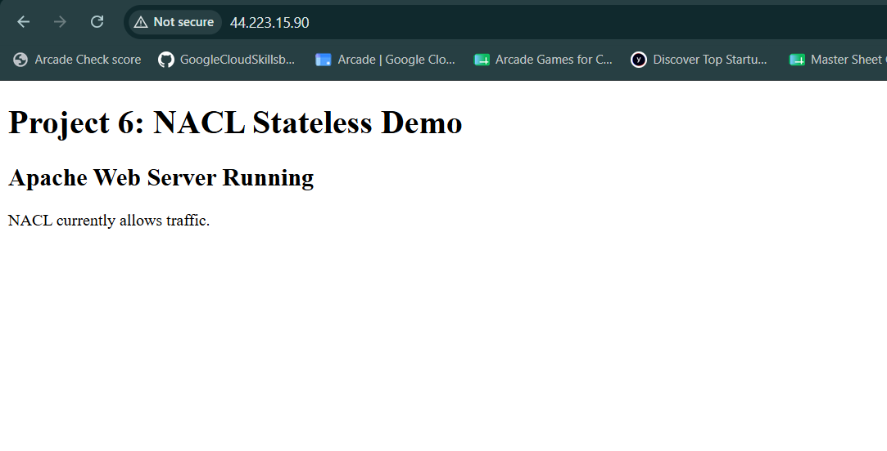
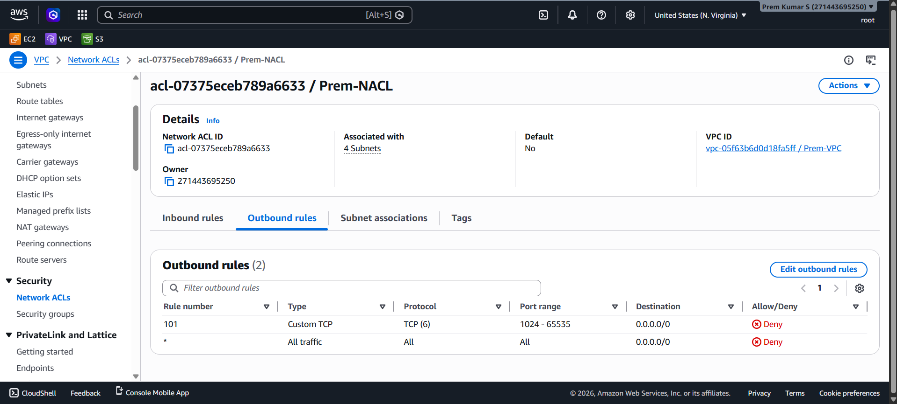
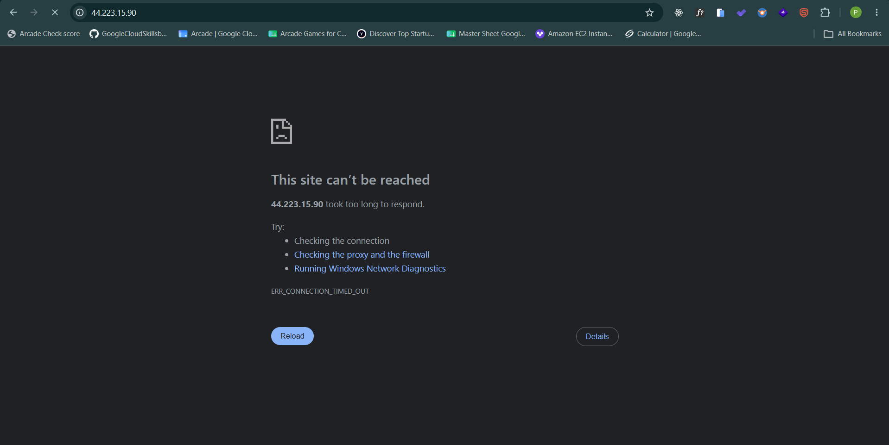
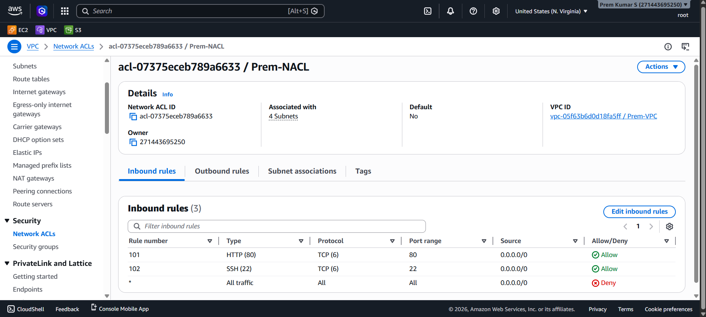

---

# 🔄 Project 6: NACL Stateless Demo

> **Prove NACL statefulness vs statelessness** — demonstrate that blocking outbound ephemeral ports (`1024–65535`) in a NACL breaks HTTP responses even when inbound HTTP port 80 is explicitly allowed, because NACLs evaluate every packet independently with no connection memory.

This project is the **direct counterpart to Project 5** (Security Group Stateful Demo). Where a Security Group automatically permits return traffic for any allowed inbound connection, a NACL does not. By blocking outbound ports `1024–65535` while keeping inbound port 80 open, this project proves that NACLs are **stateless** — each packet is independently evaluated, and a missing outbound rule kills the HTTP response stream.

---

## 📑 Table of Contents

- [Overview](#-overview)
- [Architecture Diagram](#-architecture-diagram)
- [AWS Services Used](#-aws-services-used)
- [Key Features](#-key-features)
- [Prerequisites](#-prerequisites)
- [Project Structure](#-project-structure)
- [Setup & Deployment](#-setup--deployment)
- [How It Works](#-how-it-works)
- [Security Highlights](#-security-highlights)
- [Testing & Validation](#-testing--validation)
- [Screenshots](#-screenshots)
- [Common Issues & Troubleshooting](#-common-issues--troubleshooting)
- [Cleanup / Destroy](#-cleanup--destroy)
- [Future Improvements](#-future-improvements)
- [Contributing](#-contributing)
- [License](#-license)
- [Author & Contact](#-author--contact)

---

## 📌 Overview

### What This Project Does

An Apache HTTP Server is running on an EC2 instance at public IP `44.223.15.90` inside `Prem-VPC`. The `Prem-NACL` (`acl-07375eceb789a6633`) is configured with:

- **Inbound Rule 101:** HTTP port 80 → `0.0.0.0/0` → ✅ **Allow**
- **Inbound Rule 102:** SSH port 22 → `0.0.0.0/0` → ✅ **Allow**
- **Outbound Rule 101:** Custom TCP ports `1024–65535` → `0.0.0.0/0` → ❌ **Deny**
- **Outbound Rule `*`:** All traffic → ❌ **Deny** (default catch-all)

**The result:** HTTP requests from a browser arrive at the EC2 instance (inbound :80 is allowed), Apache processes them and generates a response — but the response packets destined for the client's ephemeral port (e.g., `:54321`) are dropped at the subnet boundary by outbound rule 101. The browser receives nothing and reports `ERR_CONNECTION_TIMED_OUT`.

### Real-World Use Case

Understanding NACL statefulness is critical in production AWS networking:

- **Diagnosing "half-open" connection failures** — traffic enters a subnet but responses never leave; the root cause is always a missing or incorrect NACL outbound rule
- **Explaining why explicit outbound rules are mandatory for NACLs** — unlike Security Groups, NACLs require engineers to account for return traffic direction explicitly
- **Security architecture** — intentionally blocking ephemeral outbound ports can prevent data exfiltration from compromised instances while still allowing certain inbound management connections
- **Incident response** — blocking outbound ephemeral ports is a surgical way to stop an active server from sending data out while keeping the instance reachable for investigation

### Problem Solved

> "The NACL inbound allows HTTP port 80, Apache is running, but the website still won't load. Why?"

This project answers that precisely — the response packets use ephemeral ports (1024–65535) on the outbound path. Without an explicit outbound ALLOW for those ports, the NACL drops every response. The browser sees a timeout, not a refused connection.

---

## 🏗️ Architecture Diagram

### Phase 1 — Website Working (All NACL Rules Permissive)

```
┌───────────────────────────────────────────────────────────────────────────┐
│                          PUBLIC INTERNET                                  │
│                   Browser → http://44.223.15.90                           │
└───────────────────────────────────┬───────────────────────────────────────┘
                                    │  HTTP :80 (SYN)
                                    ▼
┌───────────────────────────────────────────────────────────────────────────┐
│                       INTERNET GATEWAY (IGW)                              │
│               Attached to vpc-05f63b6d0d18fa5ff (Prem-VPC)               │
└───────────────────────────────────┬───────────────────────────────────────┘
                                    │
                                    ▼
┌───────────────────────────────────────────────────────────────────────────┐
│  Prem-VPC (vpc-05f63b6d0d18fa5ff) — us-east-1                             │
│                                                                           │
│  ┌─────────────────────────────────────────────────────────────────────┐  │
│  │  Subnet (associated with Prem-NACL — 4 subnets total)               │  │
│  │                                                                     │  │
│  │  ┌──────────────────────────────────────────────────────────────┐   │  │
│  │  │  Prem-NACL Inbound (acl-07375eceb789a6633)                    │   │  │
│  │  │  Rule 101: HTTP  :80  TCP(6)  0.0.0.0/0  ✅ Allow             │   │  │
│  │  │  Rule 102: SSH   :22  TCP(6)  0.0.0.0/0  ✅ Allow             │   │  │
│  │  │  Rule  * : All traffic        0.0.0.0/0  ❌ Deny              │   │  │
│  │  └──────────────────────────┬───────────────────────────────────┘   │  │
│  │                             │  ✅ PASS — :80 matched rule 101        │  │
│  │                             ▼                                        │  │
│  │  ┌──────────────────────────────────────────────────────────────┐   │  │
│  │  │  EC2 + Apache httpd                                           │   │  │
│  │  │  Public IP: 44.223.15.90                                      │   │  │
│  │  │  Apache processes request → generates HTTP response           │   │  │
│  │  └──────────────────────────┬───────────────────────────────────┘   │  │
│  │                             │  Response → ephemeral port :54321      │  │
│  │                             ▼                                        │  │
│  │  ┌──────────────────────────────────────────────────────────────┐   │  │
│  │  │  Prem-NACL Outbound (PHASE 1 — no blocking rule)             │   │  │
│  │  │  (All outbound allowed in initial state)                     │   │  │
│  │  │  Response exits subnet ✅                                     │   │  │
│  │  └──────────────────────────────────────────────────────────────┘   │  │
│  └─────────────────────────────────────────────────────────────────────┘  │
└───────────────────────────────────────────────────────────────────────────┘

Result → Browser: HTTP 200 ✅  "Project 6: NACL Stateless Demo — Apache Web Server Running"
```

---

### Phase 2 — Website Broken (Outbound Ephemeral Ports Blocked)

```
┌───────────────────────────────────────────────────────────────────────────┐
│                          PUBLIC INTERNET                                  │
│                   Browser → http://44.223.15.90                           │
└───────────────────────────────────┬───────────────────────────────────────┘
                                    │  HTTP :80 (SYN)
                                    ▼
                      IGW → Prem-VPC → Subnet
                                    │
                                    ▼
┌───────────────────────────────────────────────────────────────────────────┐
│  Prem-NACL Inbound                                                        │
│  Rule 101: HTTP :80  ✅ Allow  ← packet matches, passes through           │
└───────────────────────────────────┬───────────────────────────────────────┘
                                    │  ✅ Inbound PASS
                                    ▼
┌───────────────────────────────────────────────────────────────────────────┐
│  EC2 / Apache                                                             │
│  Request RECEIVED ✅ · Response GENERATED ✅                               │
│  Response addressed to: client-ip:54321 (ephemeral port)                  │
└───────────────────────────────────┬───────────────────────────────────────┘
                                    │  Outbound response packet
                                    ▼
┌───────────────────────────────────────────────────────────────────────────┐
│  Prem-NACL Outbound (PHASE 2 — blocking rule added)                       │
│                                                                           │
│  Rule 101: Custom TCP  ports 1024–65535  0.0.0.0/0  ❌ DENY  ◄── MATCH  │
│            Port 54321 falls in 1024–65535 → PACKET DROPPED                │
│                                                                           │
│  Rule  * : All traffic             0.0.0.0/0  ❌ Deny (catch-all)         │
└───────────────────────────────────────────────────────────────────────────┘
              ❌ Response never exits the subnet
              ❌ Client receives nothing → timeout

Result → Browser: ERR_CONNECTION_TIMED_OUT ❌
         Apache:  Healthy — received and processed the request — never knew
```

**The Critical Insight:**
```
Stateful (Security Group):  Inbound ALLOW :80 → response auto-permitted (no outbound rule needed)
Stateless (NACL):           Inbound ALLOW :80 → response NOT auto-permitted → must explicitly
                            ALLOW outbound ephemeral ports 1024–65535 or response is dropped
```

```
HTTP Transaction Packet Flow:
  Browser SYN  → EC2:80          NACL Inbound Rule 101  ✅ Allow (port 80)
  EC2 SYN-ACK  → Browser:54321  NACL Outbound Rule 101  ❌ Deny  (port 54321 in 1024–65535)
                                 ↑ Breaks here — no connection established
```

---

## ☁️ AWS Services Used

| Service | Purpose | Configuration Observed |
|---|---|---|
| **Amazon VPC** | Isolated network environment | `vpc-05f63b6d0d18fa5ff` — `Prem-VPC`, `us-east-1` |
| **Network ACL (NACL)** | Stateless subnet-boundary firewall (the subject of this project) | `acl-07375eceb789a6633` — `Prem-NACL`, 4 subnets, 3 inbound rules, 2 outbound rules |
| **Internet Gateway** | Public internet access for the VPC | Attached to `Prem-VPC` (inferred from public IP `44.223.15.90` being reachable in Phase 1) |
| **Amazon EC2** | Virtual machine running Apache HTTP Server | Public IP `44.223.15.90`; running Apache httpd |
| **Apache httpd** | HTTP web server serving the demo page | Active on port 80; confirmed by Phase 1 browser screenshot |

---

## ✨ Key Features

- 🔄 **NACL Statefulness Proven by Failure** — inbound HTTP :80 is explicitly allowed, yet the website fails because the outbound return path for ephemeral ports `1024–65535` is denied
- 📊 **Outbound Ephemeral Port Block at Rule 101** — Custom TCP `1024–65535` → `0.0.0.0/0` → ❌ Deny — the most precise possible demonstration of why NACL outbound rules are mandatory
- ✅ **Live Browser Before-and-After** — four screenshots document the full progression: working page → NACL rule added → site broken with `ERR_CONNECTION_TIMED_OUT`
- 🧠 **Concept Isolation** — inbound HTTP allow is kept in place throughout; only the outbound path changes, isolating the exact mechanism
- 🔁 **Direct Complement to Project 5** — Project 5 (SG stateful) shows return traffic working without outbound rules; Project 6 (NACL stateless) shows why NACLs break without them
- 🌐 **Real Web Server Stack** — Apache on EC2 actually processes the inbound request; the failure happens strictly at the subnet egress boundary, not at the application layer
- 🔒 **Defence-in-Depth Pattern** — demonstrates how NACL outbound rules can be used as an additional data-exfiltration control layer independent of Security Groups
- 📸 **Four-Screenshot Evidence Trail** — from initial working state through NACL configuration to browser timeout — fully reproducible

---

## ✅ Prerequisites

| Requirement | Detail | Link |
|---|---|---|
| **AWS Account** | Free Tier eligible | [aws.amazon.com/free](https://aws.amazon.com/free/) |
| **IAM Permissions** | `ec2:*`, `vpc:*` including NACL management | [IAM Docs](https://docs.aws.amazon.com/IAM/latest/UserGuide/) |
| **Existing VPC** | `Prem-VPC` (`vpc-05f63b6d0d18fa5ff`) from Project 1 | See Project 1 README |
| **Existing NACL** | `Prem-NACL` (`acl-07375eceb789a6633`) from Project 2 | See Project 2 README |
| **EC2 + Apache** | Running web server on EC2 in a subnet associated with `Prem-NACL` | Deploy following Project 1 steps |
| **Web Browser** | Any modern browser for before/after validation | — |
| **AWS Region** | `us-east-1` (N. Virginia) | All resources here |

### IAM Minimum Permissions Required

```json
{
  "Version": "2012-10-17",
  "Statement": [
    {
      "Effect": "Allow",
      "Action": [
        "ec2:*",
        "vpc:*"
      ],
      "Resource": "*"
    }
  ]
}
```

---

## 📁 Project Structure

```
AWS Project/
└── Project 6 - NACL Stateless Demo/
    │
    ├── README.md                                       ← This file
    │
    └── output/                                         ← Ordered evidence screenshots
        ├── 01_Website_Working_Before_NACL_Change.png   ← Browser shows page: NACL allows traffic
        ├── 02_NACL_Outbound_Ephemeral_Ports_Blocked.png← Prem-NACL outbound: Rule 101 TCP 1024–65535 DENY
        ├── 03_Website_Failed_After_NACL_Change.png     ← ERR_CONNECTION_TIMED_OUT after outbound rule added
        └── 04_NACL_Inbound_HTTP_Allowed.png            ← Prem-NACL inbound: Rule 101 HTTP :80 + Rule 102 SSH :22 ALLOW
```

> **Note:** `Prem-NACL` (`acl-07375eceb789a6633`) and `Prem-VPC` (`vpc-05f63b6d0d18fa5ff`) are shared infrastructure reused from Projects 1 and 2.

---

## 🚀 Setup & Deployment

### Phase 1 — Deploy Web Server and Verify it Works

#### Step 1 — Launch EC2 with Apache

Follow Project 1 steps to deploy an EC2 instance with Apache running inside a subnet associated with `Prem-NACL`. Verify the website loads at:

```
http://44.223.15.90
```

Expected page (as seen in screenshot `01`):

```
Project 6: NACL Stateless Demo
Apache Web Server Running
NACL currently allows traffic.
```

✅ Confirm the website is fully accessible before making any NACL changes.

---

#### Step 2 — Confirm NACL Inbound Rules (Allow State)

Navigate to **VPC → Network ACLs → `Prem-NACL`** → **Inbound rules** tab:

| Rule # | Type | Protocol | Port | Source | Action |
|---|---|---|---|---|---|
| `101` | HTTP (80) | TCP (6) | `80` | `0.0.0.0/0` | ✅ Allow |
| `102` | SSH (22) | TCP (6) | `22` | `0.0.0.0/0` | ✅ Allow |
| `*` | All traffic | All | All | `0.0.0.0/0` | ❌ Deny |

> These rules must be in place before adding the outbound block.

---

### Phase 2 — Add Outbound DENY Rule for Ephemeral Ports

#### Step 3 — Add Outbound Rule 101 to Block Ephemeral Ports

Navigate to **VPC → Network ACLs → `Prem-NACL`** → **Outbound rules** tab → **Edit outbound rules** → **Add new rule**:

| Rule # | Type | Protocol | Port Range | Destination | Action |
|---|---|---|---|---|---|
| `101` | Custom TCP | TCP (6) | `1024 - 65535` | `0.0.0.0/0` | ❌ **Deny** |

Click **Save changes**.

> The default outbound catch-all `Rule *: All traffic → Deny` was already present. Adding Rule 101 ensures ephemeral port responses are explicitly denied before the catch-all.

**Final Outbound Rules State:**

| Rule # | Type | Protocol | Port Range | Destination | Action |
|---|---|---|---|---|---|
| `101` | Custom TCP | TCP (6) | `1024 - 65535` | `0.0.0.0/0` | ❌ **Deny** |
| `*` | All traffic | All | All | `0.0.0.0/0` | ❌ Deny |

---

#### Step 4 — Verify Website is Now Broken

Refresh or re-navigate to:

```
http://44.223.15.90
```

❌ The browser displays: **"This site can't be reached — 44.223.15.90 took too long to respond. ERR_CONNECTION_TIMED_OUT"**

Apache is still running and receiving the inbound HTTP request — but the response packet (bound for the client's ephemeral port) is silently dropped by outbound rule 101 at the subnet boundary.

---

### Phase 3 — Restore Access (Optional — Proof of Reversibility)

#### Step 5 — Remove the Outbound DENY Rule

```bash
aws ec2 delete-network-acl-entry \
  --network-acl-id acl-07375eceb789a6633 \
  --rule-number 101 \
  --no-egress \
  --region us-east-1
```

Wait 10–15 seconds and refresh the browser — the website should load again, confirming the rule was the only cause of the failure.

---

## 🔍 How It Works

### 1. The Stateless NACL Packet Evaluation Model

Unlike Security Groups, NACLs have **no connection state table**. Every single packet — whether it is a new connection SYN, an established data packet, or a response ACK — is evaluated against the rules independently, with no memory of what came before.

```
HTTP Request Arrives (inbound):
  Client IP: x.x.x.x, Source Port: 54321 → EC2:80
  NACL evaluates: Inbound Rule 101 → HTTP :80 → ALLOW ✅
  Packet reaches EC2 / Apache

HTTP Response Departs (outbound):
  EC2:80 → Client IP: x.x.x.x, Destination Port: 54321
  NACL evaluates outbound rules independently:
    Rule 101: Custom TCP 1024–65535 → destination port 54321 ∈ [1024,65535] → DENY ❌
    Packet is silently dropped at subnet egress
```

The NACL does not know this is the response to a connection it just let in. It treats every outbound packet as a brand-new, context-free evaluation.

### 2. Why Ephemeral Ports Are the Target

When a browser connects to a web server, the TCP stack on the client assigns a random **ephemeral (source) port** from the range typically `1024–65535` (or `49152–65535` on some operating systems). The server's response is addressed **back to that ephemeral port**. Blocking outbound `1024–65535` means blocking every HTTP response, HTTPS response, and SSH response destined for any client — making the subnet effectively one-way.

### 3. Inbound Rules — `Prem-NACL` (`acl-07375eceb789a6633`)

Three inbound rules as seen in screenshot `04`:

- **Rule 101** (HTTP :80 ALLOW) — permits browsers to reach Apache. This rule is intentionally left open throughout the demo to isolate the outbound as the blocking layer.
- **Rule 102** (SSH :22 ALLOW) — permits SSH for administration. Note: SSH also uses ephemeral ports for the response, so it would also be broken by the outbound rule — unless an explicit outbound rule for :22 responses was in place.
- **Rule `*`** (All traffic DENY) — default catch-all; drops anything not matched above.

### 4. Outbound Rules — `Prem-NACL` (`acl-07375eceb789a6633`)

Two outbound rules as seen in screenshot `02`:

- **Rule 101** (Custom TCP `1024–65535` DENY) — the demo rule; drops all response traffic from EC2 to any client ephemeral port.
- **Rule `*`** (All traffic DENY) — default catch-all; ensures nothing exits if not explicitly allowed (note: in the initial working state, this would have been either absent or an allow rule).

### 5. What Apache Sees

Apache on the EC2 instance receives the inbound HTTP GET request correctly — the inbound NACL rule passes it through. Apache generates a complete HTTP response. That response is handed off to the Linux TCP stack, which sends it out through the ENI. The packet arrives at the NACL outbound evaluation point and is dropped there. Apache logs the request as completed (access log shows a 200) even though the client never received the response.

### 6. Stateless vs Stateful — Side-by-Side

| Dimension | NACL (this project) | Security Group (Project 5) |
|---|---|---|
| **State tracking** | ❌ None — every packet evaluated independently | ✅ Yes — connection table maintained |
| **Return traffic** | Must be explicitly allowed with outbound rules | Auto-permitted for established connections |
| **Inbound :80 ALLOW** | Permits request in; response requires separate outbound rule | Permits request in; response auto-permitted |
| **Block mechanism** | Outbound rule 101 drops ephemeral port responses | N/A — SG return traffic cannot be blocked this way |
| **Result of ephemeral block** | `ERR_CONNECTION_TIMED_OUT` — silent drop | Not applicable |
| **Scope** | Subnet (before Security Group) | Instance (ENI) |

---

## 🛡️ Security Highlights

### NACL Inbound Rules — `Prem-NACL` (`acl-07375eceb789a6633`)

| Rule # | Type | Protocol | Port | Source | Action | Reasoning |
|---|---|---|---|---|---|---|
| `101` | HTTP (80) | TCP (6) | `80` | `0.0.0.0/0` | ✅ Allow | Permits inbound HTTP from all clients — intentionally open to isolate outbound as the blocker |
| `102` | SSH (22) | TCP (6) | `22` | `0.0.0.0/0` | ✅ Allow | Permits SSH management access — also affected by outbound ephemeral block |
| `*` | All traffic | All | All | `0.0.0.0/0` | ❌ Deny | Default catch-all — blocks all traffic not matched by rules above |

### NACL Outbound Rules — `Prem-NACL` (`acl-07375eceb789a6633`)

| Rule # | Type | Protocol | Port Range | Destination | Action | Reasoning |
|---|---|---|---|---|---|---|
| `101` | Custom TCP | TCP (6) | `1024–65535` | `0.0.0.0/0` | ❌ **Deny** | The core demo rule — blocks all TCP response traffic using ephemeral client ports |
| `*` | All traffic | All | All | `0.0.0.0/0` | ❌ Deny | Default catch-all — nothing exits unless explicitly allowed |

### Security Observations

| Observation | Detail |
|---|---|
| **Inbound permissive, outbound blocking** | HTTP :80 ALLOW inbound + ephemeral DENY outbound = one-way traffic — packets enter, responses are trapped |
| **Silent drop behaviour** | Outbound DENY causes `ERR_CONNECTION_TIMED_OUT` (not refused) — client receives no signal about why the connection failed |
| **Ephemeral block affects all TCP services** | Blocking `1024–65535` outbound breaks HTTP, HTTPS, and SSH response paths simultaneously |
| **Apache unaware of block** | The web server processes the request and logs a 200 response — the failure is invisible at the application layer |
| **Real-world use** | This pattern is used to prevent data exfiltration from compromised subnets while keeping inbound management paths open |

---

## 🧪 Testing & Validation

### Test 1 — Verify Website Works Before NACL Change

```bash
curl -I http://44.223.15.90
```

Expected (Phase 1):
```
HTTP/1.1 200 OK
Server: Apache/2.4.x (Amazon Linux)
Content-Type: text/html; charset=UTF-8
```

### Test 2 — Add Outbound Deny Rule via CLI

```bash
aws ec2 create-network-acl-entry \
  --network-acl-id acl-07375eceb789a6633 \
  --rule-number 101 \
  --protocol tcp \
  --rule-action deny \
  --egress \
  --cidr-block 0.0.0.0/0 \
  --port-range From=1024,To=65535 \
  --region us-east-1
```

### Test 3 — Verify Website Fails After NACL Change

```bash
curl --connect-timeout 15 -I http://44.223.15.90
```

Expected (Phase 2):
```
curl: (28) Connection timed out after 15001 milliseconds
```

> Timeout (not refused) confirms a silent drop — characteristic of NACL DENY, not SG DENY.

### Test 4 — Confirm Apache is Still Running (SSH into instance)

```bash
# SSH using the instance's public IP
ssh -i "your-key.pem" ec2-user@44.223.15.90
```

> Note: SSH will also timeout with the outbound ephemeral block in place (SSH responses also use ephemeral ports). To verify Apache is running while the outbound rule is active, you can temporarily remove the rule, SSH in, and re-add it — or use AWS Systems Manager Session Manager (no SSH needed).

```bash
# Once on the instance:
systemctl status httpd

# Check access log — should show the GET request from your browser attempts
tail -f /var/log/httpd/access_log
```

### Test 5 — Inspect Current NACL Outbound Rules

```bash
aws ec2 describe-network-acls \
  --network-acl-ids acl-07375eceb789a6633 \
  --query 'NetworkAcls[*].Entries[?Egress==`true`]' \
  --output json \
  --region us-east-1
```

### Test 6 — Restore and Confirm Recovery

```bash
# Remove the blocking outbound rule
aws ec2 delete-network-acl-entry \
  --network-acl-id acl-07375eceb789a6633 \
  --rule-number 101 \
  --egress \
  --region us-east-1

# Wait ~10 seconds then re-test
curl -I http://44.223.15.90
```

Expected after rule removal:
```
HTTP/1.1 200 OK
```

---

## 📸 Screenshots

### 1️⃣ Website Working — Before NACL Outbound Rule

> Browser at `http://44.223.15.90` showing the live page: **"Project 6: NACL Stateless Demo · Apache Web Server Running · NACL currently allows traffic."** The NACL outbound allows all traffic at this stage — no ephemeral port deny rule exists yet.



---

### 2️⃣ Prem-NACL — Outbound Rule 101 Ephemeral Ports Denied

> `Prem-NACL` (`acl-07375eceb789a6633`) — VPC `vpc-05f63b6d0d18fa5ff / Prem-VPC`, associated with **4 Subnets**, Default: **No**. **Outbound rules (2)** tab selected: **Rule 101** Custom TCP · TCP(6) · Port range `1024 - 65535` · Destination `0.0.0.0/0` · ❌ **Deny** · and Rule `*` All traffic · ❌ **Deny**.



---

### 3️⃣ Website Broken — ERR_CONNECTION_TIMED_OUT

> Browser at `http://44.223.15.90` shows: **"This site can't be reached — 44.223.15.90 took too long to respond. ERR_CONNECTION_TIMED_OUT"**. Apache is still running and receiving inbound HTTP requests — the HTTP response is dropped at the subnet boundary by NACL outbound rule 101.



---

### 4️⃣ Prem-NACL — Inbound Rules (HTTP and SSH Allowed)

> `Prem-NACL` (`acl-07375eceb789a6633`) **Inbound rules (3)** tab: **Rule 101** HTTP(80) · TCP(6) · Port `80` · Source `0.0.0.0/0` · ✅ **Allow** · **Rule 102** SSH(22) · TCP(6) · Port `22` · Source `0.0.0.0/0` · ✅ **Allow** · Rule `*` All traffic · ❌ **Deny**. Inbound port 80 is explicitly allowed throughout the demo.



---

## 🐛 Common Issues & Troubleshooting

| Issue | Cause | Fix |
|---|---|---|
| Website still loads after adding outbound rule 101 | NACL not associated with the correct subnet, or browser is serving cached content | Hard refresh (Ctrl+Shift+R); verify NACL subnet associations include the EC2's subnet |
| `ERR_CONNECTION_REFUSED` instead of timeout | Block is happening at Security Group (RST sent), not NACL (silent drop) | NACL drops cause timeout; check if SG is also blocking |
| Cannot SSH in to check Apache after adding outbound rule | SSH response also uses ephemeral ports — blocked by the same outbound rule 101 | Remove rule 101 temporarily to SSH in, verify, then re-add; or use AWS SSM Session Manager |
| Website broken but NACL outbound rule was removed | Rule removal takes ~5–15s to propagate; browser may also have a cached connection | Wait 15 seconds and hard-refresh |
| NACL outbound rule not taking effect | Wrong NACL ID used, or subnet associated with a different NACL | Verify subnet → NACL association in VPC console |
| Apache logs no requests after outbound block | Inbound block also in place, or EC2 is unreachable | Check inbound rule 101 exists: HTTP :80 ALLOW |
| Outbound rule `*` Deny was removed accidentally | The catch-all default deny was deleted | Re-add Rule `*` as All traffic DENY; this is the NACL's default terminating rule |
| Phase 3 (restore) — website still broken after rule deletion | Rule 101 not fully deleted; or client has stale TCP state | Verify `aws ec2 describe-network-acls` shows no rule 101 outbound; restart browser |

---

## 🧹 Cleanup / Destroy

> ⚠️ **Billing Warning:** EC2 instances and other running AWS resources incur ongoing charges. Remove all resources after completing the demo to prevent unexpected costs.

### Step 1 — Remove the NACL Outbound Deny Rule (Restore Normal State)

```bash
aws ec2 delete-network-acl-entry \
  --network-acl-id acl-07375eceb789a6633 \
  --rule-number 101 \
  --egress \
  --region us-east-1
```

### Step 2 — Terminate EC2 Instance

```bash
aws ec2 terminate-instances \
  --instance-ids <ec2-instance-id> \
  --region us-east-1
```

Wait for state → `terminated`.

### Step 3 — Delete Security Group (if project-specific)

```bash
aws ec2 delete-security-group \
  --group-id <sg-id> \
  --region us-east-1
```

### Step 4 — Delete Custom NACL (if no longer needed)

```bash
# First: disassociate from all subnets (via Console or CLI)
# Then delete:
aws ec2 delete-network-acl \
  --network-acl-id acl-07375eceb789a6633 \
  --region us-east-1
```

### Step 5 — Clean Up VPC Infrastructure (if fully tearing down)

```bash
# Delete subnets, detach and delete IGW, delete VPC
# See Project 1 README Cleanup section for full commands
```

### Step 6 — Verify in Console

```
VPC → Network ACLs → confirm Prem-NACL has no blocking outbound rule
EC2 → Instances → confirm instance is Terminated
```

---

## 🔮 Future Improvements

1. **Add Outbound Allow Rule for Ephemeral Ports Then Re-test** — After adding outbound deny rule 101, add outbound allow rule `100` for ports `1024–65535` (lower number = higher priority) and show the website returns to working — proving that rule ordering resolves the statefulness gap in NACLs.

2. **VPC Flow Logs — Visualise the Drop** — Enable VPC Flow Logs on `Prem-VPC` and query CloudWatch Logs Insights to show the outbound `REJECT` entries for port 54321 (or whichever ephemeral port was used) — making the packet-level drop visible and auditable.

3. **Terraform IaC** — Encode all NACL inbound/outbound rules as `aws_network_acl_rule` Terraform resources with a variable `block_ephemeral = true/false` — enabling the entire Phase 1 → Phase 2 → Phase 3 demo to be reproduced with a single `terraform apply` flag change.

4. **HTTPS (Port 443) Extension** — Add an SSL certificate, configure Apache for HTTPS, and demonstrate that blocking outbound ephemeral ports also breaks HTTPS responses — showing the pattern is protocol-agnostic.

5. **Compare Specific OS Ephemeral Ranges** — Run the demo blocking only `49152–65535` (Windows/modern Linux range) vs `1024–65535` (broader) and document which client OSes are affected — building practical knowledge of OS-specific ephemeral port ranges.

---

## 🤝 Contributing

All contributions welcome — corrections, extended experiments, or additional NACL rule scenarios.

```bash
# 1. Fork the repository on GitHub
# Click "Fork" → creates a copy under your account

# 2. Clone your fork locally
git clone https://github.com/<your-username>/<repo-name>.git
cd <repo-name>

# 3. Create a feature branch
git checkout -b feat/nacl-https-ephemeral-demo

# 4. Make changes and commit using Conventional Commits
git add .
git commit -m "feat(nacl): add HTTPS ephemeral port block demonstration"

# 5. Push and open a Pull Request
git push origin feat/nacl-https-ephemeral-demo
# GitHub → Compare & pull request → describe change → Submit
```

### Conventional Commit Types

```
feat      → New demonstration, experiment, or feature
fix       → Correction to CLI commands, steps, or config values
docs      → README or documentation update only
refactor  → Restructure without changing demo behaviour
chore     → Tooling, formatting, CI/CD
test      → New validation steps or CLI verification commands
```

---

## 📄 License

```
MIT License

Copyright (c) 2026 Prem Kumar S

Permission is hereby granted, free of charge, to any person obtaining a copy
of this software and associated documentation files (the "Software"), to deal
in the Software without restriction, including without limitation the rights
to use, copy, modify, merge, publish, distribute, sublicense, and/or sell
copies of the Software, and to permit persons to whom the Software is
furnished to do so, subject to the following conditions:

The above copyright notice and this permission notice shall be included in all
copies or substantial portions of the Software.

THE SOFTWARE IS PROVIDED "AS IS", WITHOUT WARRANTY OF ANY KIND, EXPRESS OR
IMPLIED, INCLUDING BUT NOT LIMITED TO THE WARRANTIES OF MERCHANTABILITY,
FITNESS FOR A PARTICULAR PURPOSE AND NONINFRINGEMENT. IN NO EVENT SHALL THE
AUTHORS OR COPYRIGHT HOLDERS BE LIABLE FOR ANY CLAIM, DAMAGES OR OTHER
LIABILITY, WHETHER IN AN ACTION OF CONTRACT, TORT OR OTHERWISE, ARISING FROM,
OUT OF OR IN CONNECTION WITH THE SOFTWARE OR THE USE OR OTHER DEALINGS IN THE
SOFTWARE.
```

---

## 👤 Author & Contact

<br/>

| | |
|---|---|
| **Name** | Prem Kumar S |
| **Role** | DevOps Engineer |
| **Location** | Krishnagiri, Tamil Nadu, India 🇮🇳 |
| **GitHub** | [github.com/ThePremkumar](https://github.com/ThePremkumar) |
| **Portfolio** | [thepremkumar.netlify.app](https://thepremkumar.netlify.app) |

<br/>

---

<div align="center">

### ⭐ Star this repo if it helped you! ⭐

*If this project helped you understand NACL statefulness, why outbound ephemeral port rules matter, or the critical difference between NACLs and Security Groups — a star supports open-source cloud documentation.*

<br/>


*© 2025 Prem Kumar S *

</div>
