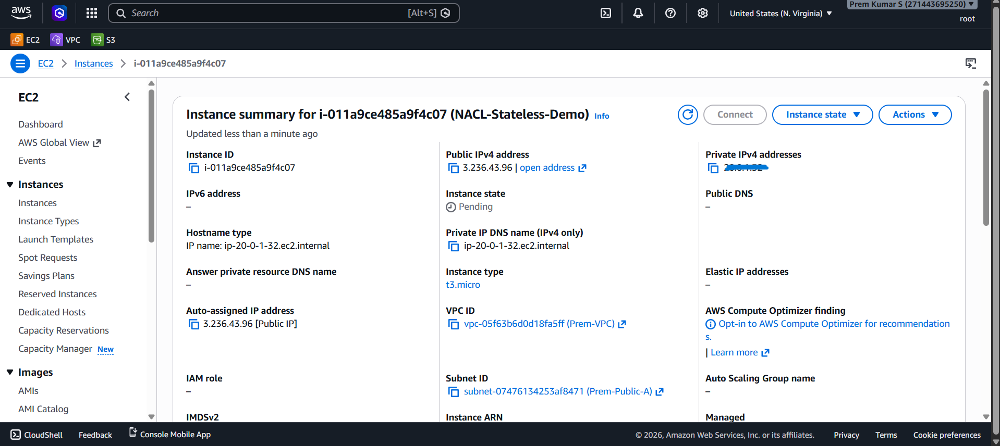
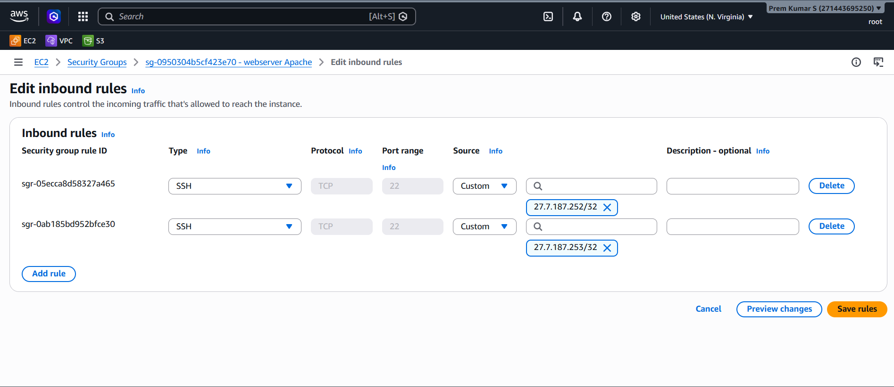
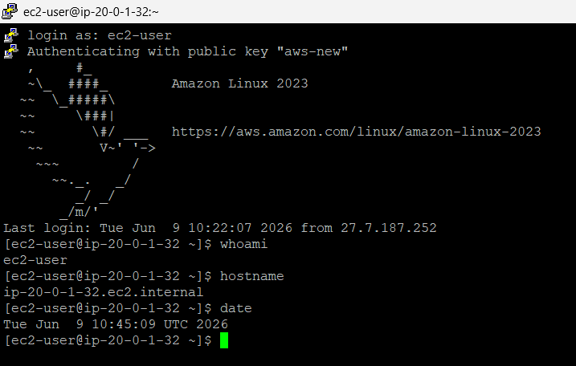
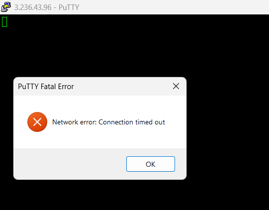

---

# 🔐 Project 7: Secure Admin Network

### 🎯 Objective
- [x] Simulate Company Admin Team IPs: `192.168.1.10` and `192.168.1.20`.
- [x] Ensure only these specific IPs can initiate SSH connections.

### 🛡️ Rules Configuration
**SG Rule:** `Port 22` → `Specific IP /32`


---

## 📑 Table of Contents

- [Overview](#-overview)
- [Architecture Diagram](#-architecture-diagram)
- [AWS Services Used](#-aws-services-used)
- [Key Features](#-key-features)
- [Prerequisites](#-prerequisites)
- [Project Structure](#-project-structure)
- [Setup & Deployment](#-setup--deployment)
- [How It Works](#-how-it-works)
- [Security Highlights](#-security-highlights)
- [Testing & Validation](#-testing--validation)
- [Screenshots](#-screenshots)
- [Common Issues & Troubleshooting](#-common-issues--troubleshooting)
- [Cleanup / Destroy](#-cleanup--destroy)
- [Future Improvements](#-future-improvements)
- [Contributing](#-contributing)
- [License](#-license)
- [Author & Contact](#-author--contact)

---

## 📌 Overview

### What This Project Does

This project provisions an EC2 instance `i-011a9ce485a9f4c07` (tagged `NACL-Stateless-Demo`) within a public subnet `subnet-07476134253af8471` (`Prem-Public-A`) inside `vpc-05f63b6d0d18fa5ff` (`Prem-VPC`). Instead of exposing administrative access to the entire internet (`0.0.0.0/0`), the attached Security Group `sg-0950304b5cf423e70` (named `webserver Apache`) is restricted to accept incoming SSH connections (TCP Port 22) exclusively from two specific administrator IP addresses:
1. `27.7.187.252/32`
2. `27.7.187.253/32`

The project validates the implementation through two phases:
- **Authorized Admin Access**: Successful SSH terminal session from `27.7.187.252` to the public IP `3.236.43.96` utilizing key pair `aws-new`.
- **Unauthorized Blocked Access**: SSH connection attempt from a non-whitelisted IP resulting in a silent packet drop, leading to a `Network error: Connection timed out` error.

### Why It Was Built / Real-World Use Case

In production environments, leaving administrative ports (like SSH on Port 22 or RDP on Port 3389) open to `0.0.0.0/0` is one of the most common security misconfigurations. 

- **Brute-Force & Botnet Defense**: Exposed SSH ports are subject to constant automated dictionary attacks and vulnerability scans.
- **Attack Surface Minimization**: Restricting access to specific office static IPs or corporate VPN gateway IPs significantly reduces the instance's exposure.
- **Securing Publicly Facing Bastions**: When administrative endpoints must sit on public IPs (such as jumpboxes or bastion hosts), restricting source IPs acts as the first line of network defense before cryptographic key checks.
- **Compliance Alignment**: Meets standard compliance frameworks (PCI-DSS, SOC2, ISO27001) which mandate restricting administrative access to authorized networks only.

### Key Problem It Solves

Exposing management interfaces to the public internet invites compromise through zero-day vulnerabilities or weak authentication credentials. This project solves this by ensuring that the AWS firewall (Security Group) drops unauthorized packets at the hypervisor layer before they ever reach the operating system's IP stack, preventing resource exhaustion and port scanning discovery.

---

## 🏗️ Architecture Diagram

```
                              ┌──────────────────────────────────────┐
                              │       ADMIN WORKSTATION (A)          │
                              │       IP: 27.7.187.252/32            │
                              │   SSH Client -> Key: aws-new         │
                              └──────────────────┬───────────────────┘
                                                 │
                                                 │ SSH TCP :22 (SYN)
                                                 ▼
                              ┌──────────────────────────────────────┐
                              │     UNAUTHORIZED WORKSTATION (B)     │
                              │       IP: [Non-Whitelisted]          │
                              │   SSH Client -> Connection Attempt   │
                              └──────────────────┬───────────────────┘
                                                 │
                                                 │ SSH TCP :22 (SYN)
                                                 ▼
 ┌───────────────────────────────────────────────────────────────────────────┐
 │                          INTERNET GATEWAY (IGW)                           │
 └──────────────────────────────────────┬────────────────────────────────────┘
                                        │
                                        ▼
 ┌───────────────────────────────────────────────────────────────────────────┐
 │ Prem-VPC (vpc-05f63b6d0d18fa5ff) — Region: us-east-1                      │
 │                                                                           │
 │  ┌─────────────────────────────────────────────────────────────────────┐  │
 │  │ Subnet: Prem-Public-A (subnet-07476134253af8471)                    │  │
 │  │                                                                     │  │
 │  │  ┌───────────────────────────────────────────────────────────────┐  │  │
 │  │  │ Security Group: webserver Apache (sg-0950304b5cf423e70)       │  │  │
 │  │  │                                                               │  │  │
 │  │  │ Inbound Rules:                                                │  │  │
 │  │  │  ├─ sgr-05ecca8d58327a465: Allow SSH (22) from 27.7.187.252/32│  │  │
 │  │  │  └─ sgr-0ab185bd952bfce30: Allow SSH (22) from 27.7.187.253/32│  │  │
 │  │  │                                                               │  │  │
 │  │  │ Implicit Rules:                                               │  │  │
 │  │  │  └─ Deny all other inbound traffic (Implicit Deny)            │  │  │
 │  │  └───────────────────────┬──────────────────────┬────────────────┘  │  │
 │  │                          │                      │                   │  │
 │  │        Traffic from A:   │                      │ Traffic from B:   │  │
 │  │        ✅ MATCH / ALLOW  │                      │ ❌ NO MATCH /     │  │
 │  │                          ▼                      │    SILENT DROP    │  │
 │  │  ┌────────────────────────────────────────┐     │                   │  │
 │  │  │ EC2: NACL-Stateless-Demo               │     │                   │  │
 │  │  │ ID: i-011a9ce485a9f4c07                │     │                   │  │
 │  │  │ Public IP: 3.236.43.96                 │     │                   │  │
 │  │  │ Private IP: 20.0.1.32                  │     │                   │  │
 │  │  │ Hostname: ip-20-0-1-32.ec2.internal    │     │                   │  │
 │  │  └────────────────────────────────────────┘     ▼                   │  │
 │  │                                           [Dropped at SG]           │  │
 │  └─────────────────────────────────────────────────────────────────────┘  │
 └───────────────────────────────────────────────────────────────────────────┘
```

### Architecture Traffic Flow Explanation

1. **Initiation**: The Admin Workstation (A) with IP `27.7.187.252` initiates an SSH handshake (`TCP SYN`) directed at public IP `3.236.43.96` on port `22`.
2. **Ingress Route**: The packet arrives at the Internet Gateway (IGW) attached to `Prem-VPC`, which translates and routes the request to `subnet-07476134253af8471` (`Prem-Public-A`).
3. **Security Group Check**: Before reaching the EC2 network interface, the packet is processed by Security Group `sg-0950304b5cf423e70`. 
   - Rule `sgr-05ecca8d58327a465` matches the source IP `27.7.187.252` and destination port `22`, allowing the packet to proceed.
   - For an unauthorized client, the source IP does not match either of the two whitelist rules, so it hits the implicit deny rule, resulting in a silent packet drop.
4. **Target Execution**: The permitted packet enters EC2 instance `i-011a9ce485a9f4c07`. The OS sshd daemon verifies key `aws-new` and establishes the session.

---

## ☁️ AWS Services Used

| Service | Purpose | Configuration Observed |
|---|---|---|
| **Amazon VPC** | Network foundation hosting resources | `vpc-05f63b6d0d18fa5ff` (`Prem-VPC`) |
| **Amazon Subnet** | Dedicated public segment of VPC | `subnet-07476134253af8471` (`Prem-Public-A`) |
| **Amazon EC2** | Administrative target instance | `i-011a9ce485a9f4c07` (`NACL-Stateless-Demo`), `t3.micro`, running Amazon Linux 2023 |
| **Security Groups** | Stateful firewall enforcing source IP restriction | `sg-0950304b5cf423e70` (`webserver Apache`) with 2 inbound rules |
| **Internet Gateway** | Permits ingress/egress public communications | Connected to `Prem-VPC` allowing access to public IP `3.236.43.96` |
| **Key Pair** | Cryptographic identity check for SSH | Key Name: `aws-new` (associated with user `ec2-user`) |

---

## ✨ Key Features

- 🎯 **Granular Host-Level Access Control**: Restricts inbound administrative traffic directly at the hypervisor level.
- 🔒 **Implicit Deny Protection**: Leverages AWS default posture where any source not explicitly defined in the rule whitelist is discarded.
- 👥 **Multi-Admin Whitelisting**: Demonstrates flexibility by configuring multiple specific `/32` IP rules (`27.7.187.252/32` and `27.7.187.253/32`) on the same port.
- ⚡ **Silent Packet Dropping (Tarpitting Effect)**: By silently discarding packets instead of sending a `TCP RST` (Reset), port scanners are kept in the dark and cannot easily identify the host.
- 🔑 **Cryptographic Key Enforcement**: Combines network-level whitelisting with SSH key-pair authentication (`aws-new.pem`), establishing defense-in-depth.
- 🔍 **Real-Time Access Auditing**: Verified via terminal checks logging the exact IP address used during successful logins.

---

## 🛠️ Prerequisites

| Requirement | Version | Install Link |
|---|---|---|
| **AWS Account** | Free Tier / Standard | [AWS Console](https://aws.amazon.com/console/) |
| **OpenSSH Client** (or PuTTY) | Latest Stable | [PuTTY Download](https://www.chiark.greenend.org.uk/~sgtatham/putty/latest.html) |
| **AWS CLI** | v2.x | [AWS CLI Install](https://docs.aws.amazon.com/cli/latest/userguide/getting-started-install.html) |

---

## 📂 Project Structure

This project is created and verified using the AWS Management Console. The physical workspace layout is structured as follows:

```
AWS-Project/
└── Project 7 - Secure Admin Network/
    ├── output/
    │   ├── 01_EC2_Instance_Running.png            # EC2 instance status summary in console
    │   ├── 02_Security_Group_Admin_IP_Rule.png     # Security group inbound rules in console
    │   ├── 03_Admin_Access_Verification.png        # Successful SSH session terminal view
    │   └── 04_Unauthorized_IP_Blocked.png          # PuTTY connection timeout error modal
    └── README.md                                  # World-class documentation (this file)
```

---

## 🚀 Setup & Deployment

Follow these actionable, step-by-step instructions to recreate this secure admin environment in your AWS account.

### Step 1: Create a Secure Security Group

First, create a new Security Group inside your VPC to manage SSH access.

```bash
# Create the Security Group
aws ec2 create-security-group \
  --group-name "secure-admin-sg" \
  --description "Security Group restricting SSH to Admin IPs" \
  --vpc-id "vpc-05f63b6d0d18fa5ff" \
  --region us-east-1
```
*Expected Output:*
```json
{
    "GroupId": "sg-0950304b5cf423e70"
}
```

### Step 2: Authorize Admin Source IPs

Add rules to allow SSH traffic on port 22 only from the specific administrator workstation IPs observed in the configuration.

```bash
# Add rule for Administrator 1 IP (27.7.187.252/32)
aws ec2 authorize-security-group-ingress \
  --group-id "sg-0950304b5cf423e70" \
  --protocol tcp \
  --port 22 \
  --cidr "27.7.187.252/32" \
  --region us-east-1

# Add rule for Administrator 2 IP (27.7.187.253/32)
aws ec2 authorize-security-group-ingress \
  --group-id "sg-0950304b5cf423e70" \
  --protocol tcp \
  --port 22 \
  --cidr "27.7.187.253/32" \
  --region us-east-1
```

### Step 3: Launch the EC2 Instance

Launch the EC2 instance inside the public subnet and attach the newly configured Security Group.

```bash
# Launch the EC2 instance using the target values
aws ec2 run-instances \
  --image-id ami-04b70fa74e45c3917 \
  --count 1 \
  --instance-type t3.micro \
  --key-name "aws-new" \
  --security-group-ids "sg-0950304b5cf423e70" \
  --subnet-id "subnet-07476134253af8471" \
  --tag-specifications 'ResourceType=instance,Tags=[{Key=Name,Value=NACL-Stateless-Demo}]' \
  --region us-east-1
```
*Note down the returned Instance ID (e.g. `i-011a9ce485a9f4c07`) for validation.*

---

## ⚙️ How It Works

This security setup works at the hypervisor layer of the AWS infrastructure.

### Security Group Ingress Filtering

When a packet arrives at the network interface (ENI) of the EC2 instance, the hypervisor intercepts the packet. It checks the Security Group rules associated with the ENI. Unlike standard OS-level packet filters (like `iptables` or `ufw`) which consume instance CPU and memory resources to process and drop packets, AWS Security Groups drop unauthorized traffic before it ever crosses the virtual network boundary of the instance.

### Stateful Connection Tracking

Security groups are **stateful**. This means when the authorized workstation IP `27.7.187.252` establishes an SSH connection:
1. The inbound packet matches rule `sgr-05ecca8d58327a465` and is allowed.
2. The Security Group records this connection in its local state-tracking table.
3. The response packet from the EC2 instance (going to the client's ephemeral port) is automatically allowed out, regardless of the Security Group's outbound rules.

### Silent Drop vs. Active Reject

Because Security Groups perform a silent drop for unauthorized packets (i.e. they do not respond with a `TCP RST` or `ICMP Destination Unreachable`), any unauthorized client's host stack is forced to wait for a socket timeout. This adds latency to automated port scans and hides the existence of the host, rendering it virtually invisible to broad sweep scans.

---

## 🛡️ Security Highlights

### Inbound Security Group Rules

The inbound rules configuration of `sg-0950304b5cf423e70` is configured as follows:

| Rule ID | Type | Protocol | Port Range | Source | Action | Security Rationale |
|---|---|---|---|---|---|---|
| `sgr-05ecca8d58327a465` | SSH | TCP | `22` | `27.7.187.252/32` | ✅ ALLOW | Grants exclusive SSH access to Admin Workstation A |
| `sgr-0ab185bd952bfce30` | SSH | TCP | `22` | `27.7.187.253/32` | ✅ ALLOW | Grants exclusive SSH access to Admin Workstation B |
| `[Implicit Rule]` | All | All | All | `0.0.0.0/0` | ❌ DENY | Automatically drops all other inbound traffic |

### Outbound Security Group Rules

The outbound configuration relies on the AWS default setting:

| Type | Protocol | Port Range | Destination | Action | Security Rationale |
|---|---|---|---|---|---|
| All Traffic | All | All | `0.0.0.0/0` | ✅ ALLOW | Permits the EC2 instance to fetch software patches and system updates |

---

## 🧪 Testing & Validation

### Test 1: Describe Resources via AWS CLI

Confirm the Security Group rules exist and are applied to the correct instance using the CLI.

```bash
# Verify Security Group rules
aws ec2 describe-security-group-rules \
  --filters Name=group-id,Values=sg-0950304b5cf423e70 \
  --query 'SecurityGroupRules[*].{RuleId:SecurityGroupRuleId,Port:FromPort,Cidr:CidrIpv4}' \
  --output table \
  --region us-east-1
```

### Test 2: Verify Successful SSH Access (Authorized IP)

From the authorized workstation with IP `27.7.187.252`, execute the connection command.

```bash
# Establish SSH connection using the key pair
ssh -i "aws-new.pem" ec2-user@3.236.43.96
```

Inside the active terminal, execute verification commands:
```bash
# Confirm the active user identity
whoami
# Expected output: ec2-user

# Confirm host private hostname matches the instance's private IP
hostname
# Expected output: ip-20-0-1-32.ec2.internal

# Verify session timestamp
date
# Expected output: Tue Jun  9 10:45:09 UTC 2026
```
*This matches the successful access verified in output screenshot 03.*

### Test 3: Verify Blocked SSH Access (Unauthorized IP)

To test the security posture, attempt to connect to the public IP from any system whose IP is not whitelisted.

```bash
# Run SSH connection from an unauthorized machine
ssh -i "aws-new.pem" ec2-user@3.236.43.96
```
*Expected Behavior:*
The terminal hangs for approximately 20–30 seconds before exiting with:
```text
ssh: connect to host 3.236.43.96 port 22: Connection timed out
```
If using PuTTY, a fatal error popup window is displayed:
`Network error: Connection timed out`
*This matches the blocked attempt verified in output screenshot 04.*

---

## 📸 Screenshots

Below are the visual evidences showing the security configuration and verification.

### 1️⃣ EC2 Instance Running Details
> AWS Console EC2 Dashboard showing the instance `i-011a9ce485a9f4c07` (`NACL-Stateless-Demo`) running in public subnet `subnet-07476134253af8471` of `Prem-VPC`. The public IP address `3.236.43.96` is assigned.


---

### 2️⃣ Whitelisted SSH Inbound Rules
> AWS Console security group edit screen showing the two authorized SSH rules for `sg-0950304b5cf423e70 - webserver Apache`. Port range 22 is explicitly limited to custom sources `27.7.187.252/32` and `27.7.187.253/32`.


---

### 3️⃣ SSH Access Verification (Authorized Host)
> SSH terminal session showing a successful login to `ip-20-0-1-32.ec2.internal` from the whitelisted workstation. The execution of verification commands (`whoami`, `hostname`, `date`) is demonstrated.


---

### 4️⃣ SSH Request Blocked (Unauthorized Host)
> PuTTY fatal error dialog showing `Network error: Connection timed out` when attempting to access the public IP `3.236.43.96` from a non-whitelisted IP address.


---

## 🐛 Common Issues & Troubleshooting

| Issue | Cause | Fix |
|---|---|---|
| `Connection timed out` for Authorized Admin | The admin's public IP changed (e.g. ISP dynamic IP reallocation) | Verify current public IP using `curl ifconfig.me` and update the CIDR rule in the Security Group. |
| `Permission denied (publickey)` | Connecting with correct IP, but wrong private key or wrong username | Verify you are using `-i aws-new.pem` and logging in as user `ec2-user`. |
| Connection allowed from random IPs | Security Group has another rule allowing port 22 from `0.0.0.0/0` | Inspect all inbound rules of the Security Group and delete any open `0.0.0.0/0` rule on port 22. |
| `Unprotected Private Key File` | Local `.pem` file permissions are too open | On Linux/macOS, run `chmod 400 aws-new.pem` to restrict permissions. |

---

## 🧹 Cleanup / Destroy

> ⚠️ **Billing Warning:** Leaving EC2 instances running under public IPs will incur ongoing AWS costs. Follow these cleanup commands to delete all resources once your verification is complete.

### Step 1: Terminate the EC2 Instance
```bash
aws ec2 terminate-instances \
  --instance-ids "i-011a9ce485a9f4c07" \
  --region us-east-1
```
*Wait for the instance state to change from `shutting-down` to `terminated` before deleting the Security Group.*

### Step 2: Delete the Security Group
```bash
aws ec2 delete-security-group \
  --group-id "sg-0950304b5cf423e70" \
  --region us-east-1
```

### Step 3: Remove Key Pair (Optional)
```bash
aws ec2 delete-key-pair \
  --key-name "aws-new" \
  --region us-east-1
```

---

## 🔮 Future Improvements

1. **Deploy Bastion Host Architecture**: Move the target instance into a private subnet and deploy a dedicated bastion host/jump box in the public subnet, restricting the admin security group to point only to the bastion's private IP.
2. **Automate IP Updates with AWS Lambda**: Implement a Lambda function combined with an API Gateway endpoint to let admins authenticate and dynamically update their temporary IP in the Security Group rules.
3. **AWS Systems Manager (SSM) Session Manager**: Transition away from standard port 22 SSH access entirely, using SSM Session Manager instead to manage shell access securely without exposing public ports.
4. **IAM Policy Restrictions**: Bind permissions so that only specific authorized IAM users can modify the inbound rules of the `webserver Apache` security group.

---

## 🤝 Contributing

Contributions to improve the security configuration or automate deployments are welcome.

1. **Fork the Repository**: Create a personal copy of the repository on GitHub.
2. **Create a Feature Branch**:
   ```bash
   git checkout -b feat/ssm-session-manager
   ```
3. **Commit Your Changes**: Follow the conventional commit format:
   ```bash
   git commit -m "feat(security): add SSM session manager config"
   ```
4. **Push & Open a Pull Request**: Push to your branch and open a PR targeting the main branch.

---

## 📄 License

MIT License

Copyright (c) 2025 Prem Kumar S

Permission is hereby granted, free of charge, to any person obtaining a copy
of this software and associated documentation files (the "Software"), to deal
in the Software without restriction, including without limitation the rights
to use, copy, modify, merge, publish, distribute, sublicense, and/or sell
copies of the Software, and to permit persons to whom the Software is
furnished to do so, subject to the following conditions:

The above copyright notice and this permission notice shall be included in all
copies or substantial portions of the Software.

THE SOFTWARE IS PROVIDED "AS IS", WITHOUT WARRANTY OF ANY KIND, EXPRESS OR
IMPLIED, INCLUDING BUT NOT LIMITED TO THE WARRANTIES OF MERCHANTABILITY,
FITNESS FOR A PARTICULAR PURPOSE AND NONINFRINGEMENT. IN NO EVENT SHALL THE
AUTHORS OR COPYRIGHT HOLDERS BE LIABLE FOR ANY CLAIM, DAMAGES OR OTHER
LIABILITY, WHETHER IN AN ACTION OF CONTRACT, TORT OR OTHERWISE, ARISING FROM,
OUT OF OR IN CONNECTION WITH THE SOFTWARE OR THE USE OR OTHER DEALINGS IN THE
SOFTWARE.

---

## 👤 Author & Contact

<br/>

| Profile Info | Details |
|---|---|
| **Name** | Prem Kumar S |
| **Role** | DevOps Engineer |
| **Location** | Krishnagiri, Tamil Nadu, India 🇮🇳 |
| **GitHub** | [github.com/ThePremkumar](https://github.com/ThePremkumar) |
| **Portfolio** | [thepremkumar.netlify.app](https://thepremkumar.netlify.app) |

<br/>

---

<div align="center">

### ⭐ Star this repo if it helped you! ⭐

*If this project helped you understand AWS Security Group IP whitelisting, administrative isolation, or how to secure target virtual servers on public subnets — a star supports open-source cloud documentation.*

<br/>


*© 2025 Prem Kumar S *

</div>
