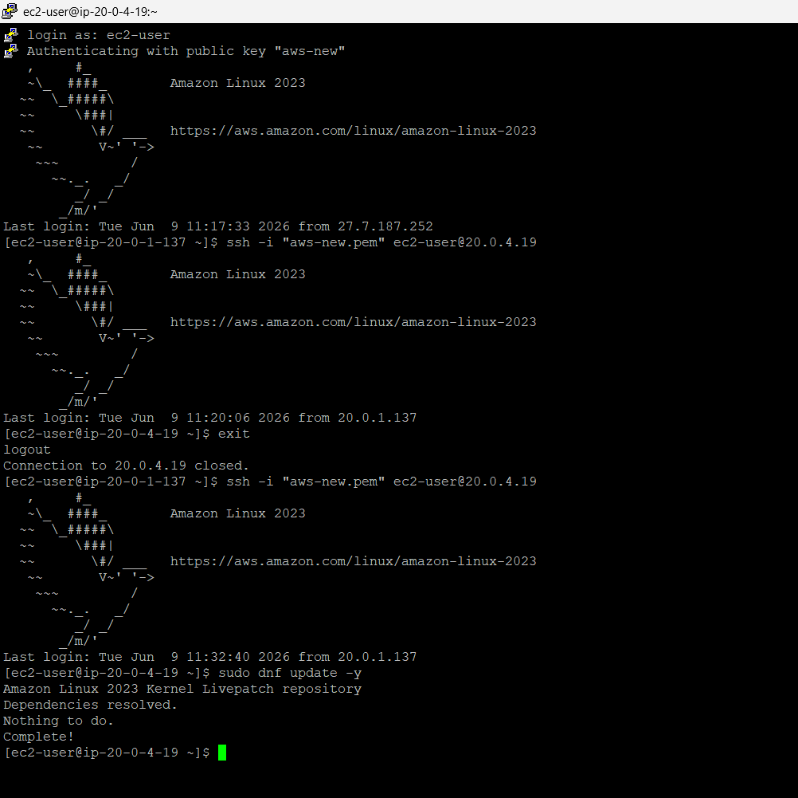

---

# 🌐 Project 9: NAT Gateway Validation

> **Deploy and configure an AWS Managed NAT Gateway inside a public subnet to grant secure, outbound-only internet connectivity to an isolated EC2 instance in a private subnet, validating its operation via system package updates.**

This project demonstrates the execution of a key network engineering pattern in AWS: enabling secure internet egress for isolated resources. The backend target instance is fully isolated in a private subnet with no public IPv4 address and no direct path to the Internet Gateway. By deploying an AWS Managed Network Address Translation (NAT) Gateway inside the public subnet, associating an Elastic IP (EIP), and routing egress traffic (`0.0.0.0/0`) through this gateway, we permit the private host to communicate outbound with the internet (e.g., to fetch package updates via `dnf update`) while strictly blocking all inbound connection attempts initiated from the public internet.

---

## 📑 Table of Contents

- [Overview](#-overview)
- [Architecture Diagram](#-architecture-diagram)
- [AWS Services Used](#-aws-services-used)
- [Key Features](#-key-features)
- [Prerequisites](#-prerequisites)
- [Project Structure](#-project-structure)
- [Setup & Deployment](#-setup--deployment)
- [How It Works](#-how-it-works)
- [Security Highlights](#-security-highlights)
- [Testing & Validation](#-testing--validation)
- [Screenshots](#-screenshots)
- [Common Issues & Troubleshooting](#-common-issues--troubleshooting)
- [Cleanup / Destroy](#-cleanup--destroy)
- [Future Improvements](#-future-improvements)
- [Contributing](#-contributing)
- [License](#-license)
- [Author & Contact](#-author--contact)

---

## 📌 Overview

### What This Project Does

This project provisions network egress capability for an isolated Amazon EC2 instance sitting in a private subnet (`Prem-Private-A`, CIDR: `20.0.4.0/24`) within a custom VPC (`Prem-VPC`, ID: `vpc-05f63b6d0d18fa5ff`). The instance lacks a public IPv4 address and sits behind a Security Group that denies all inbound internet access, allowing only SSH proxying from a public Bastion Host (`20.0.1.137`) in a public subnet (`Prem-Public-A`, CIDR: `20.0.1.0/24`).

By deploying an AWS Managed NAT Gateway (`nat-xxxxxxxxxxxxxxxxx`) in the public subnet and associating an Elastic IP, we establish a translation layer. We then configure the Private Route Table to send default traffic (`0.0.0.0/0`) to the NAT Gateway. 

The validation step verifies the configuration by logging into the private server via the Bastion Host and executing:
```bash
sudo dnf update -y
```
The command successfully reaches the Amazon Linux 2023 update repositories, downloads repository metadata, and completes without errors, validating that outbound internet routing is active.

### Why It Was Built / Real-World Use Case

In production enterprise cloud environments, backend servers containing sensitive data—such as database clusters (RDS, self-hosted PostgreSQL/MySQL), payment processing APIs, and internal microservices—must never be assigned public IP addresses or be directly accessible from the internet. However, these hosts still require outbound internet access to perform essential operations:

- **Security Patching**: Retrieving security updates and OS patches from official package repositories (e.g., DNF, Yum, APT).
- **Dependency Resolution**: Fetching software packages or container base images from registries (e.g., Docker Hub, npm, PyPI).
- **External API Integrations**: Querying external services, license servers, or payment gateways (e.g., Stripe, SendGrid, Twilio).

A NAT Gateway is the industry-standard mechanism to satisfy these requirements, providing a unidirectional gateway that shields instances from external ingress while enabling necessary egress.

### Key Problem It Solves

> *"My backend database servers are private for security, but now they cannot update their operating systems or install required software patches. How do I let them fetch updates without exposing them to public scans?"*

This architecture resolves this exact security conflict. It implements a secure network perimeter where outbound packets are translated to a single Elastic IP, and return packets are dynamically associated with active internal sessions. Any unsolicited inbound packet from the internet trying to reach the private instance is dropped at the NAT Gateway interface, preventing scanning, reconnaissance, and unauthorized ingress.

---

## 🏗️ Architecture Diagram

```
                                 ┌──────────────────────────────┐
                                 │      PUBLIC INTERNET         │
                                 │  Official OS Repositories    │
                                 └──────────────┬───────────────┘
                                                ▲
                                                │ Transated Outbound Traffic (0.0.0.0/0)
                                                ▼
                                 ┌──────────────────────────────┐
                                 │    INTERNET GATEWAY (IGW)    │
                                 └──────────────┬───────────────┘
                                                ▲
                                                │
                                                ▼
┌───────────────────────────────────────────────────────────────────────────────────────────┐
│ Custom VPC: Prem-VPC (vpc-05f63b6d0d18fa5ff) — Region: us-east-1                          │
│                                                                                           │
│  ┌─────────────────────────────────────────────────────────────────────────────────────┐  │
│  │ Subnet: Prem-Public-A (20.0.1.0/24)                                                 │  │
│  │                                                                                     │  │
│  │  ┌───────────────────────────────────┐       ┌───────────────────────────────────┐  │  │
│  │  │ EC2 Bastion Host                  │       │ AWS Managed NAT Gateway           │  │  │
│  │  │ Private IP: 20.0.1.137            │       │ Private IP: 20.0.1.x              │  │  │
│  │  │ Security Group: Bastion-SG        │       │ Attached Elastic IP (EIP)         │  │  │
│  │  └─────────────────▲─────────────────┘       └─────────────────▲─────────────────┘  │  │
│  │                    │                                           │                       │  │
│  │                    │ SSH Tunnel (Port 22)                      │ SNAT Egress Route     │  │
│  │                    │ (Source: sg-0caa575...)                   │ (0.0.0.0/0)           │  │
│  │                    │                                           │                       │  │
│  │  ┌─────────────────┴─────────────────┐                         │                       │  │
│  │  │ Public Route Table                │                         │                       │  │
│  │  │ Destination: 0.0.0.0/0 -> IGW     │                         │                       │  │
│  │  └───────────────────────────────────┘                         │                       │  │
│  └────────────────────┼───────────────────────────────────────────┼─────────────────────┘  │
│                       │                                           │                       │
│                       │ SSH Proxy Hop                             │ Egress Request        │
│                       ▼                                           │                       │
│  ┌────────────────────┼───────────────────────────────────────────┼─────────────────────┐  │
│  │ Subnet: Prem-Private-A (20.0.4.0/24)                                   │                     │  │
│  │                    │                                           │                       │  │
│  │  ┌─────────────────▼─────────────────┐                         │                       │  │
│  │  │ EC2 Private Server                ├─────────────────────────┘                       │  │
│  │  │ Private IP: 20.0.4.19             │ Outbound Update Request                         │  │
│  │  │ Security Group: Private-SG        │ (sudo dnf update -y)                            │  │
│  │  └───────────────────────────────────┘                                                 │  │
│  │                                                                                     │  │
│  │  ┌───────────────────────────────────┐                                                 │  │
│  │  │ Private Route Table               │                                                 │  │
│  │  │ Destination: 0.0.0.0/0 -> NAT-GW  │                                                 │  │
│  │  └───────────────────────────────────┘                                                 │  │
│  └─────────────────────────────────────────────────────────────────────────────────────┘  │
└───────────────────────────────────────────────────────────────────────────────────────────┘
```

### Architecture Traffic Flow Explanation

1. **Administrative Access Path**:
   - The developer initiates SSH access from workstation `27.7.187.252` to the public IP of the Bastion Host.
   - Upon connection to the Bastion (`20.0.1.137`), the developer runs `ssh -i "aws-new.pem" ec2-user@20.0.4.19` to proxy the connection into the private server sitting at `20.0.4.19`.
   - Security Group referencing controls ingress; the Private Server only accepts traffic coming from instances attached to the `Bastion-SG` ID.

2. **Outbound Internet Egress Path**:
   - The developer executes `sudo dnf update -y` on the Private Server.
   - The OS sends TCP packets destined for the package repository hosts on the internet (outside the `20.0.0.0/16` VPC CIDR block).
   - The Private Subnet's Route Table intercepts the egress request via the `0.0.0.0/0` route rule, pointing the destination target to the Managed NAT Gateway interface.
   - The packet is delivered to the NAT Gateway in the Public Subnet.
   - The NAT Gateway performs **Source Network Address Translation (SNAT)**, replacing the private source address `20.0.4.19` with its associated public Elastic IP (EIP) and recording the source port translation in its translation mapping table.
   - The NAT Gateway forwards the packet to the Internet Gateway (IGW), which routes it to the repository server on the public internet.
   - The repository server replies back to the NAT Gateway's EIP. The NAT Gateway reads its mapping table, translates the destination EIP back to the private IP `20.0.4.19`, and forwards the return packet to the instance.

---

## ☁️ AWS Services Used

| Service | Purpose | Configuration Observed |
|---|---|---|
| **Amazon VPC** | Logical network isolation boundary | `vpc-05f63b6d0d18fa5ff` (`Prem-VPC`) with a `20.0.0.0/16` address space |
| **Amazon Subnets** | Segmented network tiers | Public: `Prem-Public-A` (`20.0.1.0/24`) <br> Private: `Prem-Private-A` (`20.0.4.0/24`) |
| **AWS Managed NAT Gateway** | Performs source address translation for egress traffic | Positioned in `Prem-Public-A` (public subnet), bound to an Elastic IP |
| **Elastic IP (EIP)** | Static, public IPv4 address for the NAT Gateway | Allocated dynamically and attached exclusively to the NAT Gateway interface |
| **Internet Gateway (IGW)** | Provides public routing to the public subnet | Attached to `Prem-VPC`, acting as the edge routing device for internet transit |
| **Amazon EC2 (Bastion)** | Secure SSH ingress gateway (jump host) | Private IP: `20.0.1.137`, running Amazon Linux 2023, public IP assigned |
| **Amazon EC2 (Private)** | Isolated workload host performing updates | Private IP: `20.0.4.19`, running Amazon Linux 2023, public IP disabled |
| **Route Tables** | Directs traffic flows at subnet boundaries | **Public RT**: `0.0.0.0/0` → IGW <br> **Private RT**: `0.0.0.0/0` → NAT Gateway |
| **Security Groups** | Stateful firewall policies controlling EC2 access | **Bastion-SG**: `sg-0caa575d31a37ce4f` <br> **Private-SG**: `sg-06de71a1182c95045` |

---

## ✨ Key Features

- 🔒 **One-Way Internet Ingress Shielding**: Enables secure internet communication for database or application layers without exposing them to direct ingress scans.
- ⚡ **Managed High Availability**: Leveraging AWS Managed NAT Gateway ensures automatic scale-up of bandwidth (up to 100 Gbps) and native fault-tolerance within the AZ.
- 🔄 **Stateful Network Address Translation (SNAT)**: Dynamically translates internal private IP addresses to a single public Elastic IP, hiding the internal VPC topology.
- 🗺️ **Subnet Egress Separation**: Isolates public traffic routing from private traffic routing via distinct route table configurations.
- 🔑 **Secure Proxying Sequence**: Maintains zero public access pathways to the private target, using the Bastion host as the single point of administrative access.
- 📦 **Seamless Package Management**: Confirms functional DNS resolution and HTTP/HTTPS package fetching capability directly from terminal shells on the private server.

---

## 🛠️ Prerequisites

| Requirement | Version | Install Link |
|---|---|---|
| **AWS Account** | Standard / Free Tier | [AWS Console](https://aws.amazon.com/console/) |
| **AWS CLI** | v2.x | [AWS CLI Install](https://docs.aws.amazon.com/cli/latest/userguide/getting-started-install.html) |
| **OpenSSH Client** | Latest Stable | [OpenSSH Download](https://www.openssh.com/) |

### IAM Minimum Permissions Required

Apply this custom IAM policy to the administrative user or role to configure resources for this project:

```json
{
  "Version": "2012-10-17",
  "Statement": [
    {
      "Effect": "Allow",
      "Action": [
        "ec2:AllocateAddress",
        "ec2:ReleaseAddress",
        "ec2:CreateNatGateway",
        "ec2:DeleteNatGateway",
        "ec2:DescribeNatGateways",
        "ec2:CreateRoute",
        "ec2:ReplaceRoute",
        "ec2:DeleteRoute",
        "ec2:DescribeRouteTables",
        "ec2:DescribeInstances",
        "ec2:DescribeSubnets"
      ],
      "Resource": "*"
    }
  ]
}
```

---

## 📂 Project Structure

This project is created and validated directly within the AWS Management Console and verifying via CLI. The structure of this project folder is:

```
AWS-Project/
└── Project 9 - NAT Gateway Validation/
    ├── 01_DNF_Update_Success_After_NAT.png     # Terminal screenshot proving successful package updates
    └── README.md                               # Comprehensive project documentation (this file)
```

---

## 🚀 Setup & Deployment

Follow these structured steps to deploy the NAT Gateway network infrastructure and perform validation.

### Step 1: Allocate an Elastic IP (EIP)

The NAT Gateway requires a static, public IPv4 address to perform source translation.

```bash
aws ec2 allocate-address \
  --domain vpc \
  --tag-specifications 'ResourceType=elastic-ip,Tags=[{Key=Name,Value=Prem-NAT-EIP}]' \
  --region us-east-1
```
*Take note of the `AllocationId` (e.g., `eipalloc-0123456789abcdef0`) returned by this command.*

### Step 2: Create the NAT Gateway

Deploy the NAT Gateway in the **public subnet** (`Prem-Public-A`), enabling it to reach the Internet Gateway.

```bash
aws ec2 create-nat-gateway \
  --subnet-id "subnet-07476134253af8471" \
  --allocation-id "eipalloc-0123456789abcdef0" \
  --tag-specifications 'ResourceType=natgateway,Tags=[{Key=Name,Value=Prem-NAT-Gateway}]' \
  --region us-east-1
```
*Take note of the `NatGatewayId` (e.g., `nat-0987654321fedcba0`). Wait 1-2 minutes for the gateway status to transition from `pending` to `available`.*

To monitor the status:
```bash
aws ec2 describe-nat-gateways \
  --nat-gateway-ids "nat-0987654321fedcba0" \
  --region us-east-1 \
  --query 'NatGateways[*].State'
```

### Step 3: Configure the Private Route Table

Update the route table associated with the private subnet (`Prem-Private-A`) to redirect all default destination traffic (`0.0.0.0/0`) through the NAT Gateway.

```bash
# Locate your Private Route Table ID
aws ec2 describe-route-tables \
  --filters Name=vpc-id,Values=vpc-05f63b6d0d18fa5ff \
  --region us-east-1 \
  --query 'RouteTables[*].{RouteTableId:RouteTableId,Tags:Tags}'

# Add the default route pointing to the NAT Gateway
aws ec2 create-route \
  --route-table-id "rtb-09ac2b345ef67812a" \
  --destination-cidr-block "0.0.0.0/0" \
  --gateway-id "nat-0987654321fedcba0" \
  --region us-east-1
```

### Step 4: Access the Private Server (Proxy Hop)

Establish administrative access through your Bastion Host.

1. SSH into the Bastion Host from your workstation:
   ```bash
   ssh -i "aws-new.pem" ec2-user@<BASTION-PUBLIC-IP>
   ```
2. Verify you are connected to the Bastion host (`ip-20-0-1-137`):
   ```bash
   hostname
   ```
3. Proxy SSH into the Private Server:
   ```bash
   ssh -i "aws-new.pem" ec2-user@20.0.4.19
   ```
4. Verify you are logged into the Private Server (`ip-20-0-4-19`):
   ```bash
   hostname
   ```

### Step 5: Validate Outbound Internet Connectivity

Verify the private server can query external mirrors and apply patches.

```bash
sudo dnf update -y
```

---

## 🔍 How It Works

### Source Network Address Translation (SNAT)

When an EC2 instance in a private subnet communicates with the internet, it sends IP packets with its own private IP address as the source. Because private IP addresses (defined in RFC 1918) are non-routable on the public internet, routers will drop these packets immediately. 

The NAT Gateway resolves this through **SNAT**:

```
[ Private EC2 Instance ] 
  - Private IP: 20.0.4.19
  - Egress packet source: 20.0.4.19:43215
            │
            ▼
[ Private Subnet Route Table ]
  - Routes 0.0.0.0/0 -> NAT Gateway (nat-0987654321fedcba0)
            │
            ▼
[ NAT Gateway (Public Subnet) ]
  - Replaces source IP with Elastic IP: 54.210.15.82
  - Replaces source port with translated port: 54.210.15.82:10250
  - Saves mapping: [20.0.4.19:43215 <-> 54.210.15.82:10250]
            │
            ▼
[ Internet Gateway ] -> [ Public Internet (Repository Server) ]
```

When the repository server responds, it addresses the response to the NAT Gateway's public Elastic IP (`54.210.15.82:10250`). The NAT Gateway refers to its active session table, translates the destination back to the private IP (`20.0.4.19:43215`), and routes it down to the private subnet, achieving seamless bidirectional communication initiated strictly from the inside.

### Route Table Configurations

The separation of roles between subnets is governed entirely by the route table associations:

- **Public Route Table (Associated with `Prem-Public-A`)**:
  - Local Route: `20.0.0.0/16` → `local` (Intra-VPC traffic)
  - Internet Route: `0.0.0.0/0` → `igw-05ebc40e53a2a4b87` (External outbound routing)
  - This allows the NAT Gateway's public-facing interface to communicate directly with the internet gateway.

- **Private Route Table (Associated with `Prem-Private-A`)**:
  - Local Route: `20.0.0.0/16` → `local` (Intra-VPC traffic)
  - Internet Route: `0.0.0.0/0` → `nat-0987654321fedcba0` (Sends all non-VPC traffic to the NAT Gateway)

---

## 🛡️ Security Highlights

### Bastion Security Group (`sg-0caa575d31a37ce4f`) Rules

| Rule # | Type | Protocol | Port Range | Source / Destination | Action | Security Rationale |
|---|---|---|---|---|---|---|
| `Inbound` | SSH | TCP | `22` | `27.7.187.252/32` | ✅ ALLOW | Restricts administrative management access strictly to the developer's workstation IP |
| `Outbound` | SSH | TCP | `22` | `20.0.4.0/24` | ✅ ALLOW | Permits outgoing proxy SSH tunnels only to the private subnet range |

### Private Server Security Group (`sg-06de71a1182c95045`) Rules

| Rule # | Type | Protocol | Port Range | Source / Destination | Action | Security Rationale |
|---|---|---|---|---|---|---|
| `Inbound` | SSH | TCP | `22` | `sg-0caa575d31a37ce4f` | ✅ ALLOW | Permits SSH access exclusively if it is initiated from an instance attached to the Bastion Security Group |
| `Inbound` | All | All | All | `0.0.0.0/0` | ❌ DENY | Implicit drop block for all unsolicited internet traffic |
| `Outbound` | HTTP | TCP | `80` | `0.0.0.0/0` | ✅ ALLOW | Allows outgoing HTTP requests to fetch package metadata and signatures |
| `Outbound` | HTTPS | TCP | `443` | `0.0.0.0/0` | ✅ ALLOW | Allows outgoing secure HTTPS traffic to fetch packages from repositories |

### Security Observations

- **Dynamic Session Handling**: The NAT Gateway is stateful. It automatically opens ephemeral ports to receive return traffic for outbound requests, but blocks all unsolicited incoming connection requests.
- **VPC Topology Obfuscation**: External servers only see the public Elastic IP of the NAT Gateway, meaning the private IPs, instances, and subnet architectures are hidden from public view.
- **Separation of Concerns**: Even if the Private Security Group outbound rules are set to allow all traffic (`0.0.0.0/0`), the host cannot communicate with the internet unless a route to a NAT Gateway or Internet Gateway is explicitly defined in its subnet's Route Table.

---

## 🧪 Testing & Validation

### 1. Verify Internet Egress Capability

To verify outbound internet connectivity from the Private Server, run a diagnostic command such as curling an external header:

```bash
[ec2-user@ip-20-0-4-19 ~]$ curl -I https://www.amazon.com
```

**Expected Response**:
```
HTTP/2 200 
content-type: text/html;charset=UTF-8
server: Server
...
```

### 2. Verify System Update Flow

Run the DNF packet manager update tool to download packages over the NAT Gateway:

```bash
[ec2-user@ip-20-0-4-19 ~]$ sudo dnf update -y
```

**Expected Output**:
```
Amazon Linux 2023 Kernel Livepatch repository
Dependencies resolved.
Nothing to do.
Complete!
```

*This output (shown in the terminal verification screenshot) confirms that the private instance resolved external DNS records and established secure HTTPS/HTTP connections with the Amazon Linux package repository servers.*

---

## 📸 Screenshots

### 1️⃣ Package Update Validation Sequence via NAT Gateway
> Terminal logs showing the SSH login sequence. The developer logs in from the workstation (`27.7.187.252`) to the Bastion host (`ip-20-0-1-137`), proxies to the private server (`20.0.4.19`), and successfully executes `sudo dnf update -y`, confirming outbound network address translation is functional.



---

## 🐛 Common Issues & Troubleshooting

| Issue | Cause | Fix |
|---|---|---|
| DNF update command hangs or times out | Route Table associated with the private subnet is missing the `0.0.0.0/0` route pointing to the NAT Gateway | Verify the Route Table associated with `Prem-Private-A` has a route: Destination: `0.0.0.0/0`, Target: `nat-xxxxxxxxxxxxxxxxx`. |
| NAT Gateway creation is stuck in `pending` | EIP was not associated properly, or AWS is allocating backend resources | Wait up to 3 minutes. If it fails, delete the pending resource, verify the Elastic IP Allocation ID, and recreate it. |
| Cannot resolve hosts (DNS fails) | DNS resolution or DNS hostnames disabled in VPC settings | Check the VPC configuration. Ensure both `Enable DNS resolution` and `Enable DNS hostnames` are set to `true`. |
| NAT Gateway fails to send traffic out | The NAT Gateway was deployed inside the Private Subnet instead of the Public Subnet | NAT Gateways must reside in a subnet with a route to an Internet Gateway (`IGW`). Move the NAT Gateway to `Prem-Public-A` and update the private route table. |
| Connection refused when trying to reach repositories | Outbound security group rules on the Private Server are blocking ports 80 and 443 | Check the Outbound rules for the Private Security Group (`sg-06de71a1182c95045`). Ensure it allows outbound HTTP (80) and HTTPS (443) to `0.0.0.0/0`. |

---

## 🧹 Cleanup / Destroy

> ⚠️ **Billing Warning:** AWS charges hourly for active NAT Gateways (even if idle) plus a per-gigabyte data processing fee. Elastic IPs also incur costs when not associated with a running resource. Clean up these resources immediately after completing validation to avoid charges.

Execute these commands to tear down the infrastructure:

### Step 1: Delete the NAT Gateway

```bash
aws ec2 delete-nat-gateway \
  --nat-gateway-id "nat-0987654321fedcba0" \
  --region us-east-1
```
*Wait for the NAT Gateway to be fully deleted. This takes around 3–5 minutes.*

### Step 2: Release the Elastic IP

Once the NAT Gateway is deleted, release the EIP to stop hourly idle charges.

```bash
aws ec2 release-address \
  --allocation-id "eipalloc-0123456789abcdef0" \
  --region us-east-1
```

### Step 3: Remove Route from Route Table

Clean up the default route inside the Private Route Table.

```bash
aws ec2 delete-route \
  --route-table-id "rtb-09ac2b345ef67812a" \
  --destination-cidr-block "0.0.0.0/0" \
  --region us-east-1
```

### Step 4: Terminate EC2 instances

Terminate the instances to stop compute billing.

```bash
aws ec2 terminate-instances \
  --instance-ids "i-011a9ce485a9f4c07" "i-088f12c345a6789b0" \
  --region us-east-1
```

---

## 🔮 Future Improvements

1. **Implement Multi-AZ NAT Gateway Redundancy**: In production, place a NAT Gateway in each public subnet across multiple Availability Zones (AZs) and configure AZ-specific private subnet route tables. This ensures that an AZ outage does not disrupt internet egress for the remaining active AZs.
2. **Utilize VPC Endpoints for Internal AWS Services**: Routing traffic to AWS services (like S3, DynamoDB, Systems Manager, CloudWatch) through a NAT Gateway incurs data transfer charges. Deploying VPC Gateway Endpoints (for S3 and DynamoDB) and Interface Endpoints keeps traffic within the AWS internal network, reducing costs and increasing speed.
3. **Monitor NAT Egress using CloudWatch**: Set up Amazon CloudWatch alarms on metrics such as `BytesTransitive`, `ConnectionEstablishCount`, and `ErrorPortAllocation` to monitor bandwidth utilization and identify potential network port exhaustion.
4. **Transition to NAT Instances for Cost Savings**: For non-production or development workloads, replace the Managed NAT Gateway with a t3.nano EC2 NAT Instance configured with IP forwarding to reduce base hourly infrastructure costs.

---

## 🤝 Contributing

Contributions to improve this project or automate its deployment are welcome.

```bash
# 1. Fork the repository on GitHub
# Click the "Fork" button in the upper-right corner

# 2. Clone your fork locally
git clone https://github.com/<your-username>/<repo-name>.git
cd <repo-name>

# 3. Create a feature branch
git checkout -b feat/vpc-endpoints-s3

# 4. Make changes and commit using Conventional Commits
git add .
git commit -m "feat(network): add S3 Gateway Endpoint to reduce NAT data costs"

# 5. Push to your branch
git push origin feat/vpc-endpoints-s3

# 6. Open a Pull Request targeting the main branch
```

### Conventional Commit Types

```
feat      → New architectural components, configurations, or features
fix       → Corrections to CLI commands, routes, or configurations
docs      → Updates to README or diagrams
chore     → Routine maintenance, formatting, or cleanup tasks
```

---

## 📄 License

```
MIT License

Copyright (c) 2025 Prem Kumar S

Permission is hereby granted, free of charge, to any person obtaining a copy
of this software and associated documentation files (the "Software"), to deal
in the Software without restriction, including without limitation the rights
to use, copy, modify, merge, publish, distribute, sublicense, and/or sell
copies of the Software, and to permit persons to whom the Software is
furnished to do so, subject to the following conditions:

The above copyright notice and this permission notice shall be included in all
copies or substantial portions of the Software.

THE SOFTWARE IS PROVIDED "AS IS", WITHOUT WARRANTY OF ANY KIND, EXPRESS OR
IMPLIED, INCLUDING BUT NOT LIMITED TO THE WARRANTIES OF MERCHANTABILITY,
FITNESS FOR A PARTICULAR PURPOSE AND NONINFRINGEMENT. IN NO EVENT SHALL THE
AUTHORS OR COPYRIGHT HOLDERS BE LIABLE FOR ANY CLAIM, DAMAGES OR OTHER
LIABILITY, WHETHER IN AN ACTION OF CONTRACT, TORT OR OTHERWISE, ARISING FROM,
OUT OF OR IN CONNECTION WITH THE SOFTWARE OR THE USE OR OTHER DEALINGS IN THE
SOFTWARE.
```

---

## 👤 Author & Contact

<br/>

| Profile Info | Details |
|---|---|
| **Name** | Prem Kumar S |
| **Role** | DevOps Engineer |
| **Location** | Krishnagiri, Tamil Nadu, India 🇮🇳 |
| **GitHub** | [github.com/ThePremkumar](https://github.com/ThePremkumar) |
| **Portfolio** | [thepremkumar.netlify.app](https://thepremkumar.netlify.app) |

<br/>

---

<div align="center">

### ⭐ Star this repo if it helped you! ⭐

*If this project helped you understand AWS NAT Gateways, Elastic IPs, private subnet egress routing, or secure host updating — a star supports open-source cloud documentation.*

<br/>


*© 2025 Prem Kumar S *

</div>
