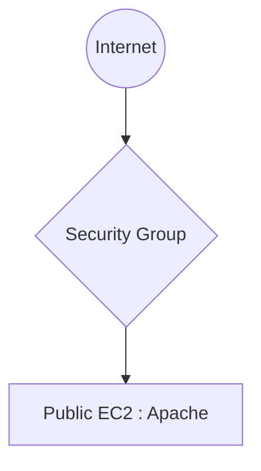
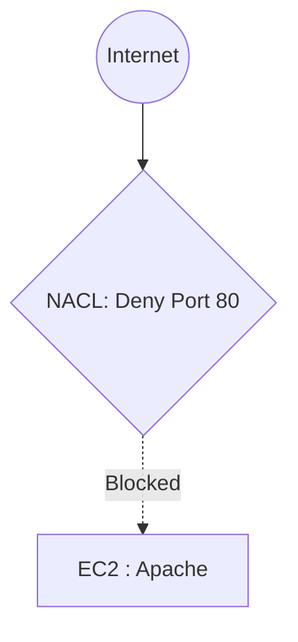
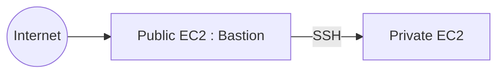
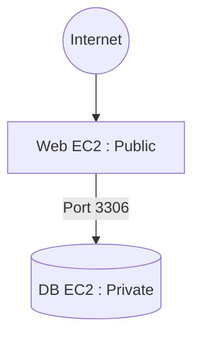
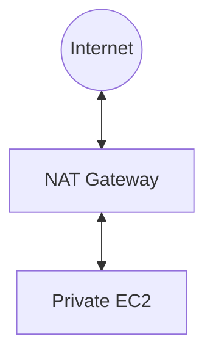
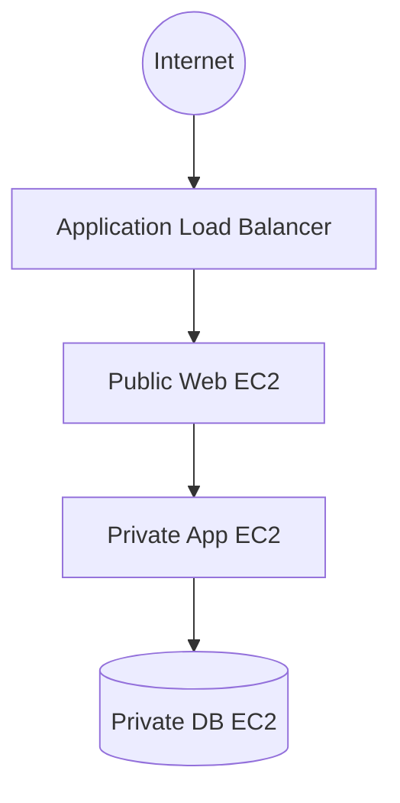

---

# ☁️ AWS EC2 Security Group & NACL Student Projects

> **A comprehensive suite of hands-on AWS networking projects designed for AWS Solution Architect students.**

These projects are perfectly structured to help students master **Security Groups, NACLs, Route Tables, Internet Gateways, NAT Gateways,** and the interplay between **Public & Private Subnets** in a real-world environment.

---

## 📑 Course Syllabus & Projects

| # | Project Name | Key Learning Focus | Link |
|---|---|---|---|
| **1** | Public Web Server Access Control | Public Access & Basic SG | [View Project](https://github.com/ThePremkumar/AWS-Project/tree/main/Project%201%20-%20Public%20Web%20Server%20Access) |
| **2** | NACL Blocking Website | Network ACL Deny Rules | [View Project](https://github.com/ThePremkumar/AWS-Project/tree/main/Project%202%20-%20NACL%20Blocking%20Website) |
| **3** | Bastion Host to Private Server | SG Referencing & Private Subnets | [View Project](https://github.com/ThePremkumar/AWS-Project/tree/main/Project%203%20-%20Bastion%20Host%20to%20Private%20Server) |
| **4** | Public Web Server + Private Database | Real-world 3-Tier Design | [View Project](https://github.com/ThePremkumar/AWS-Project/tree/main/Project%204%20-%20Public%20Web%20Server%20+%20Private%20Database) |
| **5** | Security Group Stateful Demo | Security Group Statefulness | [View Project](https://github.com/ThePremkumar/AWS-Project/tree/main/Project%205%20-%20Security%20Group%20Stateful%20Demo) |
| **6** | NACL Stateless Demo | NACL Statelessness | [View Project](https://github.com/ThePremkumar/AWS-Project/tree/main/Project%206%20-%20NACL%20Stateless%20Demo) |
| **7** | Secure Admin Network | IP Whitelisting & Admin Access | [View Project](https://github.com/ThePremkumar/AWS-Project/tree/main/Project%207%20-%20Secure%20Admin%20Network) |
| **8** | Public vs Private EC2 Challenge | Direct vs Bastion Connectivity | [View Project](https://github.com/ThePremkumar/AWS-Project/tree/main/Project%208%20-%20Public%20vs%20Private%20EC2%20Challenge) |
| **9** | NAT Gateway Validation | Internet Egress for Private EC2s | [View Project](https://github.com/ThePremkumar/AWS-Project/tree/main/Project%209%20-%20NAT%20Gateway%20Validation) |
| **10** | Mini Production Architecture | Full Solution Architect Design | [View Project](https://github.com/ThePremkumar/AWS-Project/tree/main/Project%2010%20-%20Mini%20Production%20Architecture) |
| **L1** | AWS Lambda Execution Model | Introduction to Serverless | [View Project](https://github.com/ThePremkumar/AWS-Project/tree/main/Lambda%201%20-%20AWS%20Lambda%20Execution%20Model) |
| **L2** | Reading Data from Lambda Event | Parsing Event Data | [View Project](https://github.com/ThePremkumar/AWS-Project/tree/main/Lambda%202%20-%20Reading%20Data%20from%20Lambda%20Event) |
| **L3** | AWS Lambda + S3 Integration | S3 Event Triggers | [View Project](https://github.com/ThePremkumar/AWS-Project/tree/main/Lambda%203%20-%20AWS%20Lambda%20+%20S3%20Integration) |
| **🏆** | **Final Interview Project** | Comprehensive Exam Simulation | [View Project](https://github.com/ThePremkumar/AWS-Project/tree/main/Final%20Interview%20Project) |

---

## 🌐 [Project 1: Public Web Server Access Control](https://github.com/ThePremkumar/AWS-Project/tree/main/Project%201%20-%20Public%20Web%20Server%20Access)

### 🎯 Objective
- [x] Launch EC2 in Public Subnet
- [x] Install Apache
- [x] Allow HTTP (80)
- [x] Block SSH from unwanted IPs

### 🏗️ Architecture


### 🛡️ Rules Configuration
**Security Group Rules**
| Type | Port | Source |
|---|---|---|
| SSH | 22 | Your IP |
| HTTP | 80 | 0.0.0.0/0 |

**NACL Rules**
| Rule | Port | Action |
|---|---|---|
| 100 | 80 | Allow |
| 110 | 22 | Allow |
| * | All | Deny |

### 📚 Learning Outcomes
✅ SG Stateful Behaviour <br/>
✅ NACL Stateless Rules <br/>
✅ Public Subnet Access Patterns

---

## 🛑 [Project 2: NACL Blocking Website](https://github.com/ThePremkumar/AWS-Project/tree/main/Project%202%20-%20NACL%20Blocking%20Website)

### 🎯 Objective
- [x] Verify Website works initially.
- [x] Add **DENY Rule** for Port 80 in NACL.
- [x] Verify Website is no longer accessible.

### 🏗️ Architecture


### 📚 Learning Outcomes
Students understand conflict resolution: **Security Group allows, but NACL denies = Traffic Blocked.**

---

## 🔒 [Project 3: Bastion Host to Private Server](https://github.com/ThePremkumar/AWS-Project/tree/main/Project%203%20-%20Bastion%20Host%20to%20Private%20Server)

### 🎯 Objective
- [x] Launch Public EC2 in Public Subnet
- [x] Launch Private EC2 in Private Subnet
- [x] Login to Private EC2 exclusively through the Bastion Host

### 🏗️ Architecture


### 🛡️ Rules Configuration
**Bastion SG:** `Port 22` from `Your IP`
**Private EC2 SG:** `Port 22` from `Bastion SG`

### 📚 Learning Outcomes
✅ Private Subnet Isolation Concept <br/>
✅ Security Group Referencing <br/>
✅ Secure Administrative Access

---

## 🗄️ [Project 4: Public Web Server + Private Database](https://github.com/ThePremkumar/AWS-Project/tree/main/Project%204%20-%20Public%20Web%20Server%20+%20Private%20Database)

### 🎯 Objective
- [x] Host Apache on Public EC2
- [x] Host MySQL on Private EC2

### 🏗️ Architecture


### 🛡️ Rules Configuration
**Web Server SG:** `Port 80`, `Port 22`
**Database SG:** `Port 3306` explicitly from `Web SG`

### 📚 Learning Outcomes
Students master the real-world foundational **3-tier application design pattern**.

---

## 🔄 [Project 5: Security Group Stateful Demo](https://github.com/ThePremkumar/AWS-Project/tree/main/Project%205%20-%20Security%20Group%20Stateful%20Demo)

### 🎯 Objective
- [x] Allow `SSH TCP 22` ONLY.
- [x] Connect using SSH.
- [x] Observe that no outbound rule is needed and traffic still returns successfully.

### 📚 Learning Outcomes
**Security Groups are Stateful.** Return traffic is automatically allowed for permitted inbound connections.

---

## 🚧 [Project 6: NACL Stateless Demo](https://github.com/ThePremkumar/AWS-Project/tree/main/Project%206%20-%20NACL%20Stateless%20Demo)

### 🎯 Objective
- [x] Allow inbound HTTP `80`.
- [x] Remove outbound ephemeral ports `1024-65535` in NACL.
- [x] Observe the website connection failure.

### 📚 Learning Outcomes
**Network ACLs are Stateless.** Return traffic absolutely requires an explicit outbound rule to succeed.

---

## 👨‍💻 [Project 7: Secure Admin Network](https://github.com/ThePremkumar/AWS-Project/tree/main/Project%207%20-%20Secure%20Admin%20Network)

### 🎯 Objective
- [x] Simulate Company Admin Team IPs: `192.168.1.10` and `192.168.1.20`.
- [x] Ensure only these specific IPs can initiate SSH connections.

### 🛡️ Rules Configuration
**SG Rule:** `Port 22` → `Specific IP /32`

### 📚 Learning Outcomes
Enforcing **Production-grade Security Practices** through strict IP whitelisting.

---

## ⚔️ [Project 8: Public vs Private EC2 Challenge](https://github.com/ThePremkumar/AWS-Project/tree/main/Project%208%20-%20Public%20vs%20Private%20EC2%20Challenge)

### 🎯 Objective
Deploy one EC2 with a Public IP and one without. Complete the following tasks:
1. Ping Public EC2
2. SSH Public EC2
3. Attempt direct SSH to Private EC2
4. Access Private EC2 via Bastion Host

### 📊 Expected Results
| Test | Result |
|---|---|
| Public SSH | ✅ Success |
| Private SSH Direct | ❌ Fail |
| Private via Bastion | ✅ Success |

---

## 🌍 [Project 9: NAT Gateway Validation](https://github.com/ThePremkumar/AWS-Project/tree/main/Project%209%20-%20NAT%20Gateway%20Validation)

### 🎯 Objective
- [x] Run `sudo dnf update -y` on a Private EC2
- [x] Observe failure before NAT implementation
- [x] Observe success after NAT implementation

### 🏗️ Architecture


### 📚 Learning Outcomes
Understanding how Private instances securely access the internet without requiring a public IP address.

---

## 🏢 [Project 10: Mini Production Architecture](https://github.com/ThePremkumar/AWS-Project/tree/main/Project%2010%20-%20Mini%20Production%20Architecture)

### 🎯 Objective
Students must synthesize all knowledge to build a full environment:
- [x] Create VPC
- [x] Public Subnets & Private Subnets
- [x] Route Tables & Internet Gateway
- [x] Security Groups & NACLs
- [x] NAT Gateway

### 🏗️ Architecture


### 📚 Learning Outcomes
Execution of a Complete AWS Solution Architect Design.

---

## ⚡ [Lambda 1: AWS Lambda Execution Model](https://github.com/ThePremkumar/AWS-Project/tree/main/Lambda%201%20-%20AWS%20Lambda%20Execution%20Model)

### 🎯 Objective
- [x] Create a simple AWS Lambda function.
- [x] Configure Test Events (JSON).
- [x] Review the Execution Results.

---

## ⚡ [Lambda 2: Reading Data from Lambda Event](https://github.com/ThePremkumar/AWS-Project/tree/main/Lambda%202%20-%20Reading%20Data%20from%20Lambda%20Event)

### 🎯 Objective
- [x] Create custom event payloads.
- [x] Extract and process data from the event object within the Lambda function.
- [x] Validate output based on input parameters.

---

## ⚡ [Lambda 3: AWS Lambda + S3 Integration](https://github.com/ThePremkumar/AWS-Project/tree/main/Lambda%203%20-%20AWS%20Lambda%20+%20S3%20Integration)

### 🎯 Objective
- [x] Configure an S3 Bucket to trigger a Lambda function on object creation.
- [x] Verify the Lambda function execution.
- [x] Monitor execution details via Amazon CloudWatch Logs.

---

## 🏆 [Final Interview Project (Best One)](https://github.com/ThePremkumar/AWS-Project/tree/main/Final%20Interview%20Project)

**The Ultimate Capstone Project** where students must design and configure a flawless, secure, multi-tier VPC architecture without guided instructions.

### 🏗️ Target Architecture
```text
VPC
├── Public Subnet
│   └── Bastion Host
│
├── Public Subnet
│   └── Web Server
│
└── Private Subnet
    └── Database Server
```

### ✅ Student Checklist
- [ ] Configure Security Groups
- [ ] Configure NACLs
- [ ] Set up Route Tables
- [ ] Attach Internet Gateway
- [ ] Deploy NAT Gateway
- [ ] Verify SSH via Bastion
- [ ] Verify Web Access via Browser
- [ ] Verify Database Access strictly limited to Web Server

---

<div align="center">
  <b>Built for comprehensive AWS networking education.</b><br/>
  © 2026 Prem Kumar S
</div>
